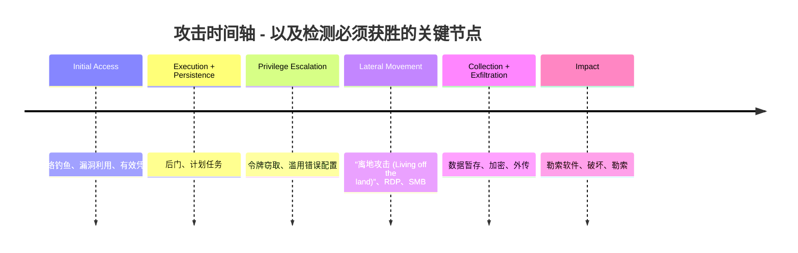
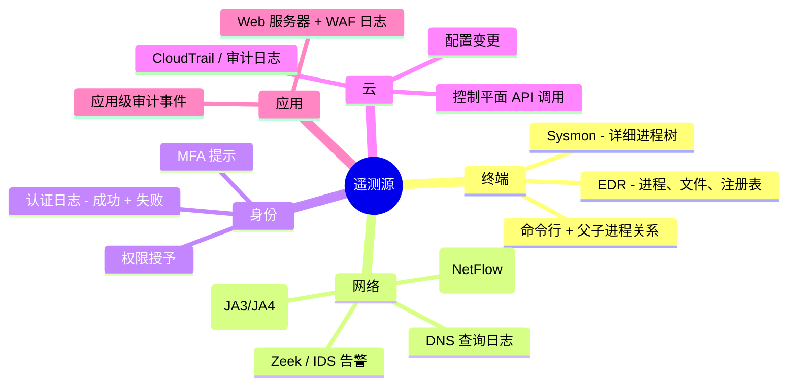
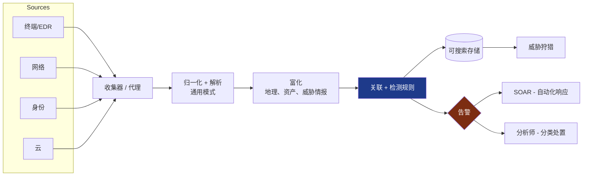
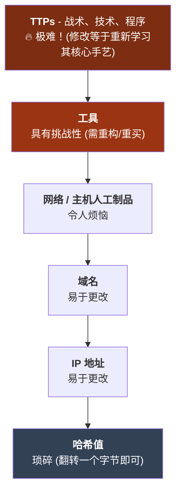
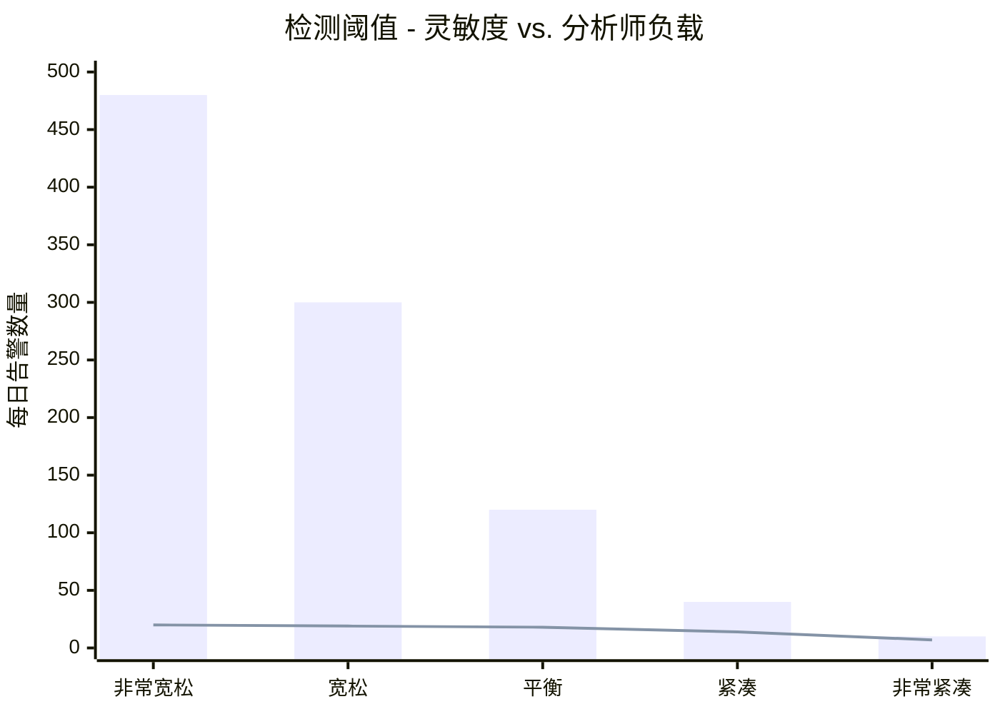
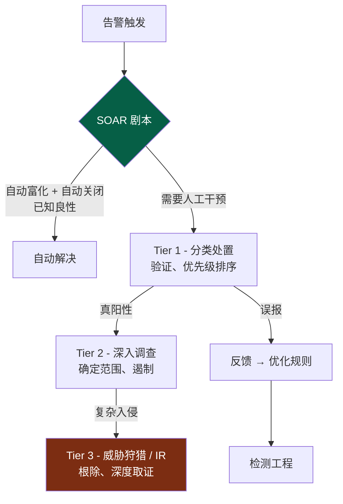
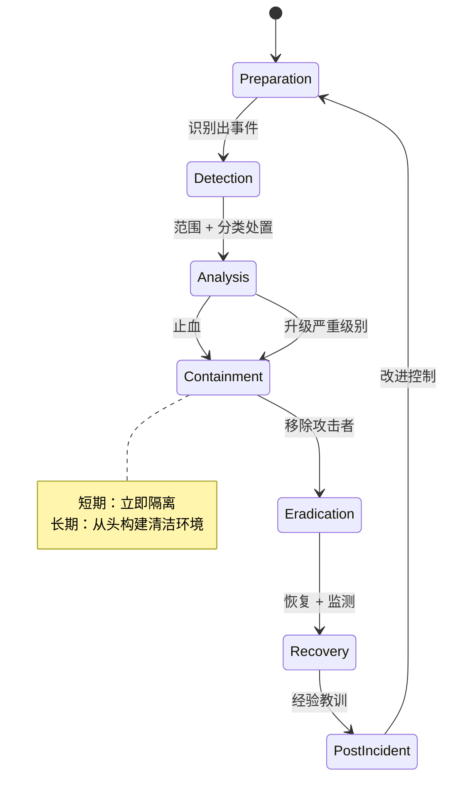
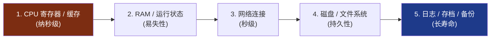
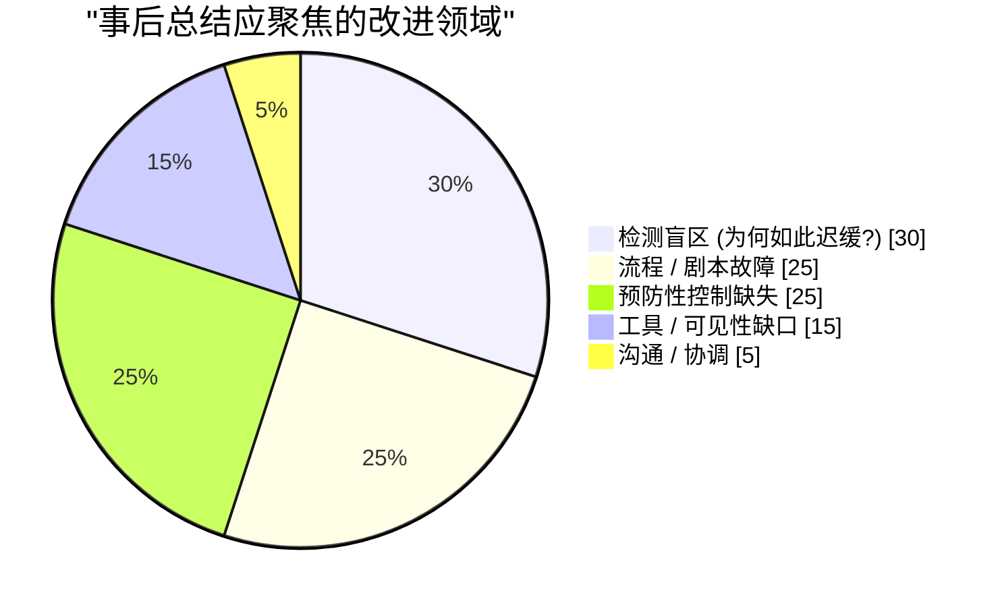
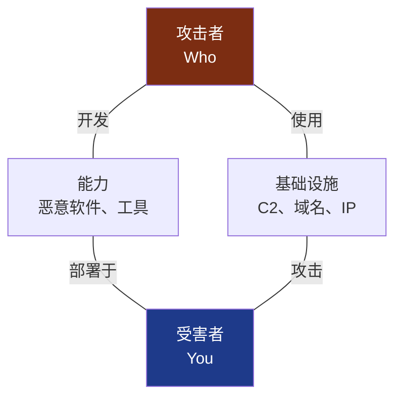

## 改变一切的前提

前三卷的核心是乐观主义。[第一卷](/posts/secure_systems_architecture/) 建立围墙。[第二卷](/posts/identity_and_access_in_depth/) 在每一扇门前部署守卫。[第三卷](/posts/cryptography_engineering_in_depth/) 确保了信息传输的不可伪造性。所有这些都是*预防性*的，其前提都是将攻击者拒之门外。

本卷从那种乐观主义结束的地方开始，引用每一位资深防御者刻在灵魂深处的一句话：

> **假设失陷 (Assume breach)。** 只要有足够的时间、预算和动机，坚定的对手总能闯入。问题不在于你是否会被攻破，而在于*你多快能察觉，以及响应有多出色。*

业界用两个残酷的数字来衡量这一点：**MTTD**（平均检测时间）和 **MTTR**（平均响应时间）。2024 年行业平均驻留时间（从最初被攻破到检测到）仍以*天到周*计。在这一窗口期内，攻击者会进行横向移动、提权并窃取数据。本卷旨在缩短这一窗口。



你每缩短一个小时的检测时间，就是从攻击者手中夺回一个小时的时间线。欢迎来到蓝队。

---

## 第一部分：遥测 - 看不见就无法检测

检测首先是一个数据问题，其次才是聪明的分析问题。如果从未收集过证据，任何算法都无法恢复它。因此，蓝队的首要任务是**可见性**：对整个资产进行监测以发出正确的信号。

### 第 1 章：真理之源



**防御者视角：** 并非所有日志都同等重要。最有价值的遥测是能够捕获*行为*的数据，特别是**带有父子进程谱系的进程命令行**（Sysmon 事件 ID 1）和**身份认证事件**。防火墙日志告诉你发生了一个连接；而进程树则告诉你 `winword.exe` 衍生出 `powershell.exe`，进而衍生出 `cmd.exe` 并运行了一条加密命令——这是一个完整的故事，而故事本身就是检测。

:::important[日志覆盖率是个系统工程——将其映射出来]
最经典的失败就是*静默盲区*：你记录了 80% 的资产，但攻击发生在剩下的 20% 中。维护一个**日志覆盖矩阵**（源 × 数据类型 × 保留周期），并将空白视为漏洞。如果所需的原始数据从未被采集，那么检测规则就是毫无价值的。像审计补丁级别一样去审计你的覆盖率。
:::

### 第 2 章：SIEM 管道

**SIEM**（安全信息和事件管理）是大脑的聚合中心：它摄入上述所有数据，将其归一化为通用模式，跨来源进行关联，并发出告警。现代管道如下：



**富化 (Enrichment)** 步骤在悄无声息中发挥了最大的价值：一个 IP 地址在确认是 Tor 出口节点、资产为域控服务器、且用户通常从另一个大洲登录之前，只是噪音。富化将数据转化为*上下文*，而上下文才是让告警可操作而非可忽略的关键。

---

## 第二部分：检测工程

购买 SIEM 就像购买钢琴一样，并不能让你自动拥有音乐。**检测工程**是一门编写、测试和维护规则的学科，旨在将遥测转化为告警，并将检测规则视为代码进行管理。

### 第 3 章：MITRE ATT&CK - 通用语言

**MITRE ATT&CK** 是该领域的通用地图：它是一个矩阵，列出了在真实入侵中观察到的攻击者**战术 (Tactics)**（即“为什么”，例如：持久化、横向移动）和**技术 (Techniques)**（即“怎么做”，例如：T1053 计划任务）[^1]。它是让红队、蓝队和威胁情报专家能够使用统一语言沟通的罗塞塔石碑。

防御者的强力手段是**覆盖率映射**，将你的检测规则覆盖到矩阵上以暴露盲点：

```mermaid
quadrantChart
    title 检测覆盖率 vs. 攻击技术频率
    x-axis 很少使用 --> 经常使用
    y-axis 覆盖率较差 --> 覆盖率较强
    quadrant-1 防御良好
    quadrant-2 过度投入
    quadrant-3 低优先级缺口
    quadrant-4 危险 - 高频且未检测
    Phishing (T1566): [0.9, 0.7]
    Valid Accounts (T1078): [0.85, 0.35]
    PowerShell (T1059): [0.8, 0.8]
    Scheduled Task (T1053): [0.5, 0.6]
    Credential Dumping (T1003): [0.7, 0.75]
    Cloud API Abuse (T1078.004): [0.6, 0.25]
    Rundll32 Proxy (T1218): [0.3, 0.45]
```

第四象限（**覆盖率薄弱的高频技术**）是你的优先积压项。这就是小型蓝队分配有限精力的方法：在追求无人使用的奇特技术之前，先防御攻击者实际正在做且你尚未捕捉到的行为。

### 第 4 章：痛苦金字塔

并非所有检测在*给对手造成打击的程度*上都是平等的。David Bianco 的**痛苦金字塔 (Pyramid of Pain)** 按指标在被检测到后攻击者修改它们的代价进行了排序 [^2]：



这一经验重塑了策略。封锁一个文件**哈希**感觉很过瘾，但攻击者重新编译一下就能在几秒钟内将其破解。检测一种**行为**——例如“任何 Office 应用衍生出连接互联网的脚本引擎”——则强迫对手放弃整套*技术*。**基于行为进行检测，而不仅仅是指标。** 你的检测在金字塔中的层级越高，对手规避它的成本就越高。

:::tip[检测即代码]
像软件一样对待检测：使用便携格式（**Sigma** 规则）编写，存储在 **git** 中，进行代码审查，并针对已知恶意样本进行*测试*。最重要的是，还要针对良性活动进行测试以衡量误报率。一个误报率高达 40% 的检测规则比没有检测更糟，因为它会训练分析师点击“忽略”。像对待生产代码一样对规则进行版本控制、测试并退役。 [^3]
:::

### 第 5 章：信噪比之战

检测的永恒张力在于捕捉真实攻击（真阳性）与被误报淹没的分析师之间的权衡：



柱状图是总告警数；折线图是*真阳性*数。调得太松（左侧），分析师需要查看 480 个告警才能找到 20 个真实的，他们会精疲力竭并开始机械性地处理。调得太紧（右侧），你就会错过真实攻击。**告警疲劳是安全控制的失败**，而不仅仅是人力资源问题。目标不是最大化告警数量，而是最大化*每位分析师每小时处理的真阳性数量*，这也是 SOAR（下文）存在的意义。

---

## 第三部分：SOC - 机器速度的响应

### 第 6 章：分层运维与 SOAR

**安全运营中心 (SOC)** 是存在于告警流中的团队与流程。经典的结构及其现代自动化如下：



**SOAR**（安全编排、自动化和响应）是力量倍增器。它运行*剧本 (Playbooks)*，即自动化的顺序任务，用以富化告警、收集上下文，甚至在不等待人类介入的情况下采取遏制行动（隔离主机、禁用账户、封禁 IP）。一个构建良好的 SOAR 管道可以自动解决大部分低保真噪音，让分析师将注意力集中在真正需要判断力的地方。

:::note[反馈回路是核心目的]
注意从 Tier 1 指回检测工程的箭头。一个成熟的 SOC 是一个*学习系统*：每一个误报都会优化一条规则，每一个漏检（事后发现）都会转化为一条新规则。一个只对告警做出反应而不将经验反馈回检测规则的 SOC，是在原地踏步。
:::

### 第 7 章：威胁狩猎 - 假设他们已经潜入

检测是在等待规则触发。**威胁狩猎 (Threat Hunting)** 的姿态则完全相反：在明确假设攻击者已经入侵的前提下，主动在遥测数据中寻找那些绕过规则的对手。它是*假设驱动*的：

::::steps

:::step[建立假设]{subtitle="他们会藏在哪里？"}
立足于威胁情报或 ATT&CK：“如果攻击者实现了持久化，我预计非管理员账户会在工作时间之外创建异常的计划任务。”好的假设必须是具体的且可证伪的。
:::

:::step[收集并分析数据]{subtitle="去看看"}
查询 SIEM/EDR 以寻找支持或反驳假设的证据。围绕进程谱系、网络目标、认证异常进行回溯。寻找“正常行为的缺失”，就像寻找恶意行为的存在一样重要。
:::

:::step[发现或优化]{subtitle="结论"}
无论你是否发现线索（升级为 IR），两者都是胜利。一次毫无发现的狩猎过程*验证*了某种控制并刻画了正常行为基线。
:::

:::step[将发现成果工程化]{subtitle="自动化它"}
狩猎中学到的任何东西都应转化为*新的自动化检测*，这样你就不必再手动去狩猎同样的东西了。狩猎应当持续不断地转化为规则。
:::

::::

:::caution[狩猎需要基线]
不知道“正常”是什么，就无法发现“异常”。有效的狩猎依赖于基线化：对于*这个*环境而言，典型的 DNS、认证和进程活动的一天是什么样的？攻击者利用了大多数机构从未描述过自身正常行为的事实，这就是为什么“离地攻击”（使用 PowerShell 和 `certutil` 等内置工具）如此有效：它隐藏在你从未学会阅读的流量中。
:::

---

## 第四部分：当警报响彻时 - 事件响应

最终，一条检测告警被证实是真实且严重的。现在你执行**事件响应 (Incident Response)** 流程，遏制住事故与演变成公司级灾难的区别，往往在于*压力下的准备与纪律*，而不是英雄主义。

### 第 8 章：NIST IR 生命周期

NIST SP 800-61 定义了经典的循环 [^4]：



工程师最容易犯错的阶段是**遏制 (Containment)**。有两种失败模式：

* **过早打草惊蛇** - 在控制了十台主机时切断其中一台的电源，只会告诉攻击者你已经察觉到了，他们会销毁所有证据或加速外传。有时你选择*观察*而不是*打击*，以获取完整范围。
* **遏制不够快** - 相反的罪过，在数据离开大楼时还在犹豫。

:::warning[不要销毁你所需要的证据]
恐慌本能是*立即重新镜像系统*。但一台被攻破的活动主机持有易失性证据——运行的进程、网络连接、驻留内存的恶意软件——一旦断电就会消失。在可行的情况下，**在根除之前捕获内存和磁盘镜像。** 你需要它们来确定范围（“他们还碰了什么？”）、满足法律/监管义务，并确保根除真正彻底。波动性顺序很重要：先内存，后磁盘。 [^5]
:::

### 第 9 章：数字取证 - 重构真相

当事件结束后（或为了法律程序），**数字取证与事件响应 (DFIR)** 会重构究竟发生了什么。核心原则是**监管链**和**波动性顺序**。证据必须按从易失到不易失的顺序收集，且每一步操作都必须记录在案，否则它在法庭上将毫无价值，在确定范围时也不可信：



取证分析师从文件系统元数据 (MFT, `$LogFile`)、内存转储 (Volatility)、Windows 事件日志以及 prefetch 和 shimcache 等制品中重构入侵时间轴，将成千上万个时间戳编织成关于*他们如何进入、做了什么以及拿走了什么*的连贯叙事。

### 第 10 章：无责事后总结 (Blameless Postmortem)

最有价值的阶段往往是在时间压力下最容易被跳过的：**经验教训**。使其奏效的规则是**无责原则**，分析只针对*系统和流程*，从不针对个人。一旦事后总结演变成追责，人们就会停止说真话，而你将失去改进所需的最关键信息。



每一起事件都是昂贵的学费。那些不断提升安全成熟度的组织是那些能*提取完整教训*的组织：每一次失陷都永久弥补了导致它的漏洞，直接反馈回“准备”阶段，并转化为第二部分的检测规则。

---

## 第五部分：威胁情报 - 知己知彼

当你了解*谁*可能针对你以及*他们如何操作*时，检测和响应能力会显著提升。**网络威胁情报 (CTI)** 是将关于对手的原始数据转化为决策的学科，它在三个层面运作：

| 层级 | 受众 | 回答的问题 | 示例 |
| --- | --- | --- | --- |
| **战略级** | 高管 / 董事会 | *谁在针对我们的行业，为什么？* | “勒索软件组织日益将医疗账单系统作为目标” |
| **运营级** | SOC 领导层 | *目前活跃的战役和 TTP 是什么？* | “该组织使用鱼叉式钓鱼 → Cobalt Strike → 双重勒索” |
| **战术级** | 分析师 / 工具 | *我该封禁或检测哪些具体指标？* | IOC、ATT&CK 技术 ID、YARA/Sigma 规则 |

连接这些的框架是**钻石模型 (Diamond Model)**，每一个入侵事件都有四个顶点，在它们之间进行关联分析可以扩展你的理解：



知道一个 C2 域名（基础设施）让你能够关联到同一注册商/模式下的其他域名；了解恶意软件（能力）让你能够编写 YARA 规则来捕捉该对手的*下一次*战役。CTI 是蓝队停止纯防御、开始主动预测的手段。

:::important[情报必须驱动行动，否则就是轶事]
一个包含一万个恶意 IP 的订阅源，如果没有规则去消耗它，那就是噪音，而非情报。检验 CTI 的试金石是一个闭环：它是否改变了你的检测、封禁、狩猎重点或优先级？将战术级 IOC 注入 SIEM 富化，将运营级 TTP 映射到 ATT&CK 覆盖矩阵，将战略评估反馈给风险决策。无法触达控制措施的情报，不过是一份无人阅读的报告。
:::

---

## 结论与前路

我们现在已经历了防御者的完整循环：**观察**（遥测）、**检测**（行为工程规则）、**响应**（SOC 与 IR 纪律）、**学习**（无责事后总结）以及**预测**（威胁情报）。我们接受了预防措施总会失效的事实，并建立了在此之后生存的肌肉记忆，将驻留时间从数周压缩至分钟级。

但在一个领域，这一切正变得更加困难且紧迫：**云原生**世界。在这个瞬息万变的容器、声明式基础设施以及由成千上万个你从未编写过的开源依赖组成的软件世界里，边界进一步溶解，工作负载仅存活几秒钟。在这里，最危险的漏洞并非通过你的代码进入，而是通过你的*供应链*——一个有毒的依赖、一个被攻破的构建管道、一个泄露的 CI 令牌。

**第五卷**（终章）将把整个系列带回到现代云原生和 DevSecOps 安全领域：容器与 Kubernetes 加固、基础设施即代码扫描、CI/CD 管道安全、SBOM 与 SLSA，以及防御软件供应链——下个十年最具决定性的破坏，正是在那里酝酿。

---

## 参考文献

[^1]: [MITRE - ATT&CK 框架](https://attack.mitre.org/)
[^2]: [David Bianco (2013) - 痛苦金字塔](https://detect-respond.blogspot.com/2013/03/the-pyramid-of-pain.html)
[^3]: [SigmaHQ - SIEM 系统通用签名格式](https://github.com/SigmaHQ/sigma)
[^4]: [NIST (2012) - SP 800-61 Rev. 2: 计算机安全事件处理指南](https://csrc.nist.gov/publications/detail/sp/800-61/rev-2/final)
[^5]: [IETF - RFC 3227: 证据收集与存档指南](https://datatracker.ietf.org/doc/html/rfc3227)