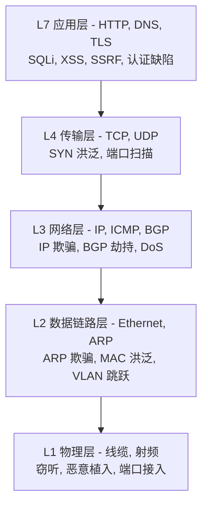
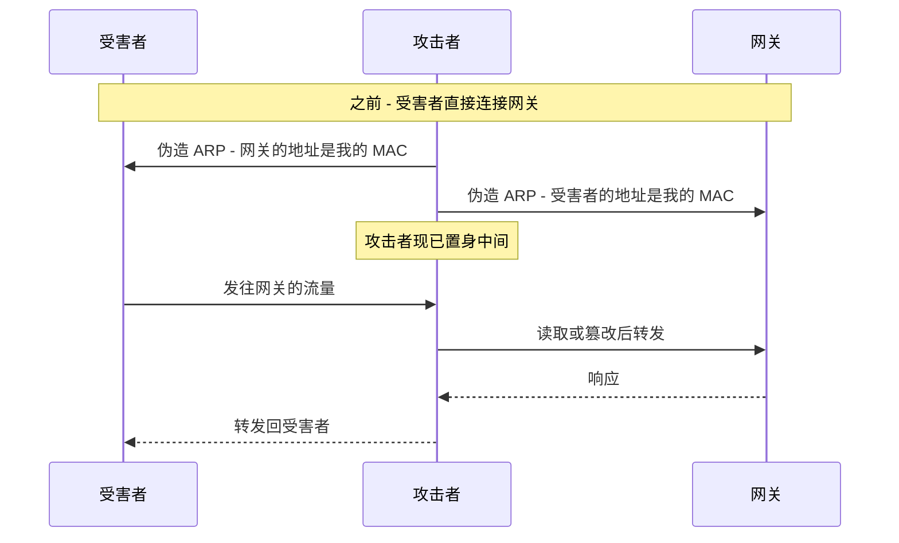
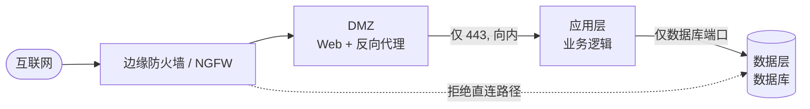
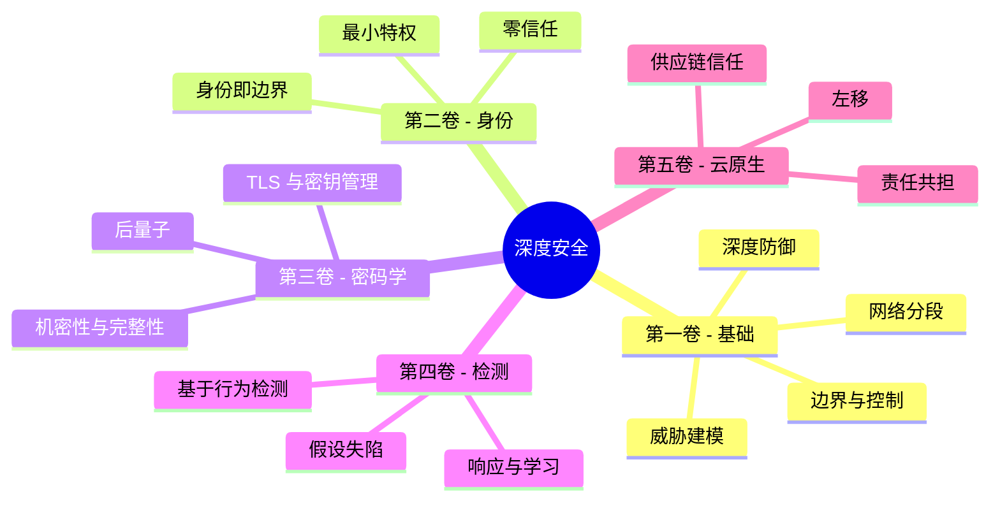
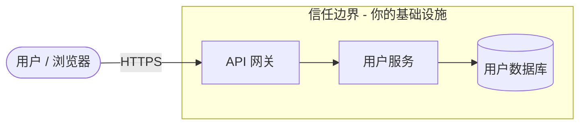
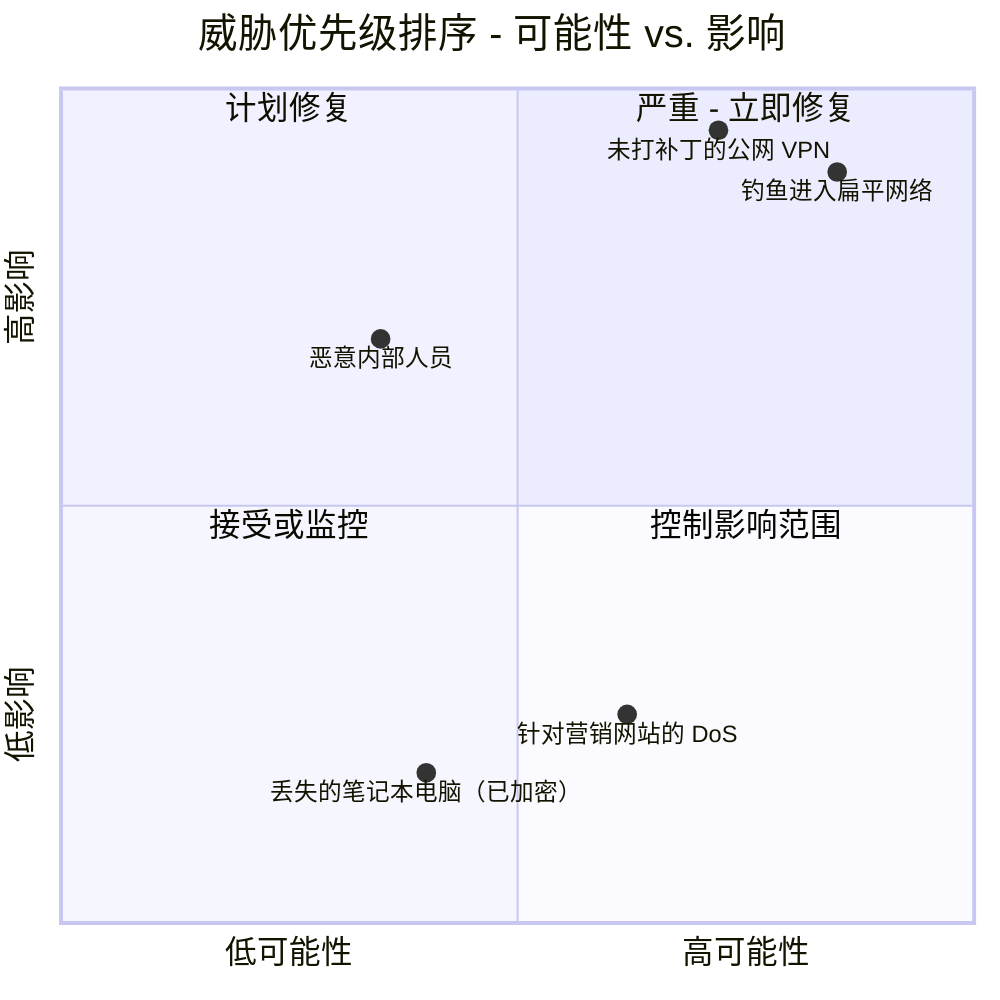
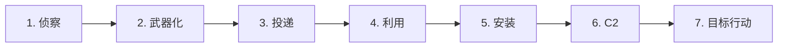
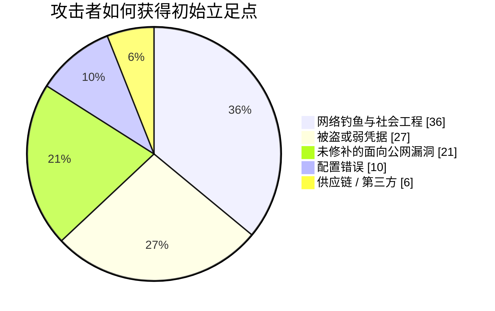
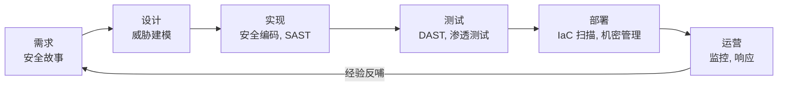

## 系列由此开篇

这是贯穿**安全架构**的五卷本旅程的开篇之作。在整个系列中，我们将走遍从铜缆到容器的整个技术栈，路线图如下：

* **第一卷（本卷）** - 基础：作为攻击面的网络、可防御的设计、深度防御、威胁建模，以及攻击者的方法。
* **第二卷** - [身份、访问与零信任前沿](/posts/identity_and_access_in_depth/)：当边界消融时，身份成为新的边界。
* **第三卷** - [密码学工程](/posts/cryptography_engineering_in_depth/)：让这一切变得可信的底层原语。
* **第四卷** - [检测、响应与威胁情报](/posts/detection_and_response_in_depth/)：当预防失效时你该做什么。
* **第五卷** - [云原生与供应链安全](/posts/cloud_native_and_supply_chain_security_in_depth/)：保护那些转瞬即逝的事物，并证明你交付了什么。

本指南的独特之处在于它的方法。每一个主题都通过**四双眼睛**来审视，因为一个真实的系统会同时被四类工程师争论不休：

* 构建基础的**网络工程师**。
* 必须保护它的**防御者**。
* 试图破解它的**黑客**。
* 编写运行于其上代码的**软件工程师**。

:::note[整个系列的论点]
没有任何单一的控制措施是值得信赖的。防火墙会失效，凭据会泄露，代码有漏洞，依赖会被投毒。因此，安全不是一件你可以买来的产品，而是一种你需要**工程化打造的属性**：每一层都假设它之前的那一层已经失守。本卷构建最外层的防线与心态。系列的其余部分则向内构建。
:::

---

## 第一部分：网络即疆域

数据通信始于网络，攻击亦然。对 OSI 或 TCP/IP 模型的肤浅解读是不够的 [^1]；安全专业人员会把每一层读两遍，一遍读它*做什么*，另一遍读它如何被*反过来利用*。

### 第 1 章：安全视角下的协议栈

每一层都承载着它自身固有的攻击和固有的防御。越往下走，攻陷就越物理、越绝对。

**第一层 - 物理层。** 线缆、光纤与交换机的世界。对黑客而言，*只要能够接触到*，它就是终极攻击向量：在未加密的线路上搭一个网络分路器 [^2]，在防火墙后遗留一个廉价的植入设备作为持久的命令与控制据点，或者干脆把一台笔记本电脑插进大厅里一个还在通电的网络插孔。防御者的答案是程序化和物理化的——上锁的机房、禁用的端口、防篡改封条——并在技术上以 **IEEE 802.1X** 网络访问控制作为支撑，它强制任何物理接入的设备在拿到哪怕一个可用帧之前先进行身份验证 [^3]。

**第二层 - 数据链路层。** MAC 地址、交换机，以及 **ARP**——这个将 IP 映射到 MAC、且在设计之初就带有隐含信任的协议 [^4]。这种信任正是漏洞所在：

这就是 **ARP 欺骗**，它把一个中间人（Man-in-the-Middle）位置交到了攻击者手中，就在本地网段之上 [^5]。它的近亲是 **MAC 洪泛**（用大量帧撑爆交换机的 CAM 表，直到它故障开放、像集线器一样广播一切 [^6]）和 **VLAN 跳跃**（通过配置错误的 Trunk 端口逃离你所在的 VLAN [^7]）。防御者在此的工具箱是交换机卫生：用**端口安全（port security）**将每个端口固定绑定 MAC [^8]，用 **DHCP 侦听（DHCP snooping）**扼杀非法 DHCP 服务器，用**动态 ARP 检测（Dynamic ARP Inspection）**根据可信绑定表丢弃伪造的 ARP。

**第三层 - 网络层。** IP 地址与路由。**IP 欺骗**伪造源地址——它是反射式 DoS（例如经典的 Smurf 攻击）背后的引擎 [^9]——而 **BGP 劫持**篡改互联网的路由表以整批吞噬流量，是一种国家级的间谍与大规模拦截工具 [^10]。防御者进行过滤：遵循 BCP 38 / RFC 2827 的**入站/出站过滤**会丢弃源 IP 撒谎的数据包 [^11]，而 ACL 强制规定谁可以和谁通信。

**第四层 - 传输层。** **TCP**（面向连接，三次握手）与 **UDP**（发射后不管）。**SYN 洪泛**用永远不完成的伪造 SYN 耗尽服务器的半开连接表 [^12]；使用 `nmap` 之类工具的**端口扫描**则绘制出正在监听的攻击面 [^13]。防御者的回应是**有状态防火墙**，它只放行一个它握过手的 ACK，以及 **SYN cookies**，在客户端证明自己真实存在之前不分配任何状态 [^14]。

### 第 2 章：设计一个可防御的网络

**扁平网络**——每台设备都能触及其他每台设备——是黑客的天堂。攻破一台被遗忘的打印机，你就能一路走到域控制器。可防御的网络是**分段的**网络 [^15]。

分段——子网、**VLAN** 和分层的 **DMZ** [^16]——把每一跳都变成一个受监控的咽喉要道。它是以拓扑形式表达的最小特权：Web 服务器根本没有理由去拨打域控制器，所以防火墙禁止它，一台被攻破的 Web 服务器发现自己身处死胡同，而不是高速公路上。

**微分段（Microsegmentation）**把这一点推向逻辑终点：策略边界围绕的是*每一个工作负载*，而非每一个区域。同一子网上的两台虚拟机并不被隐含信任；每一条流量都必须被显式允许。那条原则——*从不信任，始终验证*——正是**零信任**的种子，它成长为下一卷的整个主题。

:::important[第一次交接]
微分段追问的是*"是否应当允许这两个主体通信？"*——一旦你认真对待这个问题，网络地址就不再是一个足够好的答案了。你需要验证**身份**。而这正是**[第二卷](/posts/identity_and_access_in_depth/)**接手的地方：身份作为新的边界。
:::

### 第 3 章：守门人——防火墙与 IDS/IPS

**有状态防火墙**理解连接上下文；**下一代防火墙（NGFW）**则更进一步，具备应用感知能力（在同一个 443 端口上阻断一个应用、放行另一个）、集成的入侵防御和威胁情报馈送 [^17]。**Web 应用防火墙（WAF）**工作在第七层，用以钝化 OWASP Top 10 攻击 [^18]。

:::warning[WAF 是安全网，而非解药]
WAF 或许能阻断一个天真的 `OR 1=1`，但 WAF 规避是一门成熟的学科——编码、混淆和大小写技巧每天都在绕过特征库。针对注入的真正修复存在于代码之中（参数化查询），而非拴在它前面的一个过滤器里。把 WAF 当作深度防御的一环，而绝不要把它当作那道防御本身。
:::

**IDS** 观察并告警；**IPS** 串联在链路中并进行阻断。两者都通过**特征**（对已知威胁精准，对新型威胁盲目）或**异常**（能捕获未知，但会让你淹没在误报中）来进行检测 [^19]。而且，除非你付出解密的代价，两者面对加密流量都会失聪——这预示着为何*检测*最终必须从线路上移到端点之上，这正是第四卷的故事。

---

## 第二部分：深度防御——以及为何它就是本系列

深度防御是对以下事实的认知：任何单一的控制措施*都将*失效，因此你构建层层防线，每一层都为你争取时间、可见性，以及又一次阻止攻击者的机会 [^20]。中世纪城堡是那个老套但完美的类比：护城河、城墙、弓箭手、内堡、皇冠上的明珠，以及把这一切串联起来的守卫。

下面这一手，组织起了整个系列：**城堡的每一层就是一卷。**

* **护城河与外墙**是网络边界与分段——**本卷**。
* **每一扇门口的守卫**是身份与访问——**[第二卷](/posts/identity_and_access_in_depth/)**。
* 守卫所信任的**封缄信件**是密码学——**[第三卷](/posts/cryptography_engineering_in_depth/)**。
* **望风察觉突破的弓箭手**是检测与响应——**[第四卷](/posts/detection_and_response_in_depth/)**。
* **砖石本身的来源出处**是供应链与云原生安全——**[第五卷](/posts/cloud_native_and_supply_chain_security_in_depth/)**。

**黑客的视角：** 攻击者把这些层视为障碍，并搜寻每一层中最薄弱的接缝。如果一名员工点击了钓鱼链接，一道完美的防火墙也一文不值；如果主机未打补丁，无瑕的代码也一文不值。深度之所以重要，恰恰是因为攻击者只需要*一条*路径，而深度正是你确保没有任何单点失败成为那条路径的方式。

---

## 第三部分：威胁建模——刻意像攻击者一样思考

威胁建模是一种结构化的方法，用以在你构建薄弱接缝*之前*就找到它们 [^21]。它是前瞻性的、廉价的，也是一个团队能做的最高杠杆的安全活动之一。经典的助记符是微软的 **STRIDE** [^22]。

设想一个平凡的端点：`PUT /api/users/{id}`。先画出它的数据流图，标出数据从充满敌意的外部跨入你基础设施的那条**信任边界**。

现在，让 STRIDE 走过每一个元素和每一条流量：

| STRIDE 威胁 | 向这个端点提出的问题 | 主要防御 |
|---|---|---|
| **S**poofing（欺骗） | 用户 A 能否更改 `{id}` 去编辑用户 B 的资料？ | 强认证 authN + 逐对象授权 authZ |
| **T**ampering（篡改） | 中间人能否在传输中篡改请求体？ | TLS（第三卷） |
| **R**epudiation（抵赖） | 用户能否否认他做过某项更改？ | 签名的、不可变的审计日志 |
| **I**nformation disclosure（信息泄露） | 响应是否泄露了 PII 或密码哈希？ | 最小化输出，静态加密 |
| **D**enial of service（拒绝服务） | 一个客户端能否洪泛它并饿死数据库？ | 速率限制、配额 |
| **E**levation of privilege（特权提升） | 是否存在通往管理员的注入路径？ | 参数化查询、最小特权 |

大多数真实世界的入侵始于那张表的两端：**欺骗**（认证被破坏）和**特权提升**。最常见的单一 Web 缺陷——**不安全的直接对象引用（IDOR）**——不过是披着一个 URL 外衣的欺骗：应用信任了用户提供的 `{id}`，却没有检查*这个*用户是否可以触碰*那个*对象 [^23]。

枚举威胁只完成了一半的工作；你无法修复一切，所以你按**可能性 × 影响**排序，把预算花在两者乘积最高的地方。

下面是同一套方法，作为一个你可以在一小时设计会议里运行的可重复循环：

:::steps

:::step[分解系统]{subtitle="绘制数据流图"}
标出每一个进程、数据存储、外部实体和流量。显式地画出**信任边界**——它们正是攻击从不受信任跨入受信任的地方，也是你大部分发现会聚集之处。如果你画不出它，你对它的理解就还不足以保护它。
:::

:::step[用 STRIDE 枚举威胁]{subtitle="要系统化，别耍聪明"}
让欺骗、篡改、抵赖、信息泄露、拒绝服务和特权提升走过每一个元素。助记符的意义，就在于阻止你跳过那个你宁愿不去想的类别。
:::

:::step[按可能性与影响排序]{subtitle="把资源花在刀刃上"}
把每个威胁标在风险矩阵上。一个灾难性但不可能发生的威胁，和一个微不足道但持续不断的威胁，都在浪费你的注意力。优先为右上象限投入资源。
:::

:::step[缓解，然后验证]{subtitle="把发现转化为测试"}
每一个被接受的威胁都变成一项工程任务*以及*一个测试用例——一个授权 authZ 集成测试、一个速率限制检查、一个模糊测试目标。一个没有改变待办清单的威胁模型，只是一场表演。
:::

:::

---

## 第四部分：攻击者的方法

要打破这条链条，你必须先看见它。洛克希德·马丁的**网络杀伤链（Cyber Kill Chain）**把一次典型的入侵建模为七个阶段；防御者的目标是尽可能*早地*打破它，因为修复成本在每一步都在攀升 [^24]。

侦察将**被动 OSINT** 与**主动**探测（端口扫描、DNS 枚举、Shodan 扫荡）融为一体。武器化与投递构建并送出载荷——绝大多数是通过**网络钓鱼**，它仍是头号入侵途径：

在**利用**与**安装**之后，攻击者通过一条 **C2** 通道"回拨"，并开始**目标行动**。取得立足点之后，其手法转向保持安静：

* **横向移动** - 从第一台主机跳向皇冠上的明珠。在 Windows 域中，这意味着从内存中导出凭据并复用它们，通常通过**哈希传递（Pass-the-Hash）**，无需明文密码。
* **持久化** - 用一个能够再生的立足点，熬过重启和补丁。
* **借地取材（Living off the Land, LotL）** - 完全避免使用定制恶意软件；转而使用 `PowerShell`、`PsExec` 以及主机上已经受信任的其他工具，从而使一切看起来都无异常。

:::caution[为何仅靠边界永远无法取胜]
LotL 正是第一卷的城墙必要但不充分的原因。一个只使用合法、已签名的系统工具的攻击者，不会抛出任何可供防火墙或杀毒软件匹配的特征。捕获他们需要观察*行为*——一个 Word 文档衍生出 PowerShell，PowerShell 又打开一个网络套接字——而这正是**[第四卷](/posts/detection_and_response_in_depth/)**及其攻击者行为地图 **MITRE ATT&CK** 的领地。预防假设你能把他们挡在外面。检测则假设你没能做到。
:::

---

## 第五部分：设计即安全（Secure by Design）

最廉价的漏洞是那个从未被写出来的漏洞。**左移（Shifting left）**意味着把安全移到生命周期更早的阶段，在那里一处修复的代价是一次代码评审，而不是一次安全事件 [^25]。

在这条流水线之下，坐落着少数几条早于云、也将比云更长寿的原则——由 Saltzer 与 Schroeder 阐明的永恒设计法则 [^26]：

* **最小特权** - 每一个主体只获得它所需的最小访问权限，绝不多给。
* **故障安全默认（Fail-safe defaults）** - 默认拒绝；按例外授予。
* **完全仲裁（Complete mediation）** - 检查每一次访问，每一次都检查，而不仅是第一次。
* **机制经济性（Economy of mechanism）** - 让安全关键部分保持得足够小，以便审计。
* **深度防御** - 贯穿整个系列的主线。

这些是恒量。而你如何满足它们的*具体细节*，才是系列其余部分的所在，第一卷刻意把它们逐一交接出去，而非重复叙述：

* 认证、授权、会话管理与机密——**[第二卷](/posts/identity_and_access_in_depth/)**。
* "永远不要自制加密"、TLS 究竟如何工作，以及如何管理密钥——**[第三卷](/posts/cryptography_engineering_in_depth/)**。
* SOC、SIEM/SOAR、威胁狩猎，以及当一项控制失效时你所运行的事件响应生命周期——**[第四卷](/posts/detection_and_response_in_depth/)**。
* 容器与 Kubernetes 加固、IaC 扫描、SBOM，以及防御依赖供应链（还记得 **Log4Shell** [^27]）——**[第五卷](/posts/cloud_native_and_supply_chain_security_in_depth/)**。

:::tip[值得延续的思维模型]
把后续每一卷都当作对这里所提出的某个问题的更深回答来读。第一卷追问*"我们如何把攻击者挡在外面并拖慢他们？"*——而每一个答案最终都会承认自身的局限，那正是下一卷开篇的问题。这条由诚实的局限串成的链条，就是这个系列。
:::

---

## 结论与前路

我们从物理层出发——一根线缆、一台交换机、一个伪造的 ARP 应答——一路攀登到一场设计会议，四位工程师在那里为一张数据流图争论不休。一路走来，我们构建了外层防御：一个分段的、可防御的网络；假设彼此都会失效的层层控制；一套在攻击者之前就找到薄弱接缝的可重复方法；以及一个对那个攻击者究竟如何行动的清醒模型。

现代系统工程师必须是一位通才——对数据包和应用逻辑、对防火墙规则和容器清单一并推理，同时以构建者、防御者和破坏者的思维去思考。安全不是你添加的一项功能。它是一个系统的属性：在每一层都经过工程化打造，以便在它旁边那一层失效时依然存活下去。

我们在本卷中筑起了城墙。但就在笔记本电脑被带回家、服务器搬进别人的数据中心、API 跨越开放的互联网相互调用的那一刻，城墙便不再描述现实。你曾保护的那个"内部"消融成了一群主体——人、服务、设备、工作负载——每一个都请求做某件事，每一个都需要证明自己是谁、可以触碰什么。

那正是**[第二卷 - 身份、访问与零信任前沿](/posts/identity_and_access_in_depth/)**的起点。**身份是新的边界**，而每一个请求都是一次过境。我们那里见。

---

## 参考文献

[^1]: [Cloudflare - What is the OSI Model?](https://www.cloudflare.com/learning/ddos/glossary/open-systems-interconnection-model-osi/)
[^2]: [Krebs, B. (2012) - The Growing Threat From Tiny, Silent Network Taps](https://krebsonsecurity.com/2012/03/the-growing-threat-from-tiny-silent-network-taps/)
[^3]: [Cisco - What Is 802.1X?](https://www.cisco.com/c/en/us/products/security/what-is-802-1x.html)
[^4]: [Microsoft (2021) - Address Resolution Protocol](https://learn.microsoft.com/en-us/windows-server/administration/performance-tuning/network-subsystem/address-resolution-protocol)
[^5]: [OWASP - Address Resolution Protocol Spoofing](https://owasp.org/www-community/attacks/ARP_Spoofing)
[^6]: [Imperva - MAC Flooding](https://www.imperva.com/learn/application-security/mac-flooding/)
[^7]: [Cisco - VLAN Hopping Attack](https://www.cisco.com/c/en/us/td/docs/switches/lan/catalyst4500/12-2/15-02SG/configuration/guide/config/dhcp.html)
[^8]: [GeeksforGeeks (2023) - Port Security in Computer Networks](https://www.geeksforgeeks.org/port-security-in-computer-networks/)
[^9]: [Cloudflare - Smurf DDoS Attack](https://www.cloudflare.com/learning/ddos/smurf-ddos-attack/)
[^10]: [Cloudflare - What is BGP hijacking?](https://www.cloudflare.com/learning/security/glossary/bgp-hijacking/)
[^11]: [IETF (2000) - RFC 2827: Network Ingress Filtering](https://datatracker.ietf.org/doc/html/rfc2827)
[^12]: [Cloudflare - SYN Flood Attack](https://www.cloudflare.com/learning/ddos/syn-flood-ddos-attack/)
[^13]: [Nmap - Official Nmap Project Site](https://nmap.org/)
[^14]: [Wikipedia - SYN cookies](https://en.wikipedia.org/wiki/SYN_cookies)
[^15]: [SANS Institute (2016) - Implementing Network Segmentation](https://www.sans.org/white-papers/37232/)
[^16]: [Palo Alto Networks - What is a DMZ?](https://www.paloaltonetworks.com/cyberpedia/what-is-a-dmz)
[^17]: [Palo Alto Networks - What is a Next-Generation Firewall (NGFW)?](https://www.paloaltonetworks.com/cyberpedia/what-is-a-next-generation-firewall-ngfw)
[^18]: [OWASP - OWASP Top 10](https://owasp.org/www-project-top-ten/)
[^19]: [SANS Institute (2001) - Understanding Intrusion Detection Systems](https://www.sans.org/white-papers/27/)
[^20]: [NSA (2021) - Defense in Depth](https://www.nsa.gov/portals/75/documents/what-we-do/cybersecurity/professional-resources/csg-defense-in-depth-20210225.pdf)
[^21]: [OWASP - Threat Modeling](https://owasp.org/www-community/Threat_Modeling)
[^22]: [Microsoft (2022) - The STRIDE Threat Model](https://learn.microsoft.com/en-us/azure/security/develop/threat-modeling-tool-threats)
[^23]: [OWASP - A01:2021 Broken Access Control (IDOR)](https://owasp.org/Top10/A01_2021-Broken_Access_Control/)
[^24]: [Lockheed Martin - The Cyber Kill Chain](https://www.lockheedmartin.com/en-us/capabilities/cyber/cyber-kill-chain.html)
[^25]: [OWASP - Shift Left](https://owasp.org/www-community/Shift_Left)
[^26]: [Saltzer & Schroeder (1975) - The Protection of Information in Computer Systems](https://www.cs.virginia.edu/~evans/cs551/saltzer/)
[^27]: [CISA - Apache Log4j Vulnerability Guidance](https://www.cisa.gov/uscert/apache-log4j-vulnerability-guidance)
</content>
</invoke>
