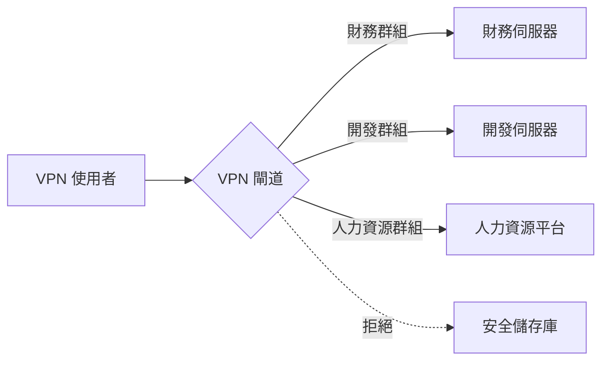

## 0.0 執行摘要：為何在零信任時代 VPN 依然重要

在現代企業中，「邊界」已在很大程度上消失。然而，虛擬私人網路 (VPN) 仍然是基礎設施管理、安全管理員存取以及舊版應用程式橋接的關鍵工具。本指南專為 300 位使用者環境設計，此規模已無法進行手動管理，但又未達「大規模企業」解決方案的程度。

我們將 **WireGuard** 作為主要協議，因為它具有高效能、現代密碼學原語和簡化的程式碼庫，同時也承認 OpenVPN 和 IPsec 在特定使用場景中的作用。

## 0.1 如何閱讀本指南

本文檔將逐步建構一個技術堆疊。我們將從高階概念模型推進到低階實施細節和營運執行手冊。

- **第 1.0–3.0 節：** 基礎概念（「是什麼」）。
- **第 4.0–8.0 節：** 架構與設計（「為什麼」）。

- **第 9.0–13.0 節：** 身份與安全（「如何做」）。
- **第 14.0–18.0 節：** 進階工程與擴展（「難點」）。

- **附錄：** 實際組態範本與疑難排解。

:::tip[操作者觀點]
VPN 本身並非安全解決方案；它是一個 **傳輸層**，應由強大的身份提供者 (IdP) 和嚴格的出口策略來管理。切勿在您的通道內允許「任意/任意」路由。
:::

---

## 1.0 VPN 基礎知識：加密疊加層

核心而言，VPN 透過不可信的有線網路建立一個虛擬點對點連線。在企業環境中，這通常涉及用戶端裝置（筆記型電腦、手機）與中央閘道之間的加密通道。

### 1.1 連線生命週期

當使用者啟動 VPN 連線時，會發生以下順序：

1. **身份驗證：** 用戶端證明其身份（通常透過憑證或支援 MFA 的認證資料）。
2. **金鑰交換：** 用戶端和伺服器使用 Diffie-Hellman 或 Noise 等協議協商會話金鑰。
3. **通道建立：** 在兩端建立虛擬網路介面（例如 `wg0` 或 `tun0`）。
4. **路由注入：** 更新系統路由表，將特定 IP 範圍透過虛擬介面傳送。
5. **封裝：** 外送封包被封裝在外部標頭（UDP/TCP）中，進行加密，然後傳送至閘道。
6. **解封：** 閘道解開封包並將其轉送至內部目的地。

### 1.2 封裝與額外負荷

每次將封包封裝到 VPN 通道時，都會增加位元組數。

- **WireGuard 額外負荷：** 32 位元組（IP 標頭 + UDP 標頭 + WireGuard 標頭）。
- **OpenVPN 額外負荷：** 60-80 位元組（因加密演算法和傳輸而異）。
如果您的標準網際網路連線有 1500 位元組（MTU）的限制，而 VPN 增加了 32 位元組，那麼您在通道內的實際資料限制為 1468。如果您忽略這一點，您的封包將被「片段化」，導致速度緩慢和網站損壞。

---

## 2.0 網路工程師的硬核術語

要設計專業系統，您必須掌握封包流程和密碼學的語言：

- **傳輸層（UDP 與 TCP）：** VPN 嚴格偏好 UDP。TCP-on-TCP（TCP Meltdown）在封包遺失期間會導致災難性的效能下降，因為兩個層級都嘗試重新傳送。
- **MTU（最大傳輸單元）：** 封包大小的物理限制（通常為 1500 位元組）。由於 VPN 會新增標頭（額外負荷），因此內部 MTU 必須較低（例如，WireGuard 為 1420），以避免片段化。

- **MSS 鉗制：** 路由器用於攔截 TCP 握手並將「最大區段大小」鉗制在 VPN 降低的 MTU 範圍內的一種技術，可防止標頭符合但資料負載不符合的「黑洞」連線。
- **PFS（完美前向保密）：** 即使長期金鑰被洩露，過去的會話金鑰也不會受到影響的屬性。每個會話都使用唯一的臨時金鑰。

- **分割通道：** 僅透過 VPN 路由公司流量（例如 `10.0.0.0/8`），同時透過使用者的本機 ISP 路由 Netflix/YouTube。對於頻寬節省至關重要。
- **全通道（強制通道）：** 透過 VPN 路由所有流量。對於高合規性環境是必需的，以確保所有網路流量都通過公司 DNS 和 DLP（資料遺失防護）篩選器。

- **CGNAT（電信級 NAT）：** 當 ISP 與多個使用者共用一個公共 IP 時。這通常會破壞 IPsec 等傳統 VPN，但 WireGuard 可以很好地處理。
- **完美前向保密（PFS）：** 如果您的伺服器長期私鑰今天被盜，攻擊者無法解密他們昨天記錄的會話。每次握手都會產生動態的一次性會話金鑰。

---

## 3.0 協定深度解析：WireGuard 與其他協議的比較

對於 300 位使用者，您的協議選擇將決定未來三年的維護開銷。

### 3.1 WireGuard（黃金標準）

- **優點：** 約 4,000 行程式碼（可審查），最先進的密碼學（ChaCha20, Poly1305），近乎即時的握手，極高的輸送量。
- **缺點：** 設計上是無狀態的（需要手動管理或協調層，如 NetBird, Tailscale, 或 Firezone，適用於 300+ 使用者）。

- **適用於：** 專注於效能的團隊、行動使用者和現代 Linux/雲端環境。

### 3.2 OpenVPN（傳統主力）

- **優點：** 無與倫比的靈活性，支援 TCP（繞過嚴格防火牆），幾乎可以在任何設備上運行。
- **缺點：** 龐大的程式碼庫（60 萬行以上），緩慢的上下文切換（使用者空間 vs 核心空間），複雜的憑證管理。

- **適用於：** 需要嚴格基於 TLS 的合規性或舊硬體支援的環境。

### 3.3 IKEv2/IPsec（原生選擇）

- **優點：** 高效能，Windows、iOS 和 macOS 原生支援，無需額外應用程式。
- **缺點：** 配置錯誤的難度極高；「IPsec」有許多不相容的變體。

- **適用於：** 無法將第三方客戶端推送到使用者的「零安裝」部署。

---

## 4.0 架構：為 300 位使用者進行設計

擴展到 300 位使用者時，您無法再依賴單一執行 bash 腳本的 Linux 機器。您需要一個能夠在週五下午硬體故障後仍然能夠運行的架構。

### 4.1 高可用性 (HA) 組

部署兩個 VPN 閘道，採用主動-被動或主動-主動配置。

- **Keepalived/VRRP：** 使用虛擬 IP（VIP）。如果閘道 A 故障，閘道 B 將在幾秒鐘內接管 VIP。
- **狀態同步：** 對於 IPsec 等協議，您可能需要同步會話狀態，以便使用者在故障轉移期間不會中斷連線。（WireGuard 是「靜默」的，可即時重新連線，這使其更容易）。

### 4.2 「每個洲的閘道」模型

對於分散式工作場所，倫敦的單一閘道會讓東京的使用者感到沮喪。

- **Anycast IP：** 使用基於雲端的 Anycast 服務，將使用者路由到最近的健康 VPN 節點。
- **地理 DNS：** 根據使用者的位置，將 `vpn.company.com` 解析為不同的區域 IP。

### 4.3 彈性擴展（雲端原生方式）

在 AWS 或 Azure 中，將您的 VPN 閘道置於 **自動擴展組** 中。如果 CPU 使用率超過 70%，雲端將自動啟動第三個閘道。這需要外部狀態儲存（如 Redis）或協調層來在節點之間共用使用者金鑰。

---

## 5.0 安全目標：「五大支柱」

在上線之前，您的實施必須證明其符合這些標準：

1. **身份優先存取：** 沒有人在 IdP（例如 Entra ID、Okta、Google Workspace）中沒有有效記錄，就無法進入。
2. **密碼學完整性：** 僅使用現代密碼。停用 RSA-2048、SHA-1 和 3DES。
3. **橫向移動防制：** 預設為「拒絕所有」。`Marketing` 群組的使用者不應能夠 ping `Database` 子網路。
4. **端點狀態：** 在允許通道建立之前，檢查連接裝置是否已啟用磁碟加密並啟用防毒軟體。
5. **可見性：** 每次連線、斷線和失敗的握手都必須記錄到中央 SIEM（安全資訊與事件管理）系統。

---

## 6.0 VPN 閘道的威脅模型

VPN 閘道是巨大的目標。如果它被攻陷，攻擊者就「進來」了。

### 6.1 內部威脅（「潛伏的系統管理員」）

- **風險：** IT 人員為其個人筆記型電腦創建「後門」靜態金鑰。
- **緩解：** 每次會話強制執行 MFA。無一例外。記錄所有金鑰生成事件並每週審核。使用「即時」（JIT）存取進行管理任務。

### 6.2 外部威脅（「認證填充器」）

- **風險：** 攻擊者找到洩漏的密碼，並以 VP 的身份登入。
- **緩解：** 裝置綁定。僅當密碼和特定的硬體憑證/裝置 ID 都存在時，VPN 才能工作。在身份驗證端點實施速率限制。

### 6.3 基礎設施威脅（「DDoS」）

- **風險：** UDP 洪水攻擊使 VPN 對所有人無法使用。
- **緩解：** WireGuard 的「Cookie」機制用於 DoS 防護。它會忽略沒有有效 MAC 的封包，直到證明握手成功。使用雲端 WAF（Web 應用程式防火牆）在邊緣篩選惡意流量。

---

## 7.0 路由和子網路設計（中等難度）

有效的路由可防止效能瓶頸並簡化安全規則。

### 7.1 避免子網路衝突

許多家用路由器使用 `192.168.1.0/24`。如果您的公司網路也使用該範圍，使用者將無法存取內部資源，因為他們的電腦認為流量是「本地」到他們的家中。

- **標準化使用 `10.x.x.x` 或 `172.16.x.x` 空間。**
- **使用唯一的區段作為 VPN 集區**（例如 `100.64.0.0/10` - 電信級 NAT 範圍）以避免重疊。

### 7.2 NAT 陷阱

如果您在所有人進入網路時將其 NAT 到單一 IP，您的防火牆日誌將顯示所有流量都來自「VPN 伺服器」。您將失去查看 *哪個* 使用者存取了 *哪個* 伺服器的能力。

- **解決方案：** 直接路由 VPN 子網路。確保內部伺服器具有返回 VPN 閘道的路由以處理這些 IP。

---

## 8.0 全通道 vs 分割通道：深入的上下文分析

此決定通常是政治性的，而非技術性的。

### 8.1 全通道的優勢

- **安全性：** 您可以將所有網路流量強制通過安全閘道（SWG）。這可以防止使用者在公司時間訪問網路釣魚網站或下載惡意軟體。
- **隱私性：** 它可以在公共 Wi-Fi（旅館、咖啡館）上保護使用者流量免受竊聽。

- **合規性：** 許多行業（金融、健康）要求全通道以符合資料保護法規。

### 8.2 分割通道的優勢

- **效能：** Zoom/Teams 通話不需要經過您的資料中心然後再回傳；讓它們直接連線到網際網路。
- **成本：** 您無需為使用者午休時觀看 4K YouTube 的頻寬付費。

- **硬體負擔：** 您的 VPN 閘道不必處理數 GB 的無害流量（如 Netflix）。

:::caution[混合中間地帶]
大多數現代企業使用 **包含式分割**。包含您的內部 CIDR 範圍（例如 `10.0.0.0/8`）和特定的 SaaS IP，但將其餘世界留給本機 ISP。
:::

---

## 9.0 身份架構：將 VPN 與現實連結

對於 300 位使用者，您無法管理閘道上的本機 Linux 使用者。您需要一個身份橋樑。

### 9.1 身份迴路

1. **用戶端應用程式** 要求登入。
2. **閘道** 將使用者重新導向至 OIDC/SAML 登錄頁面（Okta/Entra ID）。
3. **使用者** 完成 MFA（FIDO2、驗證器應用程式）。
4. **IdP** 將一個令牌（JWT）送回閘道。
5. **閘道** 生成一個短期的 WireGuard 金鑰並將其推送到用戶端。

### 9.2 MFA 實施策略

- **避免 SMS：** 它容易受到 SIM 卡交換和 SS7 攔截的攻擊。
- **偏好 TOTP 或 WebAuthn：** 如果您對安全性是認真的，則需要硬體金鑰（Yubikey）才能存取 VPN。FIDO2 是現代身份驗證安全性的頂峰。

---

## 10.0 存取控制清單 (ACL) 和微分割

VPN 不應該是一個「平面」網路。



### 10.1 實施 RBAC

- 將 IdP 群組對應到網路標籤。
- 如果您使用 **WireGuard**，請使用 **NetBird** 或 **Tailscale** 等工具透過 Web UI 定義這些規則。

- 如果您使用 **Linux/Iptables**，則需要一個動態腳本，在使用者連接時更新規則。這通常被稱為「動態防火牆策略」。

---

## 11.0 監控與日誌記錄：成為「天空之眼」

如果有人問「誰在凌晨 2 點存取了備份伺服器？」，您的 VPN 日誌必須有答案。

### 11.1 重要的追蹤指標

- **並行會話：** 我們是否達到了硬體 CPU/RAM 的極限？
- **每位使用者的資料輸送量：** 是否有人正在外洩資料（與其職位相比異常高的上傳量）？

- **握手延遲：** 身份驗證伺服器是否緩慢？
- **丟失的封包：** 表明 MTU 問題或 ISP 節流。

### 11.2 SIEM 整合

將您的日誌串流到 Elasticsearch、Splunk 或 Azure Monitor。尋找「不可能的旅行」——使用者在紐約登入，然後在 10 分鐘後在法蘭克福登入。這是會話令牌被盜的主要指標。

---

## 12.0 解決 MTU/MSS 的煩惱（難）

這是 VPN 幫助台工單的頭號原因。使用者連接成功，但無法打開大型網站或發送電子郵件。

### 12.1 「死亡 ping」測試

如果您的 VPN 已啟動但資料卡住，請執行：
`ping -M do -s 1400 10.0.0.1` (在 Linux 上) 或 `ping 10.0.0.1 -f -l 1400` (在 Windows 上)。
持續降低 `1400` 直到 ping 成功。這就是您的路徑 MTU。

### 12.2 修復方法

- 將 WireGuard MTU 設定為 `1280`（IPv6 最安全的最小值）。
- 在您的閘道上啟用 MSS 鉗制：
    `iptables -t mangle -A FORWARD -p tcp --tcp-flags SYN,RST SYN -j TCPMSS --clamp-mss-to-pmtu`
這可確保您的伺服器在遠端伺服器甚至到達 VPN 通道之前就告訴其縮小封包。

---

## 13.0 高可用性與負載平衡（難）

為了在沒有停機時間的情況下支援 300 位使用者，您需要冗餘。

### 13.1 循環 DNS

最簡單的形式。將 `vpn.company.com` 指向三個不同的 IP 位址。用戶端隨機選擇一個。如果一個失敗，使用者可能需要重新連線 2-3 次才能獲得一個「實時」伺服器。

### 13.2 TCP/UDP 負載平衡器

使用雲端負載平衡器（如 AWS NLB 或 Azure Load Balancer）。它會執行健康檢查，並僅將流量發送到正常的閘道。注意：這對於 WireGuard 來說可能很棘手，因為它是無連接的（UDP）。您必須使用基於來源 IP 的「會話粘性」。

---

## 14.0 VPN 的災難恢復 (DR)

如果您的主要資料中心出現問題，會發生什麼？

- **雲端備份：** 始終在不同的雲端區域（例如 AWS vs GCP）有一個「冷備用」閘道。
- **配置即代碼：** 將您的 VPN 配置儲存在 Git 中。如果伺服器損壞，您應該能夠在 5 分鐘內使用 Terraform 或 Ansible 啟動一個新的伺服器。「不可變性」是您在 DR 中的最佳助手。

- **緊急金鑰：** 在保險箱中保留一組物理「玻璃破碎」金鑰，以防 IdP 本身出現故障。

---

## 15.0 營運卓越：開發人員體驗

一個安全但難以使用的 VPN 將被您最優秀的工程師繞過。

- **自動連線：** 配置用戶端在使用者不在公司辦公室 Wi-Fi 時自動開啟。
- **SSO 整合：** 一鍵登入。使用者無需管理獨立的密碼或複雜的金鑰檔案。

- **靜默更新：** 使用 MDM（Jamf, InTune）推送用戶端更新，無需打擾使用者。
- **友善的主機名稱：** 確保您的內部 DNS（例如 `jira.int.company.com`）在 VPN 上工作，這樣使用者就不必記住 IP 位址。

---

## 16.0 合規性與審計（「乏味」但至關重要）

如果您受到 SOC2、HIPAA 或 GDPR 的約束，您的 VPN 是關鍵控制項。

- **審計記錄：** 記錄每次系統管理員更改 ACL 的時間。
- **會話終止：** 自動在 12 或 24 小時後將使用者踢出，強制進行 MFA 重新身份驗證。這可以防止在被盜筆記型電腦上出現「永恆通道」。

- **資料駐留：** 如果您在歐盟，請確保您的 VPN 閘道不會將流量路由到非合規司法管轄區的節點（例如某些美國資料中心）。

---

## 17.0 核心層級效能優化

為了達到最大速度，請調整您的閘道上的 Linux 核心。這些更改可讓伺服器每秒處理 10,000+ 封包而不會出現問題。

```bash
# 增加封包佇列長度
sysctl -w net.core.netdev_max_backlog=5000
# 增加接收/發送緩衝區大小（16MB）
sysctl -w net.core.rmem_max=16777216
sysctl -w net.core.wmem_max=16777216
# 為 TCP 啟用 BBR（瓶頸頻寬和往返傳播時間）
sysctl -w net.core.default_qdisc=fq
sysctl -w net.ipv4.tcp_congestion_control=bbr
```

### 17.1 多佇列支援

現代伺服器有 16+ 個 CPU 核心。WireGuard 預設情況下處理得很好，但請確保您的伺服器 NIC（網路介面卡）已配置為將中斷請求（IRQs）分配到所有核心。檢查 `/proc/interrupts` 以驗證。如果所有中斷都命中核心 0，您的效能將停滯不前。

---

## 18.0 未來證明：ZTNA 與後 VPN 時代

該行業正朝著零信任網路存取 (ZTNA) 發展。

- **概念：** 與其向使用者提供「網路存取」，不如透過反向代理為他們提供「應用程式存取」。
- **時間表：** 開始將基於 Web 的應用程式遷移到 ZTNA（Cloudflare Tunnel, Zscaler, Pomerium），同時保留 VPN 以供胖用戶端應用程式和伺服器管理。VPN 成為「管理平面」，而 ZTNA 成為「使用者平面」。

---

## 19.0 疑難排解場景：真實世界的教訓

### 場景 A：「緩慢的視訊通話」

**症狀：** 使用者說 Zoom 在家庭 Wi-Fi 上工作正常，但在 VPN 上會卡頓。
**診斷：** 使用者處於「長肥管道」（高延遲，高頻寬）。標準 TCP 擁塞控制（Cubic）在此處失敗，因為它將延遲視為擁塞的跡象。

**修復：** 將閘道切換到 BBR（如第 17.0 節所示）。BBR 測量實際頻寬並能更優雅地處理延遲。

### 場景 B：「僵屍會話」

**症狀：**儀表板顯示使用者已連接，但使用者表示他們在 4 小前已斷開連接。
**診斷：** 用戶端的網際網路突然中斷（進入電梯的通道），並且閘道從未收到「再見」封包。由於 UDP 是無連接的，伺服器會保持會話處於活動狀態。

**修復：** 降低 `PersistentKeepalive` 並實施伺服器端「死對等偵測」（DPD）超時 10 分鐘。

### 場景 C：「內部站點無限載入」

**症狀：** 頁面標題出現在瀏覽器標籤中，但頁面內容從未載入。
**診斷：** MTU 不匹配。小的握手封包可以通過，但大的資料封包（HTML/圖片）被中間的路由器丟棄。

**修復：** 在閘道上實施 MSS 鉗制（第 12.2 節）。

---

## 20.0 Linux、Mac 和 Windows CLI 快速入門

### 20.1 Linux（用戶端）

```bash
# 安裝
sudo apt install wireguard
# 組態
sudo nano /etc/wireguard/wg0.conf
# 啟動
sudo wg-quick up wg0
```

### 20.2 macOS（用戶端）

使用官方 Mac App Store 應用程式以獲得最佳體驗，或使用 Homebrew 進行 CLI：

```bash
brew install wireguard-tools
sudo wg-quick up ./myconfig.conf
```

### 20.3 Windows（用戶端）

使用 `wireguard.com` 的官方 MSI 安裝程式。它會安裝一個系統服務，允許非管理員切換 VPN 開關（如果正確配置）。

---

## 附錄 A：WireGuard 基本伺服器配置（Ubuntu 22.04）

```ini
# /etc/wireguard/wg0.conf
[Interface]
PrivateKey = <SERVER_PRIVATE_KEY>
Address = 10.0.0.1/24
ListenPort = 51820

# 強制 MTU 以避免片段化
MTU = 1420

# PostUp/PostDown 用於路由
PostUp = iptables -A FORWARD -i %i -j ACCEPT; iptables -t nat -A POSTROUTING -o eth0 -j MASQUERADE
PostDown = iptables -D FORWARD -i %i -j ACCEPT; iptables -t nat -D POSTROUTING -o eth0 -j MASQUERADE

[Peer]
# 員工 1
PublicKey = <CLIENT_PUBLIC_KEY>
AllowedIPs = 10.0.0.2/32
```

## 附錄 B：進階 Linux 用戶端設定

```bash
# 生成金鑰
wg genkey | tee privatekey | wg pubkey > publickey
# 建立組態
sudo nano /etc/wireguard/wg0.conf
# 永久啟動服務
sudo systemctl enable --now wg-quick@wg0
```

## 附錄 C：疑難排解檢查清單

1. **無法連接？** -> 檢查公司防火牆上是否已開啟 UDP 連接埠 51820。
2. **已連接但無法上網？** -> 檢查 `sysctl net.ipv4.ip_forward` 是否設定為 `1`。
3. **效能緩慢？** -> 將 MTU 降低到 `1280`。
4. **特定應用程式失敗？** -> 檢查 MSS 鉗制規則。
5. **DNS 失敗？** -> 確保用戶端上的 `/etc/resolv.conf` 指向內部 DNS 伺服器，或在 `wg0.conf` 中使用 `DNS = 10.0.0.1` 指令。

---

## 結論：架構師的最終思考

為 300 位使用者建置 VPN 是 **安全性**、**隱私性** 和 **易用性** 之間的一種平衡。透過選擇現代協議如 WireGuard，自動化您的身份流程，並尊重網路規則（MTU/MSS），您可以建置一個對使用者來說看不見、但對攻擊者來說卻是無法穿透的系統。

最成功的 VPN 是沒有人知道它在運行的 VPN。保持警惕，保持日誌記錄，並始終在需要之前測試您的故障轉移。

---

## 21.0 加密組態進階設定，以確保安全通道

雖然 WireGuard 和 IPsec 開箱即用提供強大的安全性，但企業環境通常需要明確的密碼學加固，以滿足 FIPS 140-2 或 NIST 指南等法規標準。

### 21.1 密碼套件選擇（現代堆疊）

在量子計算潛力不斷增加的世界中，選擇正確的密碼至關重要：

- **KEM（金鑰封裝機制）：** 開始研究後量子演算法，如 **Kyber** 或 **McEliece**。雖然尚未在大多數 VPN 用戶端中標準化，但它們在某些 WireGuard 分支中已達到「實驗性支援」階段。
- **AEAD（帶有相關數據的身份驗證加密）：** 始終使用 AEAD 兼容的密碼，如 **ChaCha20-Poly1305** 或 **AES-GCM**。這些密碼在單次傳輸中提供機密性和完整性，可防止「密文可塑性」攻擊。

### 21.2 Noise 協議框架

WireGuard 是基於 **Noise 協議框架** 建置的。該框架支援「1-RTT」握手，這意味著連線可以在一次往返中建立。這就是為什麼 WireGuard 比舊協議所需的「4 向握手」感覺明顯更快的原因。

---

## 22.0 雲端原生 VPN 整合（AWS、GCP、Azure）

如果您的 300 位使用者主要存取公共雲中的資源，那麼您的 VPN 架構應反映這一點。

### 22.1 AWS Transit Gateway (TGW)

與其讓每個使用者連接到 VPC 中的閘道，不如將他們連接到與 Transit Gateway 關聯的 **AWS Client VPN**。

- **優點：** Transit Gateway 作為所有 VPC 的中央路由器。您建立的任何新 VPC 都無需重新配置閘道即可立即從 VPN 存取。
- **安全性：** 您可以將安全群組應用於 TGW 連接，從而建立一個中央控制點。

### 22.2 Azure Virtual WAN

對於深度投入 Microsoft 365 和 Azure 的組織，**Azure Virtual WAN** 提供全球性的「分支到雲端」連線模型。

- **點對站（P2S）：** 這是 Azure 對使用者到閘道 VPN 的稱呼。它支援 OpenVPN 和 IKEv2，並與 Microsoft Entra ID（前身為 Azure AD）進行原生整合以實現 MFA。

---

## 23.0 管理 VPN 延遲：物理定律

無論您的伺服器多麼快，您都無法超越光速。但是，您可以優化「最後一哩」和「中間一哩」。

### 23.1 減少握手延遲

在高延遲區域（例如，南美使用者連接到維吉尼亞伺服器），握手中的每一次額外往返都會增加 500 毫秒的等待時間。

- **解決方案：** 使用需要最少往返次的 UDP 協議（WireGuard）。絕對避免使用基於 TCP 的 VPN。

### 23.2 「中間一哩」優化

大型雲端提供者（AWS、Cloudflare、Google）擁有私人光纖骨幹網，其速度比公共網際網路快 30-40%。

- **技術：** 讓使用者連接到其家中附近的「本機」入口點（PoP）。該 PoP 然後透過提供者的私人骨幹網將流量傳輸到您的中央資料中心。這是 **Tailscale**（透過其 DERP 中繼）和 **Cloudflare Warp** 速度的秘密。

---

## 24.0 結論：關於韌性的最後一句話

歸根結底，為 300 位使用者建置 VPN 是 **任務關鍵基礎設施** 的一部分。如果 VPN 發生故障，公司將無法運作。

1. **冗餘為王。**（兩個節點算一個；一個節點不算。）
2. **身份即邊界。**（MFA 不是可選的。）
3. **效能是二進制的。**（如果它很慢，使用者就不會使用它。）
4. **日誌記錄即真相。**（如果未記錄，則未發生。）

保持勤奮，監控您的封包丟失，並始終將您的私鑰保密。
