## 局勢再次變革

歷經四卷，我們築起了高牆 ([I](/posts/secure_systems_architecture/))，在每個門戶驗證了所有主體 ([II](/posts/identity_and_access_in_depth/))，讓我們的訊息無法偽造 ([III](/posts/cryptography_engineering_in_depth/))，並學會了偵測並在無論如何都會發生的入侵中倖存 ([IV](/posts/detection_and_response_in_depth/))。所有這些想法都基於一個悄然失效的假設：存在一個持久的 *伺服器*、一台 *機器*、一個 *實體*，是你所擁有並可以指向的。

在雲原生世界中，這個假設已不復存在：

* 「伺服器」是一個只存在九十秒的**容器**，隨後會被一個完全相同的複製體取代。
* 基礎設施不再是機架上的實體；它是一個透過管線應用的**YAML 檔案**。
* 應用程式不再是你所撰寫的一切；它是**你的程式碼加上兩千個你未曾撰寫的依賴項**，由你難以完全稽核的建置系統組裝而成。

最終章旨在防禦*那個*世界，在那裡，邊界已完全消失，工作負載是牛群而非寵物，而十年來最具破壞性的入侵並非透過你的前門，而是透過你的**供應鏈**而來。本系列所教授的一切依然適用，但其應用的表面如今每天閃現並消失數千次。

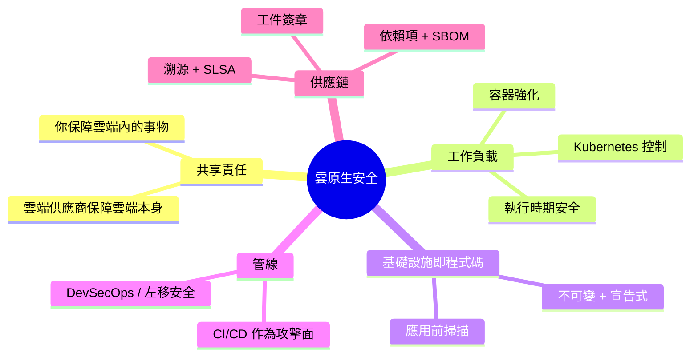

---

## 第一部分：共享責任模型

雲端安全中最基本也最常被誤解的觀念：**雲端供應商不負責保護你的應用程式。** 他們保護雲端運行的*基礎設施*；你保護你*放入*其中的內容。這條界線根據服務模型而移動，而入侵事件往往發生在對其位置的混淆之中 [^1]：

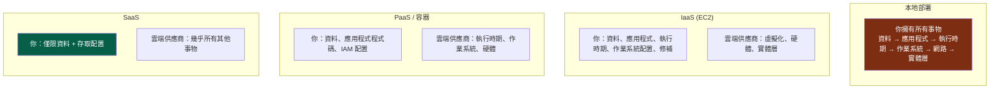

:::important[你的責任永遠不會歸零]
請注意每個欄位的共同點：**你永遠擁有你的資料和你的存取配置。** 絕大多數的「雲端入侵」並非供應商被駭，而是*客戶*的錯誤配置：一個公開的 S3 儲存桶、一個權限過高的 IAM 角色、一個暴露給 `0.0.0.0/0` 的資料庫。雲端為你提供了強大的預設關閉原語；將其保持關閉狀態是你的責任。配置錯誤，而非供應商洩露，是雲端資料暴露的首要原因。 [^2]
:::

---

## 第二部分：保護工作負載

### 第一章：容器安全 - 分層的現實

容器並非輕量級虛擬機器；它是在**共享主機核心**上的一組隔離*程序*。這個單一事實驅動了其完整的威脅模型，而防禦措施從映像檔到執行時期都採分層設計：

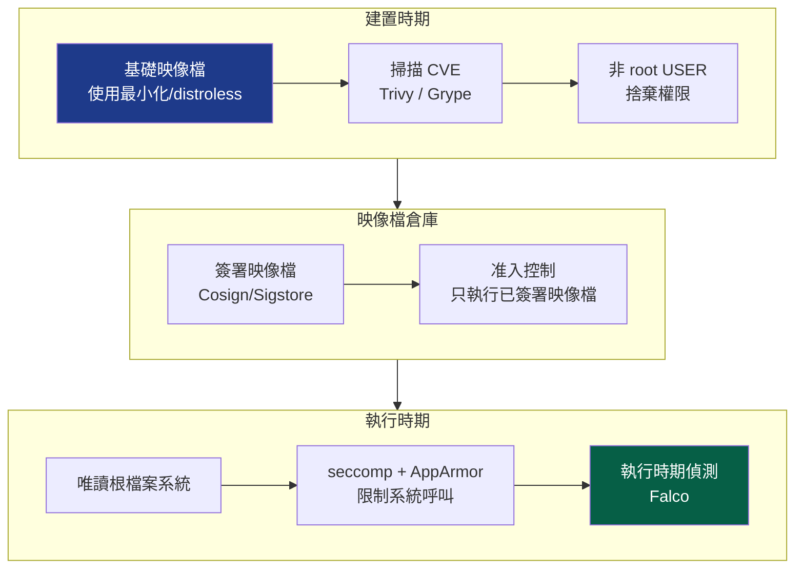

容器安全中效益最高的實踐，按投入產出比排序：

*   **最小化基礎映像檔** - `distroless` 或 scratch 映像檔只包含你的應用程式，*別無他物*：沒有 shell、沒有套件管理器、沒有 `curl`。攻擊者一旦進入，將無工具可供利用。這也將 CVE 攻擊面縮小了一個數量級，沒有作業系統套件就意味著沒有作業系統套件漏洞。
*   **絕不以 root 身份運行** - 以 root 身份運行的容器程序若逃逸出容器，將成為*主機上的* root。設定一個非 root 的 `USER`，捨棄所有 Linux 權限，只添加所需權限。
*   **唯讀根檔案系統** - 如果容器無法寫入自己的檔案系統，攻擊者便無法將惡意酬載放置於其中。
*   **掃描每個映像檔** - 在 CI 中使用 `Trivy`/`Grype` 掃描，若發現關鍵 CVE 則阻擋建置。

:::warning[容器逃逸是關鍵]
因為容器共享主機核心，一個**核心漏洞或錯誤配置可能導致完整的主機接管**，而從一個主機，往往能接管整個叢集。使此變得輕而易舉的主要錯誤包括：運行 `--privileged`、將 Docker socket (`/var/run/docker.sock`) 掛載到容器中（這等同於將主機的 root 權限包裝送出）、以及以 UID 0 運行。將特權容器視為一項需要像發放 `sudo` 權限一樣嚴格審查的決策。 [^3]
:::

### 第二章：Kubernetes - 強化協調器

Kubernetes 是一個用於容器的分散式作業系統，其安全性本身就是一門學問。攻擊面涵蓋四個方面，被稱為**雲原生安全的 4C**：雲端 (Cloud)、叢集 (Cluster)、容器 (Container)、程式碼 (Code) [^4]。

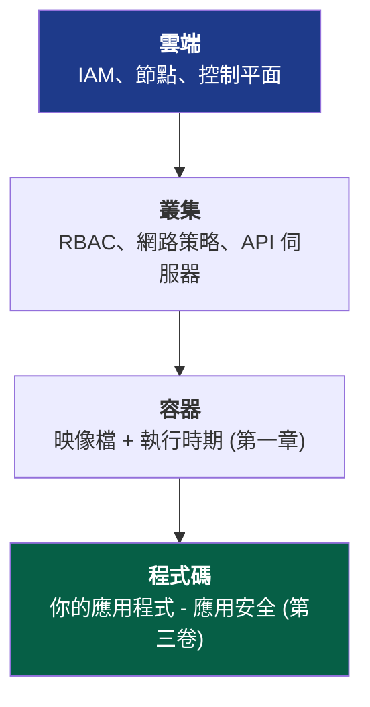

關鍵的叢集控制措施，每項都關閉一個特定的攻擊路徑：

::::steps

:::step[RBAC - API 的最小權限原則]{subtitle="誰能對叢集執行哪些操作"}
Kubernetes API 伺服器是核心資產，控制它就等於控制所有工作負載。應用第二卷的最小權限原則：不要為服務帳號設定萬用字元 `cluster-admin` 權限，將角色作用域限制在命名空間內，並且在不需要時絕不掛載預設服務帳號令牌。一個擁有過度特權令牌的 Pod 是通往叢集接管的直接跳板。
:::

:::step[網路策略 - 預設拒絕]{subtitle="東西向流量區隔"}
預設情況下，*每個 Pod 都能與其他所有 Pod 通訊*，扁平、信任，正是第一卷所警告的網路模型。應用**預設拒絕 (default-deny)** 的 NetworkPolicy，並明確只允許所需的流量。這是將微區隔 (第一卷/第二卷) 應用於 Pod 網路：它能將一個被入侵的 Pod 從發射台變成死胡同。
:::

:::step[Pod 安全標準 - 限制危險操作]{subtitle="強制執行容器規則"}
強制執行**受限 (Restricted)** Pod 安全標準：不允許特權 Pod、不共享主機命名空間、僅限非 root 運行、唯讀根檔案系統。在這裡，第一章的容器規則被平台*強制執行*，而不再僅僅是向開發人員推薦。
:::

:::step[機密資訊 - 不要將 base64 當作「加密」]{subtitle="保護敏感資料"}
Kubernetes Secrets 在 etcd 中預設僅為 **base64 編碼**，而非加密。為 etcd 啟用**靜態加密 (encryption at rest)**，更好的做法是整合外部管理器 (例如 Vault，或透過 CSI 驅動程式整合雲端 KMS)，這樣機密資訊就不會以可復原的形式存在於 etcd 中。否則，任何擁有 etcd 讀取權限的人都能讀取所有機密資訊。
:::

::::

:::tip[准入控制是你的策略瓶頸]
每個進入叢集的物件都會經過**准入控制器 (admission controller)**，這是以程式碼形式強制執行策略的理想位置。像 **OPA Gatekeeper** 或 **Kyverno** 這樣的工具讓你可以*拒絕*不符合規範的工作負載於門外：「沒有簽章的映像檔不允許」、「沒有資源限制的容器不允許」、「不允許使用 `latest` 標籤」。這是第二卷零信任模型中的 PEP，應用於叢集的門戶。在准入階段強制執行的策略不會被開發人員遺忘。 [^5]
:::

### 第三章：執行時期安全 - 假設 Pod 已被入侵

到目前為止的一切都是預防性的。將第四卷的「*假設入侵*」思維應用於工作負載：容器*最終*會運行它不應該運行的東西。**執行時期安全 (Runtime security)** 監控實時行為並標記異常，例如在一個只應運行一個程序的容器內生成 shell、對從未見過的 IP 進行出站連接、或對 `/etc/passwd` 進行寫入。像 **Falco** 這樣的工具將核心的系統呼叫流轉化為偵測，將第四卷的 SIEM/偵測工程規範延伸到短暫存在的工作負載。

---

## 第三部分：基礎設施即程式碼 - 保護藍圖

在雲原生中，基礎設施是**宣告式而非配置式**的，例如 Terraform、CloudFormation、Pulumi。這是一個安全的*饋贈*：因為整個基礎設施都是程式碼，你可以在**單一資源存在之前就掃描其錯誤配置。**

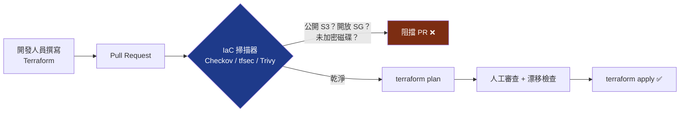

這正是**左移 (shift-left)** (第一卷 SSDLC 主題) 的最終體現：原本可能導致入侵的配置錯誤，例如對全世界開放的安全群組、未加密的資料庫、公開的儲存桶，在程式碼審查階段就被發現，*甚至在它們進入生產環境之前*。漏洞發現得越晚，修復成本就以數量級增長：

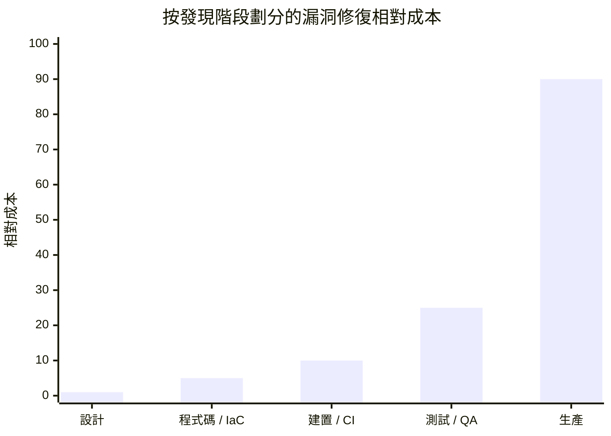

每向右一步都會使成本倍增，而在生產環境中發生*入侵*則完全超出此圖表。IaC 掃描正是你將偵測推向最經濟階段的方法。

:::note[不可變性是一項安全屬性]
IaC 實現了**不可變基礎設施 (immutable infrastructure)**：伺服器從不在原處修補，而是從已知良好的映像檔中*替換*。這悄然解決了兩個問題。**配置漂移**（「實際運行狀態」與「我們認為運行狀態」之間的緩慢差異）消失了，因為每次部署都會從原始碼重建。而且攻擊者的**持久性**變得更加困難，植入運行中主機的後門在該主機下次重新部署時就會被清除，這可能在數小時後發生。牛群而非寵物，是一種安全姿態，而不僅僅是運維上的便利。
:::

---

## 第四部分：供應鏈 - 十年來的最前沿

這是現代軟體令人不安的真相：**你可能只撰寫了你交付的其中 5%。** 另外 95% 則是開源依賴項、基礎映像檔和建置工具，這些是來自陌生人的程式碼，被間接拉取，並以你的應用程式的完整權限運行。供應鏈現在是安全領域中被最積極利用的前沿陣地，因為當你可以破壞目標*信任的*事物時，何必去攻擊一個已被強化的目標呢？

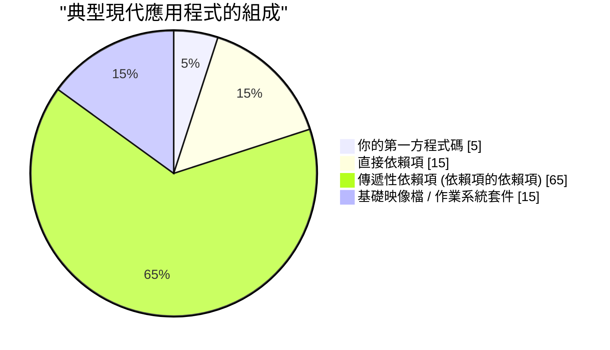

那個巨大的「傳遞性」部分是重點：你*選擇了*你的 15 個直接依賴項，但你繼承了數百個你從未聽過的依賴項，其中任何一個都可能終結你的安全性。

### 第四章：供應鏈攻擊剖析

近年來定義性的災難，**SolarWinds** (2020 年，一個被入侵的建置管線將後門注入到發送給 18,000 個組織的已簽署更新中) 和 **Log4Shell** (2021 年，一個在數百萬個應用程式中嵌入的日誌函式庫中，存在一個可輕易利用的遠端程式碼執行漏洞) [^6]，具有相同的模式：

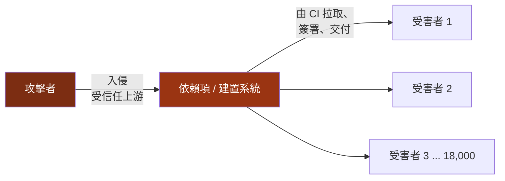

一次入侵，數千名受害者，所有其他方面都做得正確。這種不對稱性正是供應鏈安全成為國家安全優先事項的原因，也是為什麼以下防禦措施現在是基本要求，而非高深技術。

### 第五章：現代防禦 - SBOM、簽章和 SLSA

三種相互關聯的實踐回答了三個供應鏈問題：*軟體中包含什麼、它是否如其所聲稱、以及我能否信任其建置方式*：

| 防禦措施 | 回答的問題 | 內容說明 |
| --- | --- | --- |
| **SBOM** | *我的軟體中實際包含什麼？* | 軟體物料清單，一個機器可讀的組件和版本清單。當下一個 Log4Shell 爆發時，你可以搜尋你的 SBOM，並在幾分鐘內而非幾週內知道你是否受到影響。 [^7] |
| **工件簽章** | *這個工件是真實且未被篡改的嗎？* | 以密碼學方式簽署建置輸出 (**Sigstore/Cosign**)，以便消費者驗證出處，將第三卷的簽章應用於你的建置工件。 |
| **SLSA** | *我能信任建置它的過程嗎？* | 軟體工件供應鏈安全等級，一個分級的建置完整性框架：來源已驗證、建置已隔離、出處已產生並簽署。 [^8] |

端到端安全管線將這些與本系列中的所有內容結合起來：

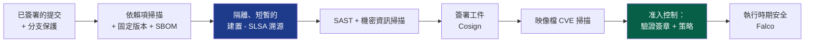

:::warning[CI/CD 管線本身就是主要目標]
你的建置系統擁有神級權限，它可以讀取所有機密資訊、簽署所有工件，並部署到生產環境。洩漏的 CI 令牌、在特權執行器中運行不受信任程式碼的惡意拉取請求，或是被污染的 GitHub Action，都是直接將帶有後門的軟體*並附上你自己的有效簽章*交付出去的途徑。將管線視為生產基礎設施：使用最小權限令牌 (OIDC 聯合、短期有效，依據第二卷的原則)、日誌中不含機密資訊、固定動作版本 (依據 SHA，而非標籤)、以及用於不受信任程式碼的隔離、短暫執行器。建構你防禦系統的管線之所以成為目標，原因與鑄幣廠相同：它製造信任。 [^9]
:::

---

## 第六部分：DevSecOps - 實現持續安全

所有五卷都匯聚於一個單一的文化轉變。舊模式中，安全團隊在開發結束時審查軟體並說「不」，在一個每天部署數千次的時代中無法生存。**DevSecOps** 消解了安全團隊的把關角色，將其專業知識*融入*管線中，使安全自動化、持續化，並成為每個人的職責。

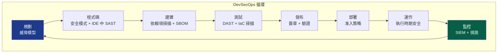

該循環中的每個節點都是本系列的一個章節，如今已自動化並嵌入其中：威脅模型 (I)、安全編碼和密碼學 (III)、依賴項和 IaC 掃描 (V)、簽章 (III/V)、准入控制和零信任實施 (II)、執行時期偵測和 SIEM (IV)。安全不再是一個*階段*，而成為管線的*屬性*，持續檢查，由程式碼強制執行，通過時無形，失敗時則響亮。

:::important[這一切的文化核心]
DevSecOps 是 20% 工具加上 80% 文化。其核心信念是：**安全是共享的責任，而非部門的否決權。** 實現這一目標的方法是讓安全路徑成為*輕鬆*路徑：預先批准的強化基礎映像檔、預設安全的範本、開箱即用的合規 IaC 模組，以及在數秒內於拉取請求中提供自動化回饋，而非在季度稽核中。當執行安全操作比執行不安全操作*更省力*時，安全就能擴展。當它成為一種負擔時，開發人員每次都會繞過它。
:::

---

## 結論：系列的綜合

我們從第一卷的實體層開始，牆壁裡的一根纜線，線路上的一個框架，最終在這裡結束，一個在基礎設施中存在九十秒的容器，而基礎設施本身不過是 git 倉庫中的文字。跨越五卷，一個真理在每個層次上都被強化：

> **沒有單一控制措施能確保系統安全。安全是深度防禦，由獨立、重疊的控制層組成，每一層都假設其前一層最終會失效。**

回顧這種深度防禦實際演變為何：

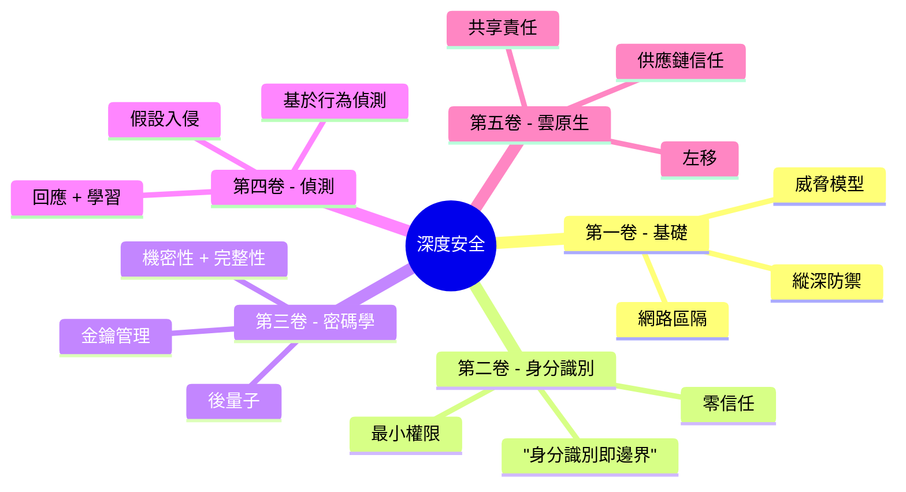

防火牆假設網路可能被入侵，因此身分識別驗證每個請求。身分識別假設憑證可能被竊取，因此密碼學使會話不可偽造且具備前向保密性。密碼學假設端點仍可能被控制，因此偵測監視揭露其行為的異常。偵測假設工作負載本身可能被污染，因此供應鏈證明我們交付的就是我們所建置的。這些控制措施沒有一個信任其他措施是完美的，而*這種嵌入在架構中的不信任感*，正是藝術的全部。

邊界已消融。機器變得短暫存在。程式碼大部分來自陌生人。但貫穿始終，原則依然堅守：**分層防禦、驗證一切、假設入侵、證明溯源，並且絕不相信一道牆會是最後一道。** 這就是深度安全。這就是我們的任務。

感謝你走完整個技術棧。去建造那些難以打破，且謙遜到足以在被打破後仍能存活的事物吧。

---

## 參考文獻

[^1]: [AWS - 共享責任模型](https://aws.amazon.com/compliance/shared-responsibility-model/)
[^2]: [Gartner / CSA - 十一個駭人聽聞的雲端安全威脅](https://cloudsecurityalliance.org/artifacts/top-threats-to-cloud-computing-egregious-eleven/)
[^3]: [NIST (2017) - SP 800-190: 應用程式容器安全指南](https://csrc.nist.gov/publications/detail/sp/800-190/final)
[^4]: [Kubernetes - 雲原生安全概述 (4C 原則)](https://kubernetes.io/docs/concepts/security/overview/)
[^5]: [Open Policy Agent - Gatekeeper](https://open-policy-agent.github.io/gatekeeper/website/docs/)
[^6]: [CISA - Apache Log4j 漏洞指南](https://www.cisa.gov/uscert/apache-log4j-vulnerability-guidance)
[^7]: [NTIA - 軟體物料清單 (SBOM)](https://www.ntia.gov/SBOM)
[^8]: [SLSA - 軟體工件供應鏈安全等級](https://slsa.dev/)
[^9]: [OWASP - CI/CD 十大安全風險](https://owasp.org/www-project-top-10-ci-cd-security-risks/)