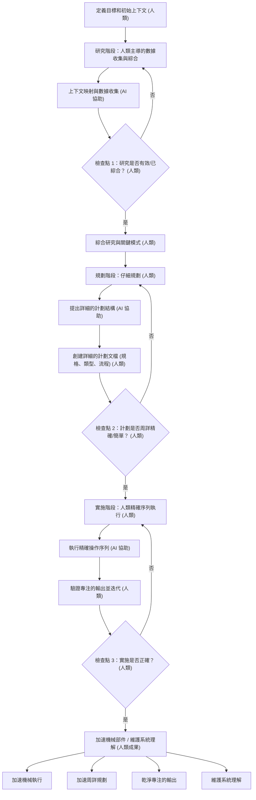

目前，工程團隊中正在發生一個無聲的現象。一名開發者使用 AI 代理程式來生成一個複雜的功能。測試通過了。程式碼已部署。但如果你問該開發者精確解釋剛才交付內容的機制，他們可能會感到困難。

我們正在交付我們並不完全理解的程式碼，而且交付的速度是前所未有的。

近期產業的討論——尤其是來自在大型企業公司處理龐大程式碼庫的工程領導者——凸顯了現代軟體開發中一個明顯的悖論。AI 工具已將過去需要數天的工作轉變為僅僅數小時。但大型生產系統最終會失敗，而當它們失敗時，你需要一個深入理解系統的人來除錯。

我們不是第一代面臨軟體危機的，但我們是第一代面臨無限規模生成世代的。

## 「簡單」的幻覺

要理解為什麼我們的程式碼庫變得越來越難以理解，我們必須重新審視一個基本的工程哲學：*簡單*與*容易*之間的區別。

正如 Clojure 的創建者 Rich Hickey 著名定義的，**簡單**指結構。它意味著一個組件只做一件事，並且不與其他組件糾纏。而**容易**，另一方面，意味著近在咫.邇。它意味著解決方案唾手可得——就像從 npm 拉取一個套件、從 Stack Overflow 複製一個程式碼片段，或者提示一個 LLM。

簡單性需要深思熟慮、設計和架構的解耦。而「容易」幾乎不需要任何思考。

AI 是終極的「容易」按鈕。在聊天介面中，添加功能幾乎沒有阻力。你要求 AI 添加身份驗證，然後是 OAuth，然後修補一個會話錯誤。很快，你就不再從事軟體工程，而是在管理一個臃腫的上下文窗口。由於 AI 模型渴望取悅，它們只是將新程式碼疊加在舊程式碼之上，透過滿足你最新的提示來改變邏輯，而對不良的架構決策毫無抵抗。

我們現在以速度換取簡單性，卻要在將來付出巨大的複雜性作為代價。

## AI 時代的意外複雜性

在他傳奇的 1986 年論文《沒有銀彈》中，Fred Brooks 將軟體複雜性分為兩類：
1.  **本質複雜性：** 解決實際業務問題的基本難度。
2.  **意外複雜性：** 我們在嘗試實現解決方案時創建的混亂的變通方法、遺留抽象和技術債務。

在一個龐大、陳舊的程式碼庫中，這兩種類型的複雜性都深度糾纏在一起。要將它們分離，需要歷史背景和人類直覺。

AI 生成工具在這方面非常掙扎。當 LLM 掃描儲存庫時，它缺乏判斷核心業務規則和過時、笨拙的變通方法之間差異的能力。它將每個現有模式都視為必須保留的嚴格要求。如果你要求 AI 重構一個深度耦合的遺留系統，它通常會失控，要麼放棄，要麼使用新的語法重新創建舊的、損壞的模式。

## 解決方案：規格驅動開發

如果核心問題是缺乏理解，那麼解決方案不是更努力地提示或等待一個更聰明的模型。解決方案是完全改變我們與程式碼生成關係。我們必須從編寫程式碼轉變為*指定架構*。

這種方法——通常被稱為上下文壓縮或規格驅動開發——迫使人類工程師在 AI 完成機械式打字工作之前，完成思考的艱難工作。它通常涉及三個不同的階段：

### 1. 引導式研究
與其要求 AI 開始編寫程式碼，不如將相關的架構圖、文檔和針對性的程式碼片段餵給它。要求它映射依賴關係並識別邊緣情況。作為人類，你需要驗證和糾正此分析。產出的不是程式碼，而是一份已驗證的研究文檔。

### 2. 高保真規劃
利用研究成果，起草一份嚴格的實施計劃。這包括定義函數簽名、數據流和服務邊界。這份文檔應該非常精確，以至於一名初級工程師在沒有進行架構選擇的情況下也能執行它。這是你主動消除意外複雜性的地方。

### 3. 受限實施
最後，將精確、經過驗證的規格交給 AI 來執行。由於 AI 受你的藍圖嚴格限制，它不會陷入「複雜性螺旋」。你可以快速審查生成的程式碼，因為你只是根據你自己的計劃進行驗證。

## 工程師的未來

軟體工程最難的部分從來都不是輸入語法。它一直是知道*要輸入什麼*。

如果我們使用 AI 來繞過關鍵思考階段，我們的系統直覺將會萎縮。我們將失去那種來之不易的本能，它告訴我們某個特定的架構太脆弱或耦合太緊密。

在 AI 時代蓬勃發展的工程師，將不是那些生成最高程式碼量的工程師。他們將是那些對他們所構建的東西保持深層結構性理解的人，他們能夠看到架構的接縫，並利用 AI 加速機械工作，同時堅決保護設計的簡單性。

***