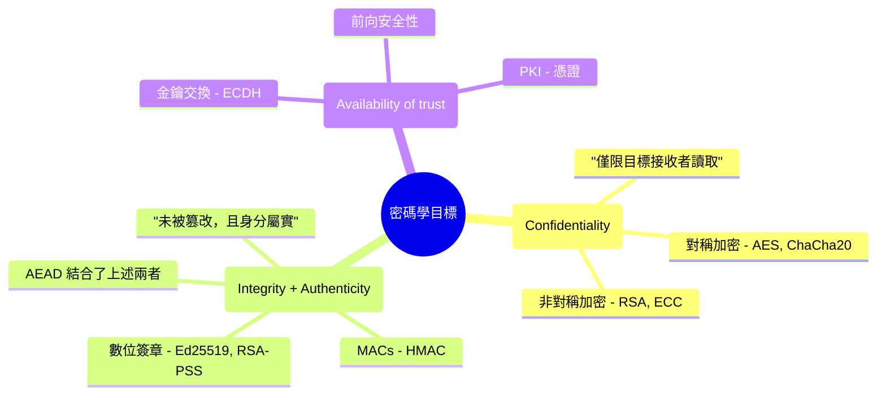
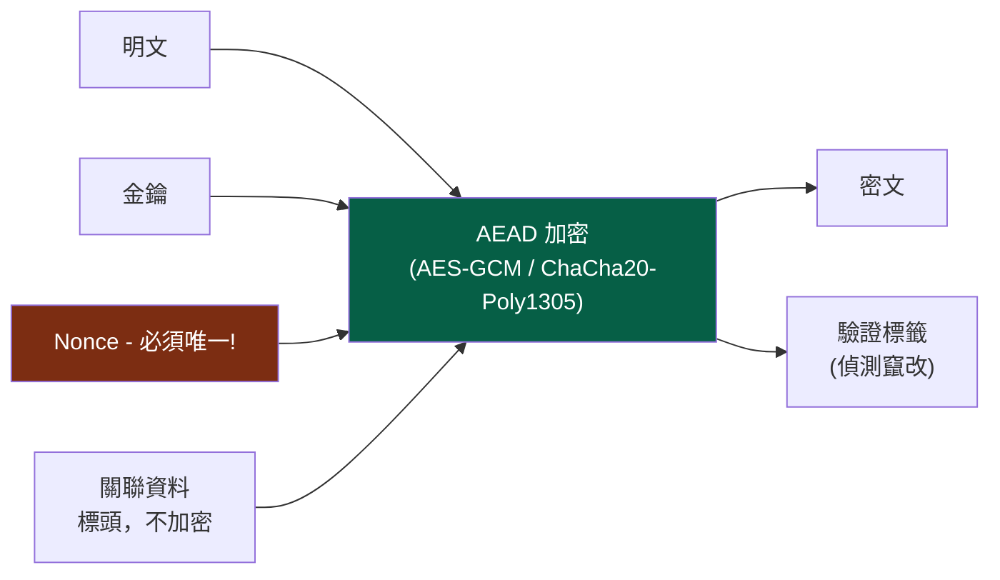
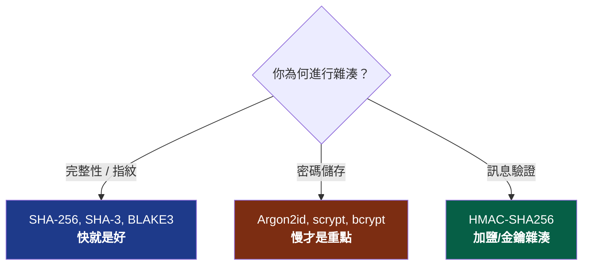
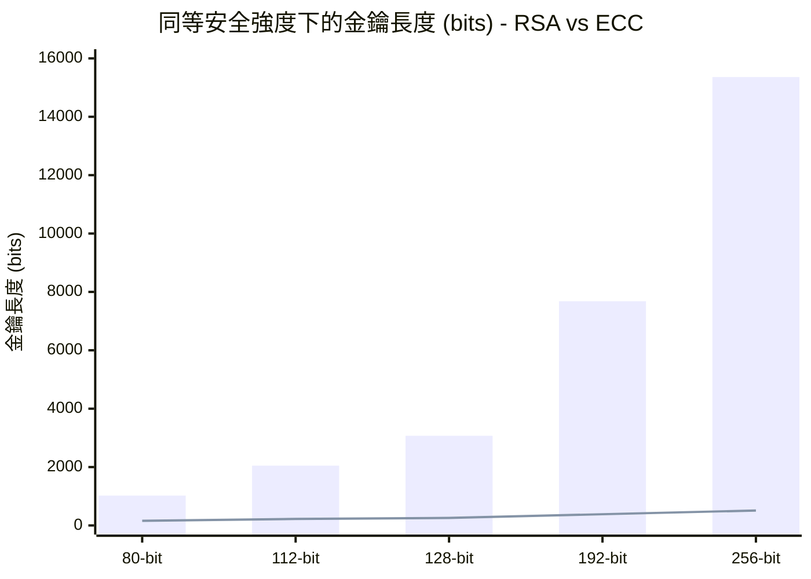
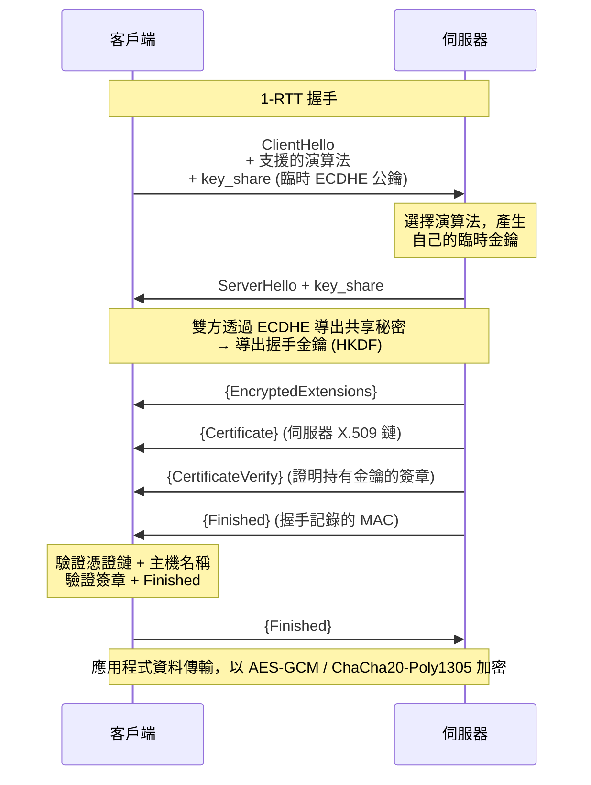
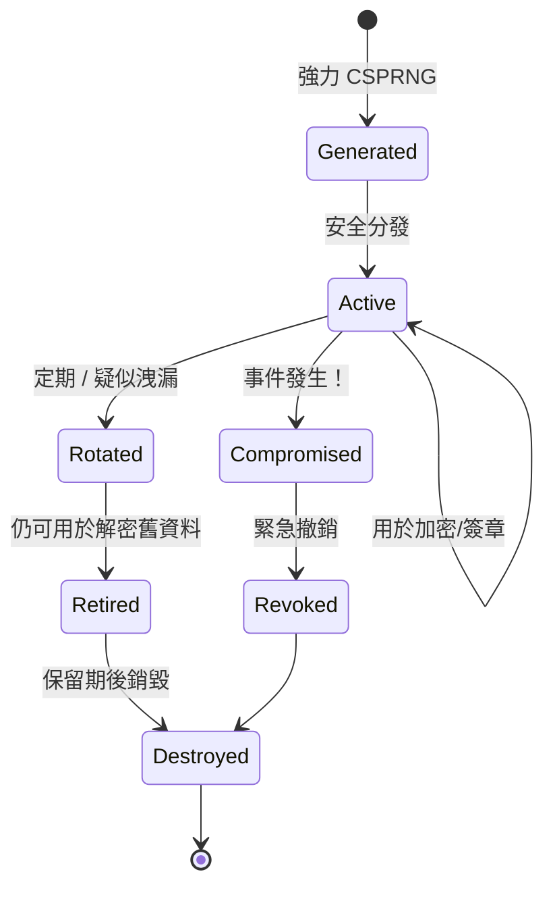
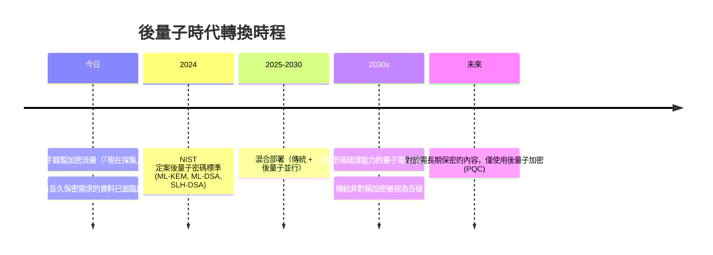
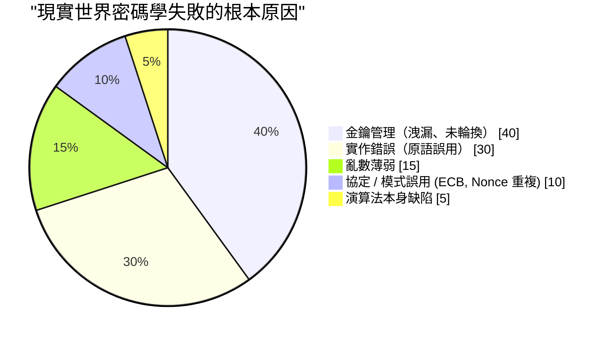

## 我們曾試圖關上的那個盒子

本系列文章至今已兩度提到密碼學，但都只是淺嚐輒止。[第一卷](/posts/secure_systems_architecture/) 提到「使用 TLS」。[第二卷](/posts/identity_and_access_in_depth/) 提到「數位簽章綁定至來源」以及「使用 Argon2id 進行雜湊」，然後就跳過了。上述每一句話背後，都隱藏著一套精妙且脆弱的機器機制。

本卷將正式打開這個盒子。

我們的目標不是要把你培養成密碼學家，那條路需要數年的數學訓練，並且要對自己的「小聰明」保持敬畏。我們的目標是讓你成為一名**密碼學工程師**：能夠判斷哪種原語 (primitive) 適合解決什麼問題，理解為什麼安全預設值是安全的，最重要的是，能夠在即將做出災難性決定前及時察覺。

:::important[第一戒律]
**不要自行發明密碼學。不要自行實作密碼學原語。** 包括密碼演算法、運作模式、填充方式、亂數產生器都不要自己動手。請使用經過審查的高階函式庫（如 libsodium、Tink 或作業系統內建的密碼學功能），這些工具能確保安全選項成為*預設*選項。本卷內容的存在是為了讓你知道這些函式庫在做什麼，而不是讓你去重造它們。歷史上每一次災難性的密碼學失敗，都始於一位認為這條規則不適用於自己的工程師。[^1]
:::

---

## 第一部分：三大目標與為其服務的原語

實際上，所有的密碼學皆旨在服務以下三個目標的組合：

第四個目標，**不可否認性 (non-repudiation)**（即簽署方事後無法否認簽名），主要源自於數位簽章。這也是對稱式密碼學*無法*提供的特性，因為雙方共享同一個金鑰，任何一方都有可能產生該驗證標籤。

### 第一章：對稱式密碼學 - 快速、共享與模式

對稱式密碼學使用**同一個共享金鑰**進行加密與解密。它的速度*非常快*（硬體加速的 AES 可達每秒數 GB），但有一個棘手的問題：**雙方如何在不被竊聽的情況下取得相同的金鑰？**（第二部分將會解答。）

初學者最容易掉入的陷阱是**運作模式 (modes of operation)**。像 AES 這樣的區塊加密演算法每次只能加密固定的 16 個位元組。要加密真實資料，必須將區塊串聯起來，而串聯模式決定了安全性。

:::warning[ECB 企鵝 - 為什麼模式很重要]
最原始的模式 **ECB (Electronic Codebook)** 會獨立加密每一個區塊。相同的明文區塊會產生相同的密文區塊。如果你用 ECB 模式加密 Linux 企鵝的點陣圖，你依然可以在密文中*看見企鵝的輪廓*，因為資料結構洩漏了。ECB 會摧毀任何具有結構性資料的機密性。如果你在程式碼中看到 `AES/ECB`，請直接視為 Bug。[^2]
:::

現代的解決方案是 **AEAD (Authenticated Encryption with Associated Data)**，它將機密性*與*完整性融合在同一個原語中，確保兩者缺一不可：

你應該優先選擇的兩種 AEAD 演算法：

| 演算法 | 優勢 | 注意事項 |
| --- | --- | --- |
| **AES-256-GCM** | 到處都有硬體加速 (AES-NI)，極為普及 | **Nonce 重複使用是災難性的**，在同一金鑰下重複使用 Nonce 會洩漏驗證金鑰與明文 XOR |
| **ChaCha20-Poly1305** | 在*軟體層*運作極快（適合無 AES-NI 的行動/IoT 裝置），設計上具備恆定時間特性 | 同樣要求 Nonce 唯一性 |

:::caution[Nonce 不需保密，但必須唯一]
**Nonce** (number-used-once) 不需要保密，它是明文傳輸的。但在同一個金鑰下，它**絕不能重複**。對於 GCM 的 96 位元隨機 Nonce，在單一金鑰下傳輸約 $2^{32}$ 則訊息後，生日悖論碰撞的風險將變為現實。安全模式：使用*計數器* Nonce（保證唯一）、在限制前更換金鑰，或使用具備抗 Nonce 誤用能力的模式，如 **AES-GCM-SIV**。[^3]
:::

### 第二章：雜湊 - 單向街道

密碼學雜湊將任意輸入映射為固定長度的摘要，使得 (a) 無法反推，(b) 無法找到兩個輸入產生相同摘要（**抗碰撞性**），或 (c) 無法找到匹配特定摘要的輸入（**抗原像性**）。

人們常混淆的三種用途，它們需要*不同*的函數：

核心關鍵：**檔案完整性需要最快的安全雜湊；密碼雜湊則需要最慢的。** 對密碼使用 SHA-256 是漏洞（GPU 每秒可暴力破解數十億次）；對檔案檢查碼使用 Argon2id 則徒增無意義的延遲。同樣稱為「雜湊」，需求卻截然不同。

**MAC (訊息驗證碼)** 加入了金鑰，確保只有持有秘密的人才能產生或驗證標籤。這兼具了完整性與真實性。請使用 **HMAC** 並務必以**恆定時間比較 (constant-time comparison)** 來核對標籤。一般的提前結束 `==` 比較會洩漏時序資訊，攻擊者可藉此逐位元組偽造標籤。

$$
\text{HMAC}(K, m) = H\big((K \oplus opad)\,\|\,H((K \oplus ipad)\,\|\,m)\big)
$$

雙重雜湊結構並非裝飾，它防禦了**長度擴充攻擊 (length-extension attacks)**，否則攻擊者能直接在原始 `H(K \| m)` 結構後追加資料。

### 第三章：非對稱加密 - 解決金鑰交換難題

非對稱（公開金鑰）加密使用**金鑰對**：公開金鑰隨意分享，私有金鑰則需嚴加保管。任何人都能用你的公鑰加密；只有你的私鑰能解密。反之：你用私鑰簽章；任何人都能用你的公鑰驗證。

* **RSA** - 經典演算法。安全性基於大整數分解的難度。目前被認為*過大且緩慢*，128 位元安全強度需使用 3072 位元金鑰。沒問題，但效能較重。
* **橢圓曲線密碼學 (ECC)** - 以小得多的金鑰提供同等安全性，因為它基於橢圓曲線離散對數問題，該問題在相同位元長度下更難破解。**256 位元 ECC 金鑰 ≈ 3072 位元 RSA 金鑰**。

在高安全需求下，長條圖（RSA）與折線（ECC）之間的巨大鴻溝，正是現代協定預設採用橢圓曲線的原因：**Ed25519** 用於簽章，**X25519** 用於金鑰交換，兩者皆具備快速、精簡且難以誤用的設計特性 [^4]。

:::note[非對稱加密很少直接加密資料]
公開金鑰操作速度慢且容量有限。實務上你幾乎不會用 RSA 加密檔案。你通常使用非對稱加密來**交換或封裝對稱金鑰**，然後用對稱式 AEAD 加密大量資料。這就是**混合加密 (hybrid encryption)**，這也是 TLS、PGP、age 等所有健全系統的運作方式。
:::

---

## 第二部分：金鑰交換與 TLS 1.3 握手

現在我們可以回答對稱加密無法解決的問題：兩個陌生人如何在被監聽的網路上達成共享秘密？

### 第四章：Diffie-Hellman 與前向安全性

**Diffie-Hellman (DH)** 是其中的美麗演算法。雙方將各自的私密內容與對方的公開值結合，基於代數特性，最終能計算出*相同的*共享秘密；而竊聽者即使看見了所有公開值，也無法計算出結果。

關鍵特性是**（完美）前向安全性 (Forward Secrecy)**。如果每次會話都使用一個*臨時 (ephemeral)* 的 DH 金鑰對（ECDHE，其中的 "E" 代表 ephemeral），並且在會話後立即丟棄，那麼即使攻擊者錄製了所有加密流量，*即使明年偷走了你的長期私鑰*，他們也無法解密錄製的會話。會話金鑰隨著會話結束而死亡。

:::important[為什麼現在前向安全性不可妥協]
「現在錄製，日後解密」是真實存在的資金充足的對手策略，特別是考慮到量子運算即將來臨（第七章）。前向安全性確保了即便日後伺服器金鑰洩漏，今日截獲的密文也不會淪為資產負債。TLS 1.3 強制要求**前向安全的 ECDHE**，舊有的靜態 RSA 金鑰交換（無前向安全性）已被徹底移除。[^5]
:::

### 第五章：真正的 TLS 1.3 握手

這就是我們常說的「使用 TLS」背後的實際過程。TLS 1.3 將往返次數 (round trip) 從兩次降為一次，並剔除了所有不安全的選項 [^5]：

每一步都有其存在意義：

* **第一個訊息中的 `key_share`** - 客戶端*猜測*並直接傳送臨時公鑰，這正是 TLS 1.3 節省一次往返的原因。
* **`Certificate` + `CertificateVerify`** - 憑證將伺服器身分綁定到公鑰（透過第二卷提到的 PKI 鏈）；*簽章*則證明伺服器確實持有對應的私鑰。沒有私鑰的竊取憑證是無用的。
* **`Finished`** - 針對整個握手過程的 MAC。如果中間人篡改了任何訊息（例如降級攻擊以削弱加密強度），雜湊值將無法匹配，握手會中止。

:::tip[TLS 1.3 刪除的內容與保留的一樣重要]
TLS 1.3 移除了 RSA 金鑰交換、靜態 DH、CBC 模式、RC4、MD5、SHA-1、壓縮（解決了 CRIME/BREACH 攻擊）以及重協商。設計哲學：**更少的選項意味著更少的配置錯誤導致的安全漏洞。** 一個沒有不安全選項的協定，就不會被誘騙去使用它們。請在所有地方關閉 TLS 1.0/1.1；優先使用 1.3，僅對舊版用戶端保留 1.2。
:::

---

## 第三部分：金鑰管理 - 理論遇上現實

密碼學界醜陋的秘密：**演算法幾乎從來不是弱點，金鑰管理才是。** AES-256 從未被破解。但金鑰卻常被提交到 git、寫入 log、發送郵件、硬編碼到程式碼中，且從不輪換。金鑰生命週期管理是門紀律：

關鍵的實踐：

::::steps

:::step[使用真正的 CSPRNG 產生金鑰]{subtitle="誕生"}
金鑰必須來自**密碼學級安全**的亂數來源 (`/dev/urandom`, `getrandom()`, 平台的 CSPRNG)。絕對不要使用 `Math.random()`、時間戳記種子或任何「聰明」的 PRNG。可預測的亂數是「不可破解」的密碼學被輕易攻破的最常見原因。
:::

:::step[存放在 KMS 或 HSM]{subtitle="保管"}
**硬體安全模組 (HSM)** 或雲端 **KMS** 儲存金鑰，確保金鑰*絕不會以明文形式離開*邊界。你只需將資料發送*給它*進行簽章或解密。這意味著即使攻擊者控制了你的應用程式伺服器，也無法竊取原始金鑰。
:::

:::step[使用信封加密擴大規模]{subtitle="架構"}
使用單一物件的**資料加密金鑰 (DEK)** 加密資料；再使用存放在 KMS 中的**金鑰加密金鑰 (KEK)** 加密該 DEK。要輪換金鑰時，只需重新加密小型 DEK，無需重新加密 PB 級資料。這就是各大雲端廠商處理靜態加密的方式。
:::

:::step[輪換金鑰，並且輪換要*快*]{subtitle="維護"}
輪換必須自動化且無感，在密文上加上金鑰 ID 以便過渡期並存。能夠在幾分鐘內輪換金鑰的組織能在洩漏中倖存；而需要一週遷移才能輪換的組織，則會被自身的架構挾持。
:::

::::

:::warning[歷史上的亂數錯誤]
2008 年 Debian OpenSSL：一個出於好意的 Patch 毀壞了熵源，將金鑰空間減少到約 32,767 種可能性，導致兩年間產生的所有 SSH 與 TLS 金鑰皆可被預測。2010 年：Sony PS3 在 ECDSA 簽章中重複使用了固定 Nonce，洩漏了主簽章金鑰。規律是永恆的：**密碼學失敗在亂數處理與重複使用，而非演算法本身。** [^6]
:::

---

## 第四部分：量子地平線

本卷中的每一種非對稱原語（RSA、ECC、Diffie-Hellman）都基於一個數學問題（整數分解、離散對數），足夠強大的**量子電腦**執行 **Shor 演算法**即可高效解決。雖然該機器尚未問世，但威脅已經存在。

### 第七章：現在採集，日後解密

量子威脅中非對稱加密的處境：

* **非對稱加密 (RSA, ECC, DH)** - 被 Shor 演算法*徹底破解*。這是緊急情況。
* **對稱加密 (AES) 與雜湊 (SHA-2/3)** - 僅被 Grover 演算法*削弱*，有效安全性減半。修復方式很簡單：使用 **AES-256**（後量子時代仍保留 128 位元安全性）以及 384 位元以上的雜湊。對稱加密基本上沒問題。

2024 年 NIST 標準化了第一批後量子演算法 [^7]：

* **ML-KEM** (Kyber) - 金鑰封裝，ECDH 金鑰交換的替代品。
* **ML-DSA** (Dilithium) 與 **SLH-DSA** (SPHINCS+) - 數位簽章。

:::note[當下的務實做法：混合]
沒有人會一夜之間全面轉向純 PQC，新演算法還很年輕，缺乏實戰驗證。業界的回答是**混合金鑰交換**：同時執行傳統 X25519 *與* ML-KEM，結合兩者的共享秘密。這樣除非兩者皆被破解，否則會話依然安全。Chrome、Cloudflare 等已預設部署 X25519+ML-KEM。如果你採購的服務需要十年以上的保密期限，請務必現在就詢問廠商的 PQC 發展藍圖。 [^8]
:::

---

## 第五部分：恥辱殿堂 - 工程師如何弄壞好的密碼學

演算法是穩健的。以下是現實世界系統死亡的方式，也是你在審查程式碼時會真正遇到的失敗清單：

| 反模式 | 致命原因 | 修復建議 |
| --- | --- | --- |
| **自製密碼學** | 你會漏掉細節，攻擊者絕不會 | 使用 libsodium / Tink / 平台加密庫 |
| **ECB 模式** | 洩漏明文結構（企鵝圖） | 使用 AEAD：AES-GCM / ChaCha20-Poly1305 |
| **Nonce / IV 重複** | GCM 模式下災難性的金鑰/明文洩漏 | 使用計數器 Nonce，或 AES-GCM-SIV |
| **亂數薄弱** | 可預測的金鑰 = 沒有金鑰 | 僅使用 CSPRNG，禁止 `Math.random()` |
| **對密碼使用 SHA-256** | GPU 每秒破解數十億次 | 使用 Argon2id / scrypt / bcrypt |
| **`==` 比較 MAC/標籤** | 時序側通道洩漏，允許偽造標籤 | 使用恆定時間比較 |
| **不驗證憑證** | `verify=False` 重新開啟 MitM 大門 | 必須驗證鏈 + 主機名 + 過期時間 |
| **無前向安全性** | 一個金鑰洩漏導致歷史全部解密 | 使用臨時 ECDHE (TLS 1.3) |
| **加密但不驗證** | 填充預言機與位元翻轉攻擊 | 使用 AEAD，或 Encrypt-then-MAC |

再看一眼這張表。**演算法本身的缺陷是最小的一塊。** 95% 的密碼學失敗都是工程上的失敗：金鑰處理、誤用、亂數問題。這些都在*你的*控制範圍內，也是本卷內容的重點。

:::important[總結]
好的密碼學不在於精通數學，而在於**尊重數學所設下的邊界**：唯一的 Nonce、私密金鑰、真正的隨機性、經認證的密文、經驗證的憑證、前向安全性、以及輪換機制。透過經過審查的函式庫來正確落實這些邊界，你就能繼承前輩們花數十年強化出的全部原語效能。一旦跨越了邊界，任何演算法都救不了你。
:::

---

## 結論與展望

我們已經從原語開始建立信任：保密的加密演算法、證明身分的簽章、透過不安全網路繫結上述要素的握手協定、保持金鑰誠信的生命週期管理，以及量子時代已經投下的陰影。

但密碼學、身分驗證與網路防護牆都是*預防性*控制。它們假設你能將攻擊者拒之門外。**第四卷**將接受完全相反的前提，這是每位資深防禦者都銘記於心的真理：*假設已經被攻破 (assume breach)。* 我們將進入藍隊的營運現實：偵測工程、MITRE ATT&CK 框架、威脅獵取、SIEM/SOAR 管線，以及當預防失效時（這是一定會發生的），你必須執行的事件響應與數位鑑識劇本。

預防是一個你無法完全兌現的承諾。偵測才是你在承諾失效後生存的唯一途徑。

---

## 參考文獻

[^1]: [Latacora - Cryptographic Right Answers](https://www.latacora.com/blog/2018/04/03/cryptographic-right-answers/)
[^2]: [Filippo Valsorda / Wikipedia - Block cipher mode of operation (ECB penguin)](https://en.wikipedia.org/wiki/Block_cipher_mode_of_operation#Electronic_codebook_(ECB))
[^3]: [IETF - RFC 8452: AES-GCM-SIV Nonce Misuse-Resistant AEAD](https://datatracker.ietf.org/doc/html/rfc8452)
[^4]: [Bernstein, D. J. et al. - Ed25519 & Curve25519](https://ed25519.cr.yp.to/)
[^5]: [IETF - RFC 8446: The Transport Layer Security (TLS) Protocol Version 1.3](https://datatracker.ietf.org/doc/html/rfc8446)
[^6]: [Debian - DSA-1571-1 openssl predictable random number generator](https://www.debian.org/security/2008/dsa-1571)
[^7]: [NIST (2024) - Post-Quantum Cryptography Standards (FIPS 203/204/205)](https://csrc.nist.gov/projects/post-quantum-cryptography)
[^8]: [Cloudflare - The state of the post-quantum Internet](https://blog.cloudflare.com/pq-2024/)