## 改變一切的前提

前三卷在核心上是樂觀的。[第一卷](/posts/secure_systems_architecture/)建立了高牆。[第二卷](/posts/identity_and_access_in_depth/)在每扇門前安排了守衛。[第三卷](/posts/cryptography_engineering_in_depth/)使訊息傳遞變得無法偽造。這一切都是「預防性」的，前提都是將攻擊者拒之門外。

本卷從那種樂觀消失的地方開始，從每一位資深防禦者銘刻在靈魂中的那句話開始：

> **假設遭駭 (Assume breach)。** 只要有足夠的時間、預算和動機，堅定的對手總能進入。問題不在於「是否」會被入侵，而在於「你多快能發現，以及你的響應有多有效」。

業界用兩個殘酷的指標來衡量這一點：**MTTD**（平均偵測時間）和 **MTTR**（平均響應時間）。2024 年的業界平均駐留時間（從初始入侵到偵測發現）仍然以「天到週」計算。在那個窗口期內，攻擊者會進行橫向移動、權限提升並竊取資料。本卷的主旨就是關於如何壓縮這個窗口。

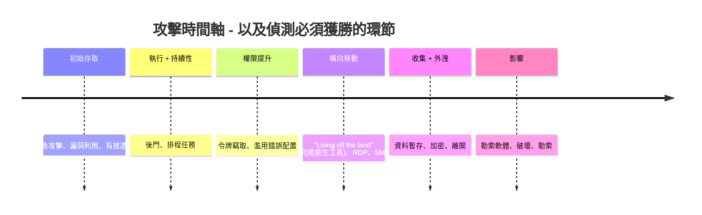

你在偵測時間上縮短的每一個小時，都是攻擊者在該時間軸上失去的機會。歡迎來到藍隊。

---

## 第一部分：遙測 - 你無法偵測看不見的事物

偵測首先是資料問題，其次才是聰明的分析問題。如果從未收集過證據，任何演算法都無法恢復它。因此，藍隊的第一項工作是**可視性 (visibility)**：為基礎設施進行檢測，以發出正確的訊號。

### 第 1 章：真實來源

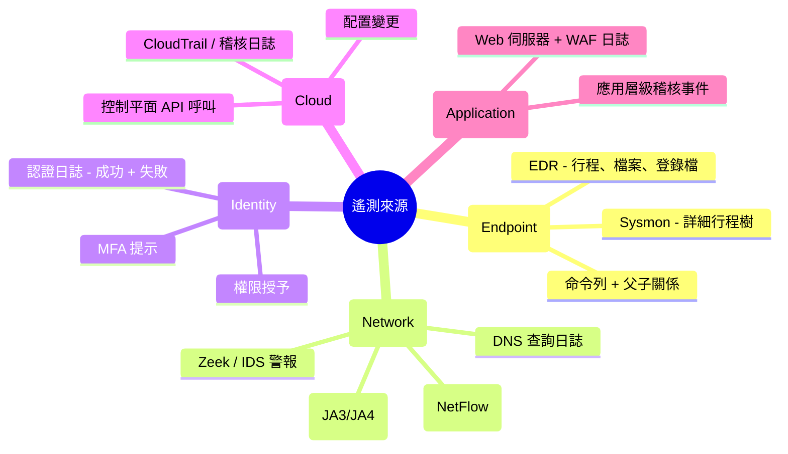

**防禦者觀點：** 並非所有日誌都是平等的。最有價值的遙測資料是那些能捕捉「行為」的資料，特別是**帶有父子行程關係的行程命令列**（Sysmon 事件 ID 1）以及**認證事件**。防火牆日誌只告訴你發生了連接；而行程樹能告訴你 `winword.exe` 衍生出 `powershell.exe`，進而衍生出 `cmd.exe` 並執行了編碼後的命令——這是一個故事，而故事本身就是偵測的核心。

:::important[日誌記錄是覆蓋率問題 - 進行映射]
經典的失敗在於「沈默缺口」：你記錄了 80% 的資產，但入侵卻發生在剩下的 20% 中。維護一個**日誌覆蓋率矩陣**（來源 × 資料類型 × 保留期），並將缺口視為漏洞。如果偵測規則所需的資料從未被導入，那麼該規則就毫無價值。像審計修補程式版本一樣審計你的覆蓋率。
:::

### 第 2 章：SIEM 管道

**SIEM**（安全性資訊與事件管理）是大腦的聚合中心：它攝取上述所有資料，將其正規化為通用結構，進行跨來源關聯，並觸發警報。現代化管道如下：

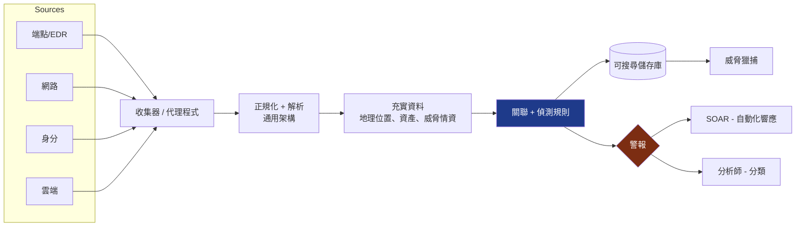

**充實資料 (Enrichment)** 步驟往往被低估，但它最有價值：一個 IP 位址在獲得情資前只是雜訊，直到你知道它是 Tor 出口節點、該資產是網域控制站，且該使用者通常是從另一個洲登入的。充實資料將數據轉化為「情境」，而情境正是讓警報具備可執行性而非被忽視的關鍵。

---

## 第二部分：偵測工程

購買 SIEM 並不會自動賦予你偵測能力，就像買了鋼琴不會自動演奏音樂一樣。**偵測工程**是一門編寫、測試和維護規則的學科，它將遙測資料轉化為警報，並將偵測本身視為程式碼。

### 第 3 章：MITRE ATT&CK - 通用語言

**MITRE ATT&CK** 是該領域的共同地圖：一個矩陣，展示了在真實入侵中觀察到的對手**戰術 (Tactics)**（為什麼，例如：持久性、橫向移動）與**技術 (Techniques)**（如何做，例如：T1053 排程任務）[^1]。它是讓紅隊、藍隊和威脅情報人員能夠使用共同語言進行溝通的「羅塞塔石碑」。

防禦者的強力手段是**覆蓋率映射**，將你的偵測規則疊加到矩陣上，以暴露盲點：

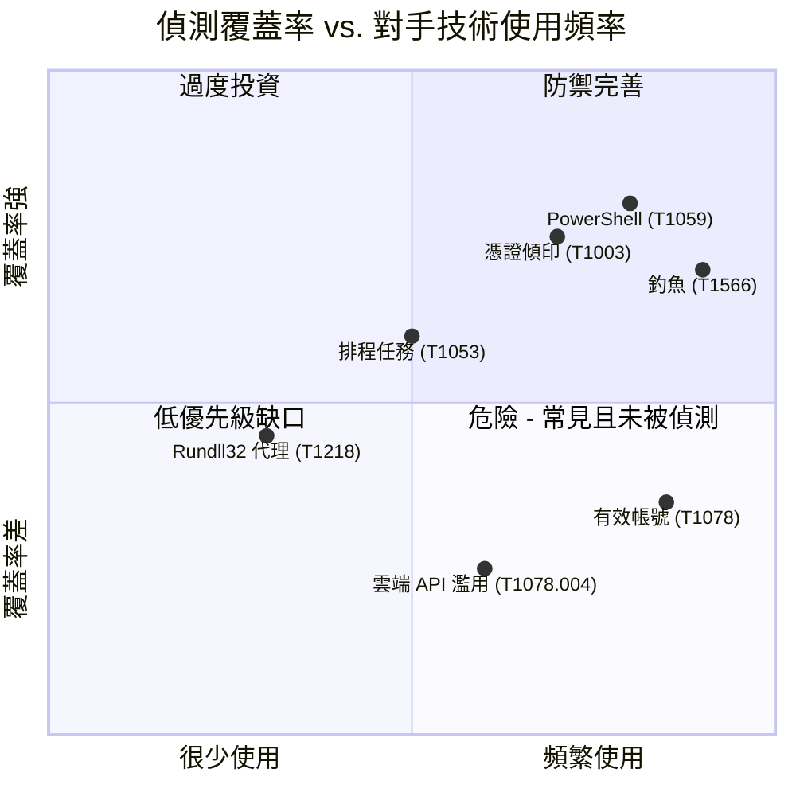

第四象限，即**常見技術但覆蓋率弱的部分**，是你必須優先處理的待辦事項。這就是小規模藍隊如何分配有限精力的方式：在追求那些沒人針對你使用的奇門遁甲技術之前，先防禦攻擊者實際會做的、而你尚未捕捉到的事情。

### 第 4 章：痛苦金字塔

並非所有的偵測在「對對手造成的痛苦程度」上都是一樣的。David Bianco 的**痛苦金字塔 (Pyramid of Pain)** 根據對手在被你偵測到後進行變更的成本，對指標進行了分級 [^2]：

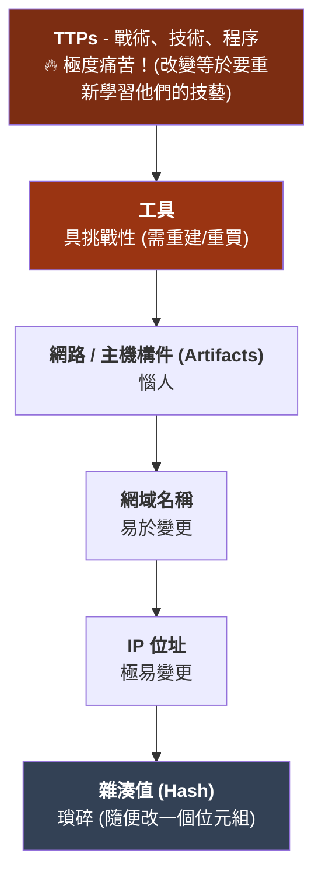

這個教訓重塑了策略。封鎖檔案**雜湊值**感覺很爽，但攻擊者重編譯後幾秒鐘就繞過了。偵測一種「行為」，例如「任何 Office 應用程式啟動了連向網際網路的腳本引擎」，會迫使對手不得不放棄整個「技術」。**要偵測行為，而不僅僅是指標。** 你的偵測在金字塔中位置越高，對手規避它的成本就越高。

:::tip[偵測即程式碼 (Detection-as-code)]
像對待軟體一樣對待偵測：以可攜格式（**Sigma** 規則）編寫，儲存在 **git** 中，進行代碼審查，並針對已知的惡意樣本——更重要的是，針對良性活動——進行「測試」，以衡量誤報率。一個誤報率達 40% 的偵測規則比沒有偵測更糟，因為它會訓練分析師直接點擊「忽略」。像生產環境程式碼一樣對規則進行版本控制、測試與退役。[^3]
:::

### 第 5 章：訊號與雜訊之戰

偵測領域永恆的張力在於：在捕捉真實攻擊（真陽性）與讓分析師淹沒在錯誤警報中之間取得平衡：

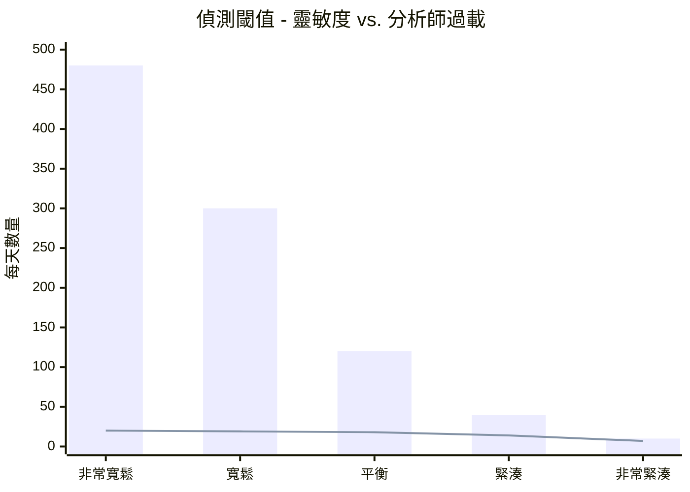

柱狀圖代表總警報數；折線圖代表「真正」的陽性。調整得太寬鬆（左側），分析師必須篩選 480 個警報才能找到 20 個真實攻擊，他們會疲憊不堪並開始草率處理。調整得太緊湊（右側），則會漏掉真實攻擊。**警報疲勞 (Alert fatigue) 是一種安全控管失敗**，而不僅僅是人資問題。目標不是警報最大化，而是「每位分析師小時的真陽性最大化」，這正是 SOAR（下一步）存在的原因。

---

## 第三部分：SOC - 以機器速度進行響應

### 第 6 章：分層運作與 SOAR

**安全運作中心 (SOC)** 是活在警報流中的團隊與流程。經典架構及其現代化自動化流程如下：

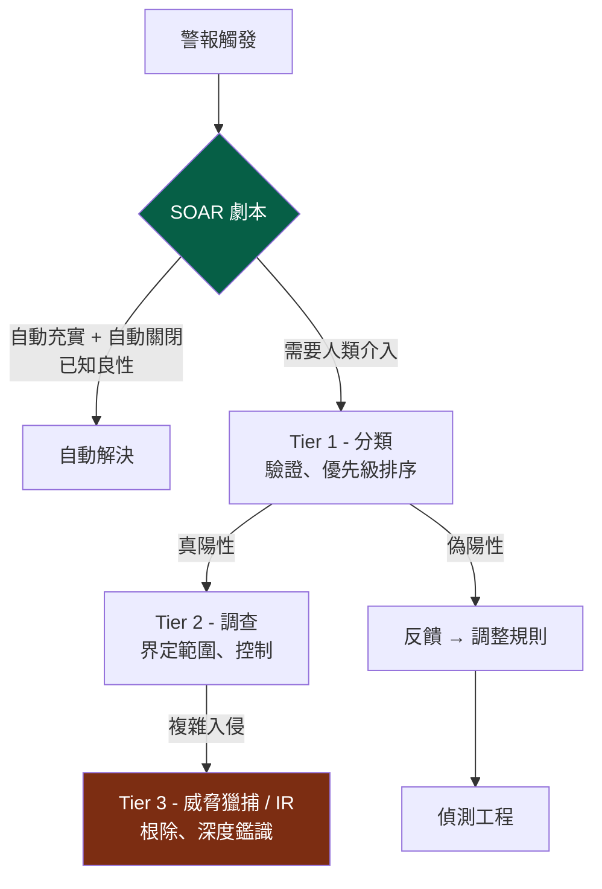

**SOAR**（安全編排、自動化與響應）是力量倍增器。它執行「劇本 (playbooks)」，即自動化序列，這些序列會充實警報、收集情境，甚至在不等待人類的情況下採取控制措施（隔離主機、停用帳號、封鎖 IP）。建構良好的 SOAR 管道會自動解決大部分低品質雜訊，讓人類將注意力集中在真正需要判斷的地方。

:::note[回饋迴圈才是重點]
注意從 Tier 1 回到偵測工程的箭頭。成熟的 SOC 是一個「學習系統」：每一次偽陽性都調整了規則，每一次被遺漏的偵測（事後發現）都成為了新的規則。一個只對警報做出反應而不將經驗反饋到偵測規則中的 SOC，只是在原地踏步。
:::

### 第 7 章：威脅獵捕 - 假設他們已經進入

偵測是等待規則觸發。**威脅獵捕 (Threat hunting)** 是相反的姿態：主動在遙測資料中搜尋那些溜過規則的對手，並明確假設他們已經身處內部。這是「假設驅動」的：

::::steps

:::step[形成假設]{subtitle="他們會躲在哪裡？"}
基於威脅情報或 ATT&CK：「如果攻擊者達成了持久性，我預期會看到非管理員帳號在非工作時間建立異常的排程任務。」好的假設必須是具體且可證偽的。
:::

:::step[收集並分析資料]{subtitle="去看看"}
查詢 SIEM/EDR 以尋找支持或反駁該假設的證據。圍繞行程關係、網路目標、認證異常進行旋轉分析。尋找異常缺失的情況，就像尋找邪惡行為一樣重要。
:::

:::step[揭露或完善]{subtitle="發現"}
無論你是否找到了東西（若是，則升級到 IR），這都是收穫。一次毫無發現的獵捕，驗證了一項控制並映射了正常行為。
:::

:::step[營運化發現]{subtitle="自動化"}
獵捕過程中學到的任何東西都應轉化為「新的自動化偵測」，這樣你就不必再手動獵捕同樣的事情了。獵捕應不斷轉化為規則。
:::

::::

:::caution[獵捕需要基準]
你不了解「正常」就無法發現「異常」。有效的獵捕取決於基準線——對於「這個環境」來說，DNS、認證和行程活動的典型一天是什麼樣子？攻擊者利用了大多數組織從未定義過自身常態的事實。這就是為什麼「Living off the land」（使用 PowerShell 和 `certutil` 等原生工具）如此有效：它隱藏在你從未學會解讀的流量中。
:::

---

## 第四部分：當一切大難臨頭 - 事件響應

最終，某個偵測結果是真實且嚴重的。現在你執行**事件響應 (Incident Response)** 流程，而控制住事件與導致公司倒閉的入侵之間，往往只取決於「準備與壓力下的紀律」，而不是英雄主義。

### 第 8 章：NIST IR 生命周期

NIST SP 800-61 定義了經典的循環 [^4]：

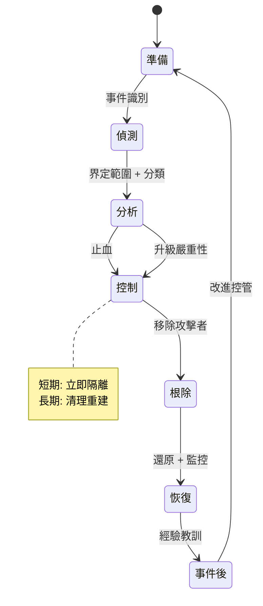

工程師最常搞砸的階段是「控制」。有兩種失敗模式：

* **過早驚動攻擊者** - 當他們還持有其他十台主機時，貿然切斷一台主機的電源只會讓他們知道你已經發現了，導致他們毀滅證據或加速資料外洩。有時你需要「先觀察再出擊」，以收集完整範圍。
* **控制不夠快** - 相反的罪過，在資料離開大樓時還在猶豫不決。

:::warning[不要摧毀你需要的證據]
恐慌的直覺是「現在就重新安裝系統」。但一台被入侵的現行主機保留著揮發性證據，如正在運行的行程、網路連接、記憶體駐留惡意軟體，這些在你斷電的瞬間就會消失。在可行的情況下，**在根除前捕捉記憶體和硬碟鏡像**。你需要它們來界定範圍（「他們還碰了什麼？」）、滿足法律/監管義務，並確保根除確實徹底。揮發性順序很重要：先記憶體，後磁碟。[^5]
:::

### 第 9 章：數位鑑識 - 重構真相

當事件結束（或為了法律訴訟）時，**數位鑑識與事件響應 (DFIR)** 會精確重構發生的一切。核心原則是「保管鏈 (chain of custody)」和「揮發性順序」。證據必須按從最易逝到最持久的順序收集，且每一項處理步驟都必須記錄在案，否則它在法庭上毫無價值，在界定範圍時也不可信：

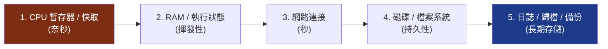

鑑識分析師從檔案系統元資料（MFT, `$LogFile`）、記憶體轉儲（Volatility）、Windows 事件日誌以及預讀取（Prefetch）和 shimcache 等構件中重構入侵時間軸，將數千個時間戳記編織成關於「他們如何進入、做了什麼、拿走了什麼」的一致敘述。

### 第 10 章：無責備的事後檢討 (Blameless Postmortem)

最有價值的階段往往是在時間壓力下最容易被跳過的：**經驗教訓**。使其運作的規則是「無責備」，分析目標是「系統與流程」，絕非個人。一旦事後檢討變成指責遊戲，人們就會停止說真話，而你會失去改進所需的關鍵資訊。

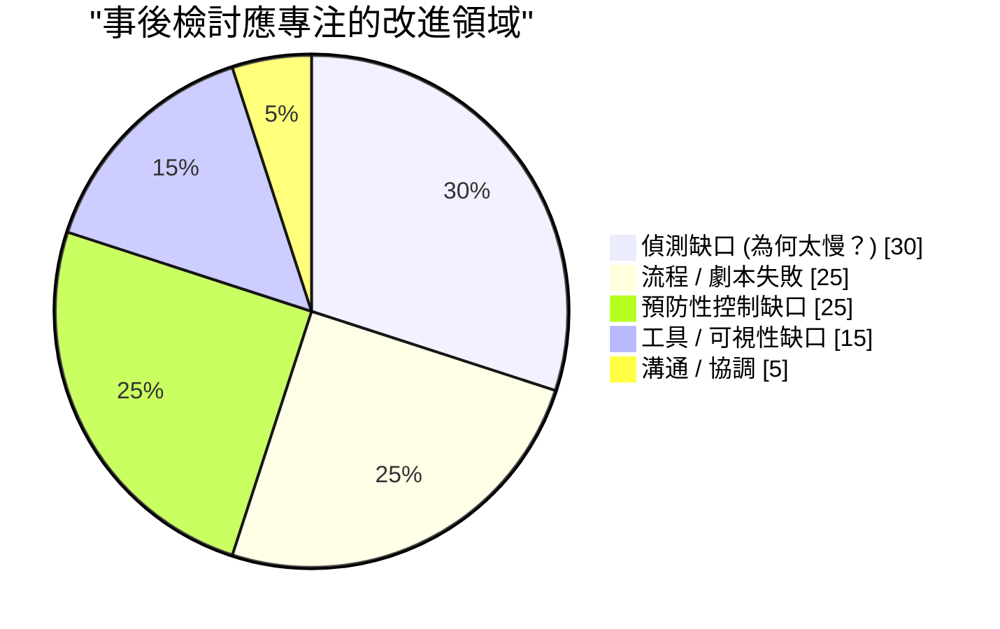

每一場事件都是昂貴的學費。那些能累積安全成熟度的組織，是那些「完整提取教訓」的組織：每一次入侵都永久彌補了允許其發生的缺口，並直接反饋到準備階段，進入第二部分的偵測規則中。

---

## 第五部分：威脅情報 - 了解你的對手

當你了解「誰可能針對你」以及「他們如何運作」時，偵測與響應能力會顯著提升。**網路威脅情報 (CTI)** 是一門將關於對手的原始數據轉化為決策的學科，它在三個層次上運作：

| 層次 | 受眾 | 回答的問題 | 範例 |
| --- | --- | --- | --- |
| **戰略性** | 高層 / 董事會 | *誰針對我們行業？為什麼？* | 「勒索軟體集團越來越針對醫療保健帳單」 |
| **運作性** | SOC 主管 | *現在有哪些活動與 TTPs？* | 「該集團使用魚叉釣魚 → Cobalt Strike → 雙重勒索」 |
| **戰術性** | 分析師 / 工具 | *我封鎖/偵測哪些具體指標？* | IOCs、ATT&CK 技術 ID、YARA/Sigma 規則 |

連結的框架是**鑽石模型 (Diamond Model)**，每一個入侵事件都有四個頂點，在它們之間旋轉分析能擴大你的理解：

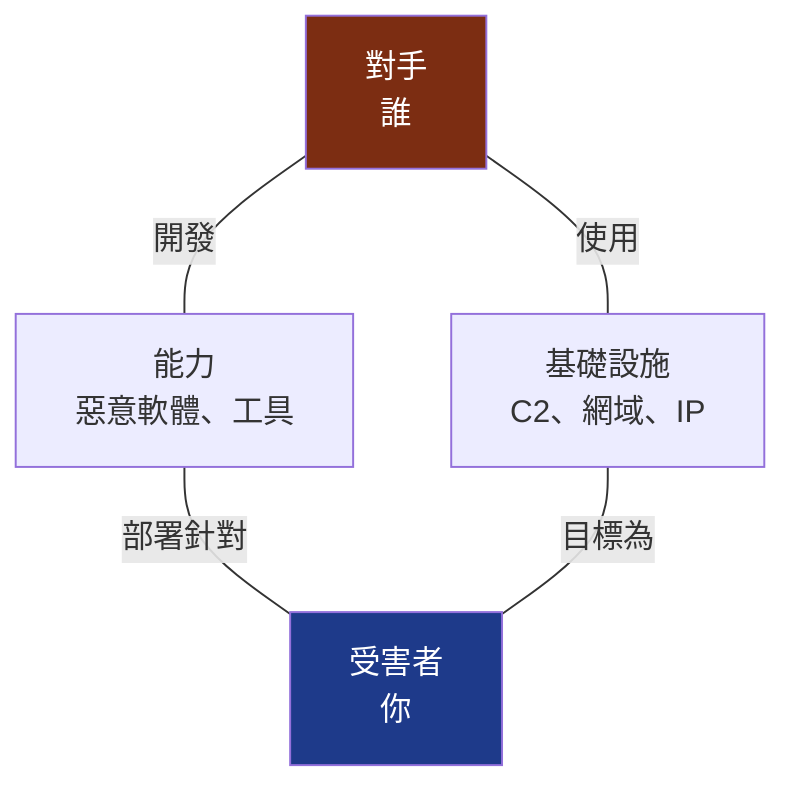

了解一個 C2 網域（基礎設施）讓你能夠旋轉到同一註冊商/模式下的其他網域；了解惡意軟體（能力）讓你能夠編寫捕捉對手「下一次」活動的 YARA 規則。CTI 是藍隊從單純防禦轉向主動預測的方式。

:::important[情報必須推動行動，否則只是瑣事]
一個沒有任何規則消耗的一萬個惡意 IP 清單只是雜訊，而非情報。CTI 的考驗在於閉環：它是否改變了你的偵測、封鎖、獵捕或優先級？將戰術 IOC 餵入 SIEM 充實資料，將運作 TTP 餵入 ATT&CK 覆蓋率地圖，將戰略評估餵入風險決策。無法觸及控管措施的情報，只是沒人讀的報告。
:::

---

## 結論與未來之路

我們現在經歷了防禦者的完整循環：**看見**（遙測）、**偵測**（行為偵測工程）、**響應**（SOC 與 IR 紀律）、**學習**（無責備事後檢討）以及**預測**（威脅情報）。我們接受了預防會失敗的事實，建立了生存肌肉，將駐留時間從週縮短到分鐘。

但還有一個領域，所有這些挑戰都在同時變得更困難、更快速：即**雲端原生**的世界，這裡有短暫存在的容器、宣告式基礎設施，以及由數千個你從未寫過的開源依賴組成的軟體。在這裡，邊界進一步消解，工作負載存在時間僅有幾秒，最危險的入侵不是通過你的程式碼，而是通過你的「供應鏈」：一個被投毒的依賴、一個被入侵的建構管道、一個洩漏的 CI 憑證。

**第五卷**，系列大結局，將把整個系列帶回到現代雲端原生與 DevSecOps 安全：容器與 Kubernetes 加固、基礎設施即程式碼掃描、保護 CI/CD 管道、SBOM 與 SLSA，以及防禦軟體供應鏈——這是未來十年決定性入侵正在發生的地方。

---

## 參考文獻

[^1]: [MITRE - ATT&CK Framework](https://attack.mitre.org/)
[^2]: [David Bianco (2013) - The Pyramid of Pain](https://detect-respond.blogspot.com/2013/03/the-pyramid-of-pain.html)
[^3]: [SigmaHQ - Generic Signature Format for SIEM Systems](https://github.com/SigmaHQ/sigma)
[^4]: [NIST (2012) - SP 800-61 Rev. 2: Computer Security Incident Handling Guide](https://csrc.nist.gov/publications/detail/sp/800-61/rev-2/final)
[^5]: [IETF - RFC 3227: Guidelines for Evidence Collection and Archiving](https://datatracker.ietf.org/doc/html/rfc3227)