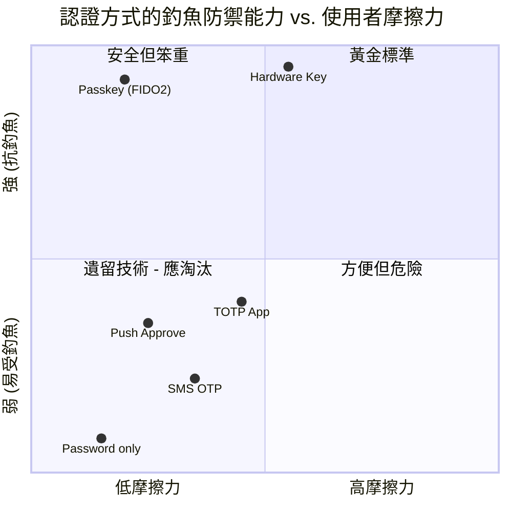
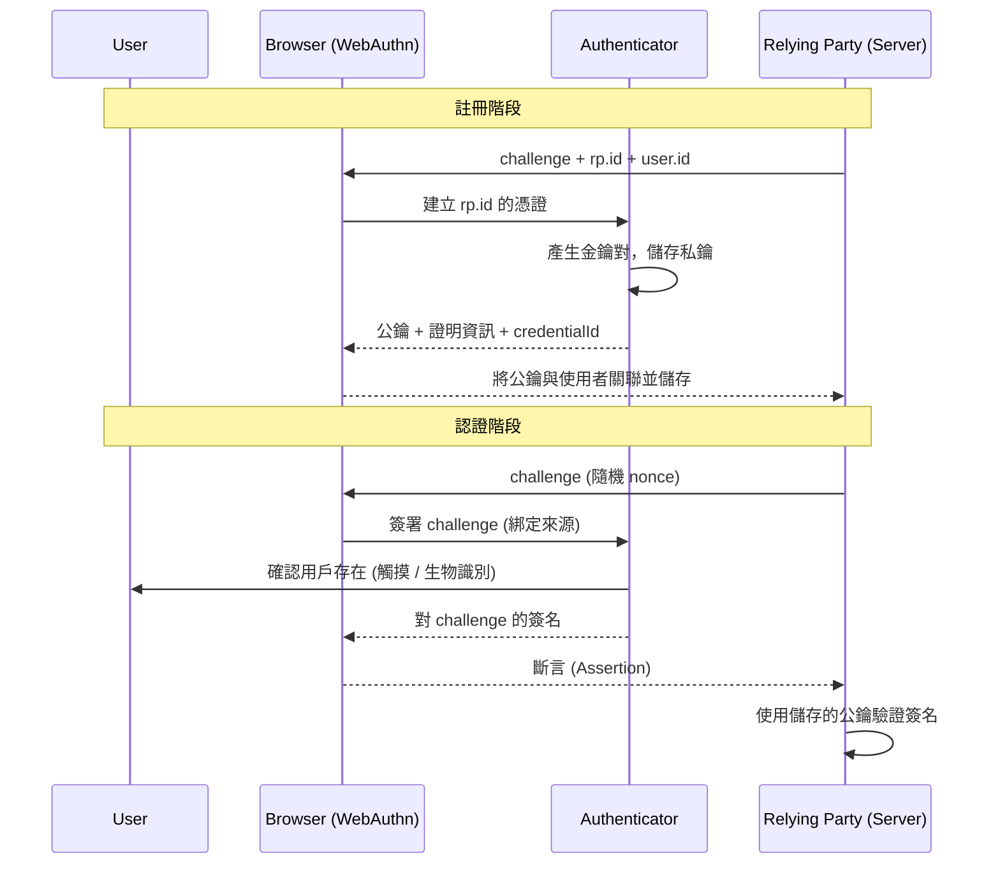
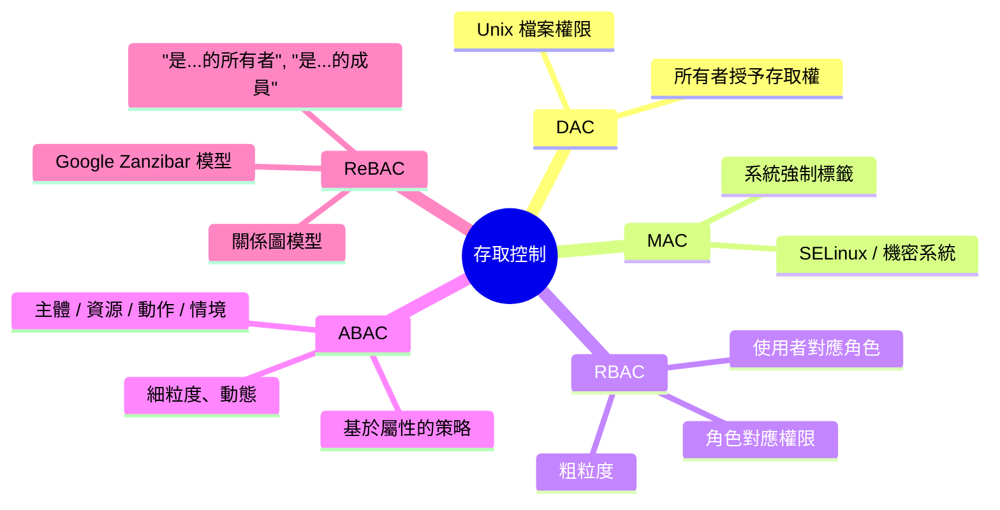
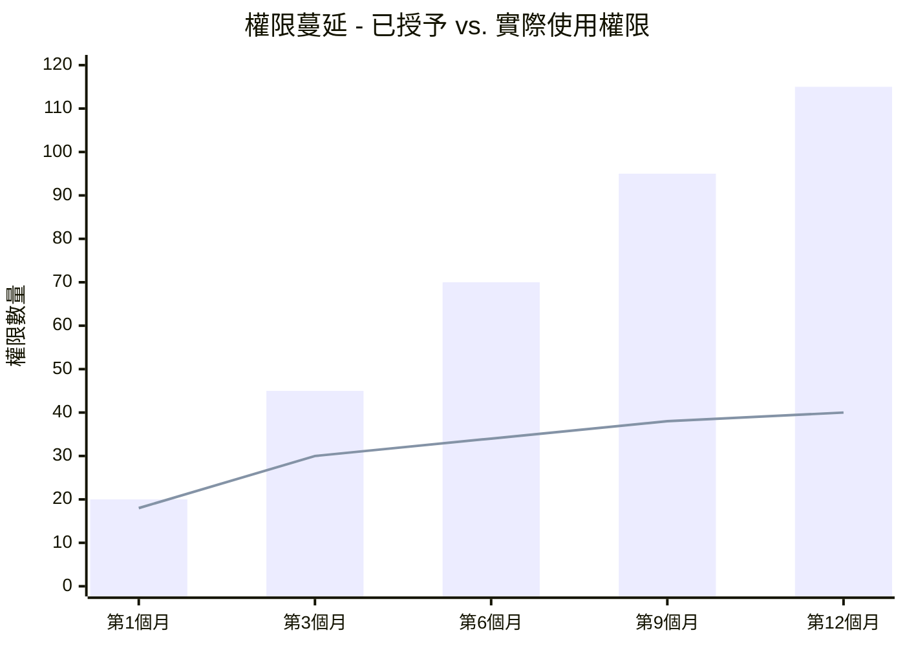
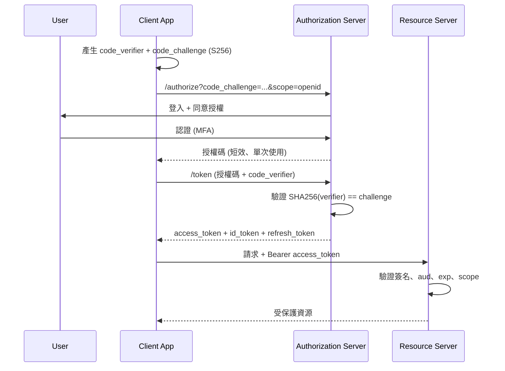
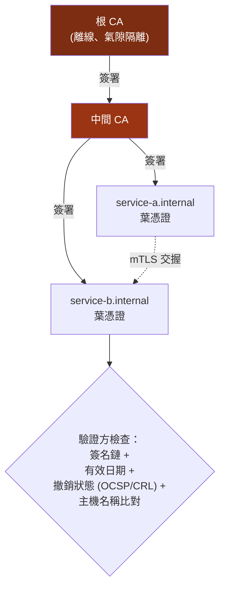
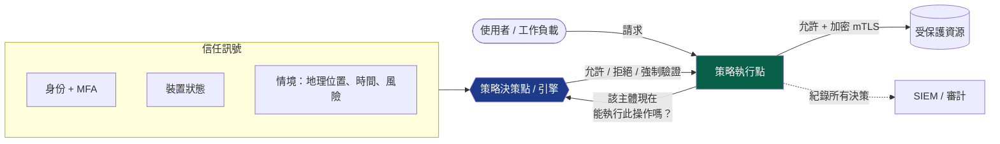
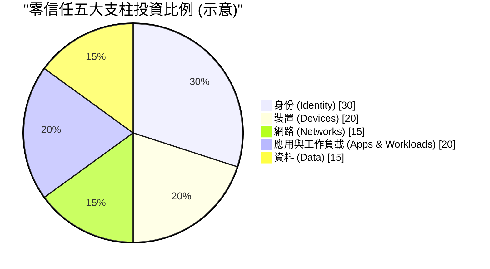

## 第一卷的結尾回顧

在 [第一卷](/posts/secure_systems_architecture/) 中，我們從底層硬體到軟體程式碼完整剖析了整個技術堆疊，並透過四種視角進行觀察：網路工程師、防禦者、駭客以及軟體工程師。我們在網路邊緣築起高牆，在通道中部署 IDS 感測器，並將防火牆視為領域的守門人。

隨後，這個領域消融了。

筆記型電腦被帶回家使用。伺服器遷移至他人的資料中心。API 開始透過公共網際網路互相呼叫。那種「城堡與護城河」的傳統模式——即「內部」代表*受信任*，「外部」代表*敵意*——已不再適用於現實。護城河消失了。剩下的只有一群主體：人員、服務、裝置和工作負載。每一個主體都在請求執行操作，且都必須證明自己的身份以及被允許觸及的範圍。

這正是本卷的主題。**身份即是新的邊界** [^1]，而每一次請求都是一次跨越邊界的行為。

:::note[本卷的核心主線]
認證（Authentication）回答的是*「你是誰？」*，而授權（Authorization）回答的是*「你能做什麼？」*。本文中提到的其餘所有內容——包括要素、Token、會話、策略引擎、金鑰材料——其存在目的都是為了讓上述兩個問題的答案在機器執行速度下變得**可信任、可撤銷且可審計**。
:::

---

## 第一部分：認證 - 證明你是誰

### 第 1 章：重新審視三大要素

每一種認證方案都可以歸納為三大經典要素的組合，加上現代新增的兩個要素：

* **知識要素 (Something you know)** - 密碼、PIN 碼、複雜密碼。
* **持有要素 (Something you have)** - 硬體金鑰、手機、智慧卡。
* **生物特徵要素 (Something you are)** - 指紋、臉部、虹膜。
* **位置要素 (Somewhere you are)** - 地理位置 / 網路環境（這是一種*情境*訊號，而非嚴格的硬性要素）。
* **行為要素 (Something you do)** - 行為生物識別：打字節奏、滑鼠軌跡動態。

**駭客視角：** 每一種要素都有其對應的原生攻擊方式。知識要素容易被*釣魚*或*暴力破解*。持有要素會被*竊取*或透過*SIM 卡挾持*繞過。生物特徵要素則會被*偽造*（如提取指紋、列印人臉），且最關鍵的是，這些要素**無法更換**——一旦外洩，你這輩子只有十個指紋可以用。

**防禦者視角：** 多重身份驗證 (MFA) 之所以有效，是因為攻擊者必須同時攻破*不同類別*的要素。但並非所有的 MFA 都一樣好。這也是防禦者最容易忽略的一個關鍵細微差別：



圖表給我們的教訓是：**基於 SMS 的 OTP 確實是 MFA，但它是脆弱的 MFA。** 它能防止密碼重用，但無法抵禦即時釣魚代理或 SIM 卡挾持攻擊。唯有 **FIDO2 / WebAuthn** 憑證——其中私鑰永遠不會離開認證器，且簽名在密碼學上綁定了來源（Origin）——才是真正*具備抗釣魚能力*的機制 [^2]。

:::warning[MFA 疲勞攻擊是真實存在的威脅]
在 2022 年，多起重大資安事件使用了**推送轟炸 (Push-bombing)**：攻擊者已掌握密碼，隨後不斷向受害者傳送驗證通知，直到對方因為煩躁或混淆而點擊「核准」。不具備*數字比對 (Number Matching)* 功能的推送式 MFA 是設計缺陷，而非安全防禦。請優先使用 Passkey，或強制要求在每次推送通知上執行數字比對，並加入情境檢查（應用程式名稱、地理位置等）。 [^3]
:::

### 第 2 章：頑強的密碼

即便在 Passkey 的未來世界中，密碼資料庫在十年內仍會存在。正確儲存密碼是無可妥協的底線。

原則：**絕對不要儲存使用者輸入的原始密碼。** 應儲存經過緩慢、加鹽（Salted）、記憶體硬化（Memory-hard）處理的雜湊值。

$$
H = \text{Argon2id}(\text{password}, \text{salt}, m, t, p)
$$

其中 $m$ 為記憶體消耗成本（KiB），$t$ 為時間成本（疊代次數），$p$ 為並行處理數。Argon2id 是目前 OWASP 推薦的預設選擇，因為它能同時抵抗 GPU 破解（透過記憶體硬化）以及旁路攻擊（透過混合資料存取模式） [^4]。

為什麼*緩慢*的雜湊很重要？這可以用攻擊者的經濟成本來解釋。如果攻擊者每秒能計算 $R$ 次雜湊，破解一個從大小為 $N$ 的金鑰空間中隨機選出的密碼，平均所需時間為：

$$
t_{\text{crack}} = \frac{N}{2R}
$$

像未加鹽的 SHA-256 這種快速雜湊，現代 GPU 叢集每秒可進行 $R \approx 10^{11}$ 次嘗試。經過調校的 Argon2id 可以將效率降至 $R \approx 10^{3}$。將 $R$ 降低八個數量級，就是這場攻防博弈的關鍵。

:::tip[密碼儲存檢查清單]

1. **雜湊處理**：使用 Argon2id（若不適用，則選用 scrypt 或 bcrypt）。
2. **加鹽（Salt）**：每個使用者必須擁有唯一的鹽值（以防範彩虹表攻擊）。
3. **加胡椒粉（Pepper）**：考慮在 HSM/KMS 中儲存伺服器端的 Pepper，並與資料庫分離（以防範攻擊者僅竊取資料庫的情況）。
4. **不要強制**：不要嚴格限制密碼長度或禁止貼上密碼，這會迫使用戶選擇更簡單的密碼。
5. **檢查外洩資料庫**：將新密碼與已知的**外洩資料庫**進行比對（例如 HaveIBeenPwned 的 k-anonymity API） [^5]。

:::

### 第 3 章：無密碼時代的終局 - WebAuthn 與 Passkeys

WebAuthn (瀏覽器 API) 加上 CTAP (認證器協定) 共同構成了 **FIDO2**。其思維模型如下：



其魔力在於一行程式碼：**簽名被綁定到了特定的來源（`rp.id`）**。一個位於 `paypa1.com` 的釣魚網站無法誘導認證器為 `paypal.com` 產生有效的斷言，因為瀏覽器會拒絕釋放它。這種設計從結構上而非依賴使用者的警覺性，徹底消除了憑證釣魚威脅 [^2]。

**Passkey** 本質上就是一種*可發現、可同步*的 FIDO2 憑證，並備份到雲端金鑰鏈（Apple、Google、Microsoft 或密碼管理器），確保裝置遺失時不會失去存取權。這種同步機制是讓無密碼技術得以被消費者廣泛採納的人體工學突破。

---

## 第二部分：授權 - 決定你能做什麼

認證只是簡單的一半。**授權才是真實系統的流血之地。** OWASP Top 10 已將「失效的存取控制 (Broken Access Control)」列為 **No.1** 的網路風險，其危害性甚至超過了注入攻擊與加密失效的總和 [^6]。

### 第 4 章：控制模型 - 從角色到屬性再到關係



**RBAC (角色基礎存取控制)** 是大多數組織採用的模型：使用者擁有多種角色，角色組合了權限。它易於理解與審計。其失敗模式在於**角色爆炸 (Role Explosion)**：當出現「業務時間內、財務專案、歐盟地區的編輯」這種極度具體的角色時，系統中會充斥成千上萬個角色，導致沒人能理清權限關係。

**ABAC (屬性基礎存取控制)** 透過在請求時評估策略屬性來解決此問題：

```txt
# 一個簡單的 ABAC 策略 (OPA / Rego 風格)
allow if {
    input.subject.department == input.resource.owner_department
    input.action == "read"
    input.context.time_hour >= 9
    input.context.time_hour < 18
}
```

**ReBAC (關係基礎存取控制)**，由 Google 的 **Zanzibar** 論文 [^7] 推廣，並以 OpenFGA 和 SpiceDB 等開源系統為代表，將授權建模為一個關係圖：「Alice 是 Doc 的編輯，Doc 在 Folder 中，Bob 是 Folder 的瀏覽者 → Bob 可以查看 Doc」。它非常適合處理 SaaS 產品中常見的「使用者 X 對物件 Z 能否執行 Y」這種涉及層級分享與巢狀結構的檢查。

:::important[IDOR 陷阱 - 授權領域最常見的傷口]
**不安全直接物件參照 (Insecure Direct Object Reference, IDOR)** 發生在你驗證了使用者身份，卻忘記了*對物件進行授權*。經典案例：

```bash
GET /api/invoices/1043   ->  200 OK  (我的發票)
GET /api/invoices/1044   ->  200 OK  (別人的發票！)
```

修復之道在於一種開發規律，而非依賴某個函式庫：**每個物件存取請求都必須限制在請求主體的範圍內。** 永遠不要直接使用 `SELECT * FROM invoices WHERE id = ?`；務必寫成 `... WHERE id = ? AND owner_id = ?`，或者將此檢查納入集中式的策略引擎中。IDOR 是造成「失效的存取控制」登上 OWASP 榜首的根本原因 [^6]。
:::

### 第 5 章：最小權限原則的量化

最小權限原則強調：僅授予所需的*最小*權限，並在*最短*時間內有效。在實務上，權限往往只會累積，這種現象稱為**權限蔓延 (Privilege Creep)**。一個有用的心智衡量指標是：*已使用權限*與*已授予權限*的比率。



長條（已授予）與折線（已使用）之間日益擴大的差距，即是你的**常駐攻擊面**：這些權限在帳號被攻擊者接管的瞬間即被繼承，且往往無人監控。對策包括：

* **即時 (JIT) 存取：** 在有限的時間視窗內授予高權限，過期自動撤銷。
* **存取審查 / 再認證：** 定期執行「你還需要這些權限嗎？」的審核工作。
* **特權存取管理 (PAM)：** 將管理員憑證封裝在金鑰保險庫中，代理會話，並記錄所有操作。

---

## 第三部分：Token、會話與聯合身份

### 第 6 章：OAuth 2.0 與 OIDC 的混淆

在架構設計中，最常見的錯誤是混淆了 **OAuth 2.0**（授權 - 委派存取）與 **OpenID Connect (OIDC)**（認證 - 證明身份）。OIDC 其實是 *OAuth 2.0 之上*的一層輕量級身份認證層 [^8]。

* **OAuth 2.0** 回答：*「你是否願意讓這個 App 代表你存取資源 R？」* 它核發**存取權杖 (Access Token)**。
* **OIDC** 回答：*「這個使用者是誰？」* 它核發 **ID Token**（一個包含使用者宣告的簽名 JWT）。

目前對於 SPA、行動裝置與 Web 應用程式，最推薦的現代化流程是 **Authorization Code + PKCE**：



**為何需要 PKCE (Proof Key for Code Exchange)？** 如果沒有它，攻擊者若攔截了授權碼（例如透過在相同 URI Scheme 下註冊惡意 App），便可兌換憑證。PKCE 將授權碼與只有合法用戶端知道的密鑰（`code_verifier`）綁定，使得竊取的程式碼失去價值。**OAuth 2.1** 已強制所有用戶端必須使用 PKCE，並完全移除了危險的 *Implicit* 與 *Password* 授權類型 [^9]。

:::caution[停止使用 Implicit 流程]
傳統的 Implicit 授權將 Token 直接放在 URL Fragment 中，這是瀏覽器還沒有 `fetch` 與 CORS 功能時代的產物。Token 會洩漏到瀏覽記錄、Referrer 與日誌中。如果教學文件教你使用 `response_type=token`，請直接忽略，該內容已過時十年。請一律使用 Authorization Code + PKCE。
:::

### 第 7 章：會話 (Sessions) 與 Token - 有狀態 vs. 無狀態的權衡

| 特性 | 伺服器會話 (Cookie → 會話儲存) | 獨立的 JWT (Self-contained) |
| --- | --- | --- |
| 狀態 | 伺服器持有會話；Cookie 只是不透明 ID | 伺服器無狀態；Token 本身即狀態 |
| 撤銷 | **即時** - 刪除會話資料列 | **困難** - 到期前有效，需維護黑名單 |
| 擴展性 | 需要共用儲存 (Redis) | 極易水平擴展 |
| 負載 | 小型 Cookie | 每次請求需傳送較大的 Token |
| 適用場景 | 傳統 Web App，需即時登出 | 服務對服務、短效存取權杖 |

業界標準的妥協做法是：**短效存取權杖 (5–15 分鐘) + 長效更新權杖 (Refresh Token)。** 存取權杖是你不打算撤銷的 JWT（反正很快過期）；更新權杖則是可撤銷、可輪替的伺服器端憑證。撤銷使用者只需在存取權杖有效期過後即可將其完全阻斷。

:::warning[JWT 的三大殺手]

1. **`alg: none`** - 歷史上某些函式庫會接受宣告不需簽名的 Token。務必在伺服器端鎖定預期的演算法；永遠不要相信 Header 中的 `alg`。
2. **HS256 vs RS256 混淆** - 攻擊者提交一個使用你的 RSA *公鑰*作為 HMAC 密鑰簽署的 HS256 Token。務必鎖定演算法。
3. **在 `localStorage` 儲存 JWT** - 任何 XSS 攻擊皆可讀取。對於瀏覽器會話，請優先選擇 `HttpOnly`、`Secure` 與 `SameSite` Cookies。 [^10]

:::

### 第 8 章：聯合身份與 SSO

**單一登入 (SSO)** 讓使用者能用一組登入憑證存取多個應用程式。兩大主流協定：

* **SAML 2.0** - 基於 XML，冗長，在企業 B2B 與遺留系統中仍居統治地位。
* **OIDC** - 基於 JSON/JWT，是現代新應用、行動裝置與 API 的預設選擇。

參與者包括：**身份提供者 (IdP)** - 如 Okta、Entra ID、Keycloak、Google - 負責對使用者進行認證，並向**服務提供者 (SP)** / 依賴方（Relying Party）保證其身份。價值在於集中化：在單一位置強制執行 MFA、在單一位置停用離職員工帳號、在單一位置保留完整審計軌跡。

:::note[Deprovisioning（帳號銷毀）是隱形殺手]
SSO 最大的安全價值在於**即時、集中的離職管理。** 現實中最常見的失敗案例是「孤兒帳號」：員工離職後，HR 關閉了 SSO 帳號，但該員工在某個被遺忘的伺服器上的本地管理員帳號卻依然活躍。請確保所有身份來源與你的 HR 記錄系統同步。沒有人類持有的帳號，就是攻擊者的囊中之物。
:::

---

## 第四部分：機器身份與機密管理

人類只是變數之一。在現代雲端環境中，**機器身份的數量是人類的 45 倍** [^11]，每一個微服務、函式、容器與 CI 任務都需要對某個對象進行認證。

### 第 9 章：PKI 與信任鏈

機器對機器的信任建立在 **X.509 憑證**與公開金鑰基礎設施（PKI）之上。憑證將公鑰與身份綁定，並由驗證方信任的憑證授權中心 (CA) 簽署。



根憑證的私鑰是皇冠上的珍珠，必須保持**離線與氣隙隔離 (Air-gapped)**，因為一旦外洩，其下所有憑證皆失效。中間 CA 負責日常簽署，確保根金鑰無需從保險庫中取出。

**mTLS (雙向 TLS)** 是 PKI 解決服務對服務認證的方案：*雙方*都出示憑證，確保服務不僅能驗證呼叫者，也能向被呼叫者證明自身身份。這是零信任架構中工作負載間的加密主幹（這也是服務網格如 Istio 和 Linkerd 的存在價值，它們透過 **SPIFFE/SPIRE** 身份自動化了憑證的發行與輪替） [^12]。

### 第 10 章：機密管理

軟體開發中最古老的罪惡：硬編碼機密。

```python
# 永不消逝的漏洞
DB_PASSWORD = "hunter2"          # 提交到 git，永遠留在歷史紀錄中
API_KEY = "sk_live_a1b2c3d4..."  # 在用戶端程式碼包中外洩
```

Git *永不遺忘*。一旦提交了機密，即使在下一次 commit 中「刪除」它，該機密依然存在於歷史記錄中，並會在幾秒內被機器人抓取。正確的紀律：

::::steps

:::step[永遠不要 commit 機密]{subtitle="預防"}
使用 pre-commit hook（如 `gitleaks`、`trufflehog`）在機密進入歷史紀錄前予以阻擋。在 CI 中強制執行此規律，確保沒人能在本地繞過檢查。
:::

:::step[集中於機密管理器]{subtitle="儲存"}
使用 HashiCorp Vault、AWS Secrets Manager 或雲端 KMS。應用程式透過經過身份驗證的工作負載在執行時取得機密，機密永遠不應出現在原始程式碼或 Baking 到映像檔的環境變數檔案中。
:::

:::step[優先使用動態、短效機密]{subtitle="輪替"}
Vault 可以產生一個僅有效一小時的資料庫憑證，之後自動撤銷。一個外洩的一小時憑證，遠比一個已存在三年且永不過期的靜態憑證安全。
:::

:::step[定期與懷疑時即輪替]{subtitle="回應"}
將輪替自動化。當機密「可能」外洩時，先輪替再調查。輪替必須成為一項無趣、一鍵完成、零停機的操作，否則它永遠不會發生。
:::

::::

:::tip[工作負載身份勝過預存機密]
最好的機密是你從不儲存的那一個。**工作負載身份聯合 (Workload Identity Federation)**（如 AWS IAM Roles for Service Accounts, GCP Workload Identity, OIDC-federated CI 運行環境）讓工作負載證明「它是什麼」來取得短效憑證，過程中沒有長效金鑰。如果你還在 CI 中貼上靜態雲端金鑰，這是你最值得投資的升級。
:::

---

## 第五部分：綜合 - 構建零信任架構

現在我們可以將一切拼湊成 NIST 在 **SP 800-207** 中正式定義的模型：**零信任 (Zero Trust)** [^13]。其基礎假設，以及它取代城堡與護城河的原因，可以用一句話概括：

> **永不信任，始終驗證。** 預設網路具有敵意。地理位置不能授予任何權限。每一次請求都必須經過獨立的認證、授權與加密。

該參考架構包含一個負責評估策略的**策略決策點 (PDP)**，以及散佈在資料路徑上、負責詢問 PDP 並強制執行結果的**策略執行點 (PEP)**：



成熟的零信任方案包含五大支柱（根據 CISA 零信任成熟度模型） [^14]：



請注意，**身份佔據了最大的份額**，這並非巧合。當網路不再賦予任何信任時，身份就成了主要的控制平面。本卷提到的所有內容：要素、Token、策略引擎、機器身份，都是為了讓這個控制平面變得可信任。

:::important[零信任是過程，而非產品]
沒有廠商能出售「盒裝零信任」。它是一種*架構*與*作業原則*，需循序漸進：從為最重要的應用程式加入抗釣魚 MFA 開始，增加裝置狀態檢查，實行微分割，最後擴展至工作負載。成熟度衡量的是消除了多少隱性信任，而非在資安設備上砸了多少錢。
:::

---

## 結論與前瞻

第一卷保護了一個地方。本卷保護了一個*主體*，無論它身在何處。我們用門前的拷問取代了高牆：*證明你是誰，證明你被允許。*

然而，本卷中的每一個主張、每一個 Token 簽名、每一個 mTLS 交握、每一個雜湊密碼，都建立在我們目前視為「魔法盒」的密碼學基礎上。在 **第三卷** 中，我們將開啟這個盒子。我們將從底層建構密碼原語：對稱與非對稱加密、真實的 TLS 1.3 交握、金鑰交換與前向安全性，以及即將到來的後量子密碼學衝擊，並盤點工程師在這些細節上導致災難性後果的所有方式。

你剛剛學會信任的身份，其強度僅取決於簽署它的數學公式是否堅不可摧。

---

## 參考文獻

[^1]: [Microsoft (2021) - Identity is the new security perimeter](https://www.microsoft.com/en-us/security/business/security-101/what-is-identity-access-management-iam)
[^2]: [FIDO Alliance - How FIDO Works](https://fidoalliance.org/how-fido-works/)
[^3]: [CISA (2022) - Implementing Phishing-Resistant MFA](https://www.cisa.gov/sites/default/files/publications/fact-sheet-implementing-phishing-resistant-mfa-508c.pdf)
[^4]: [OWASP - Password Storage Cheat Sheet](https://cheatsheetseries.owasp.org/cheatsheets/Password_Storage_Cheat_Sheet.html)
[^5]: [Troy Hunt - Have I Been Pwned: Pwned Passwords (k-Anonymity)](https://haveibeenpwned.com/API/v3#PwnedPasswords)
[^6]: [OWASP - A01:2021 Broken Access Control](https://owasp.org/Top10/A01_2021-Broken_Access_Control/)
[^7]: [Google (2019) - Zanzibar: Google's Consistent, Global Authorization System](https://research.google/pubs/pub48190/)
[^8]: [OpenID Foundation - What is OpenID Connect](https://openid.net/developers/how-connect-works/)
[^9]: [IETF - OAuth 2.1 Authorization Framework (draft)](https://datatracker.ietf.org/doc/html/draft-ietf-oauth-v2-1)
[^10]: [OWASP - JSON Web Token Cheat Sheet](https://cheatsheetseries.owasp.org/cheatsheets/JSON_Web_Token_for_Java_Cheat_Sheet.html)
[^11]: [CyberArk (2023) - Identity Security Threat Landscape Report](https://www.cyberark.com/threat-landscape/)
[^12]: [SPIFFE - Secure Production Identity Framework For Everyone](https://spiffe.io/docs/latest/spiffe-about/overview/)
[^13]: [NIST (2020) - SP 800-207: Zero Trust Architecture](https://csrc.nist.gov/publications/detail/sp/800-207/final)
[^14]: [CISA - Zero Trust Maturity Model v2.0](https://www.cisa.gov/zero-trust-maturity-model)