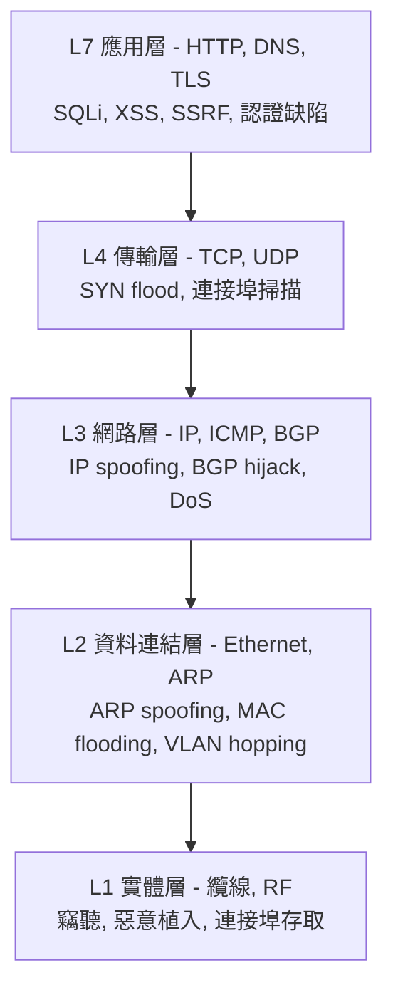
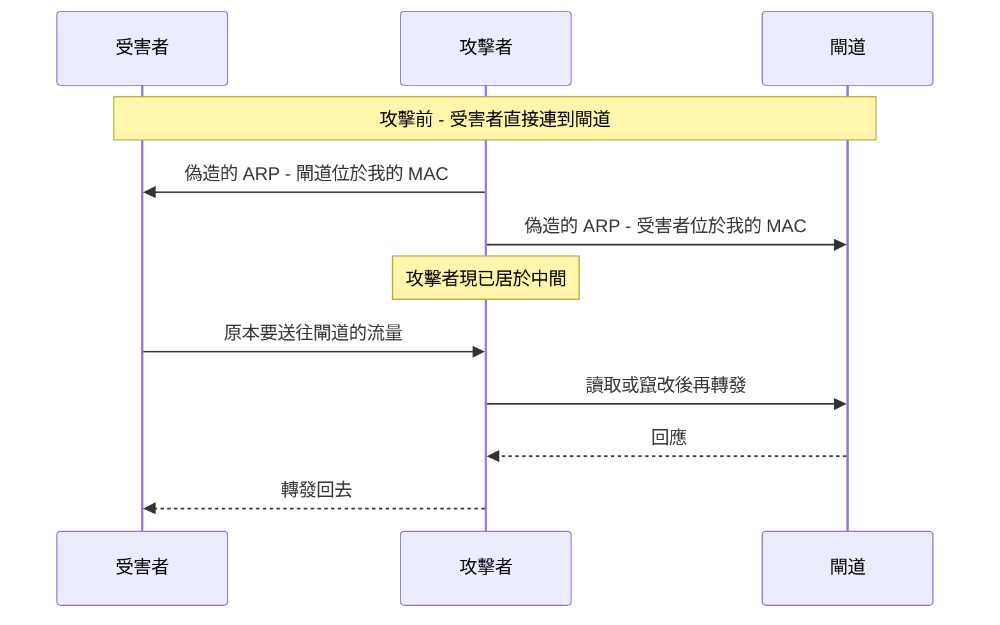
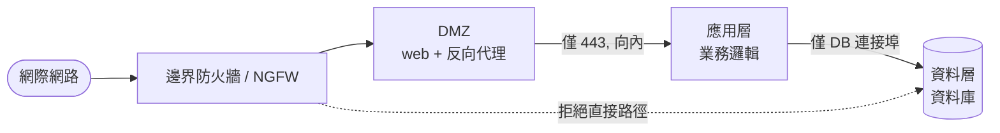
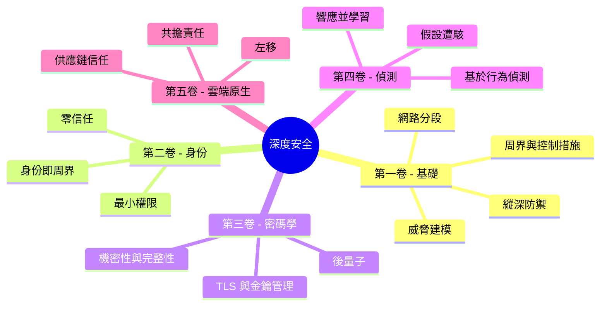
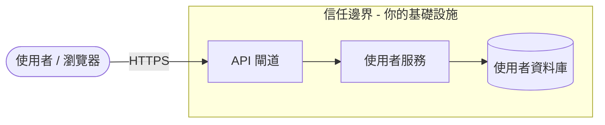
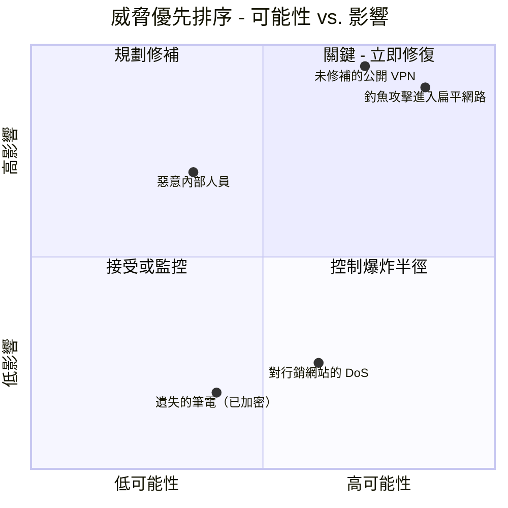
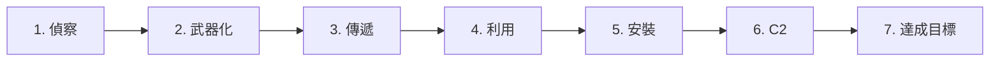
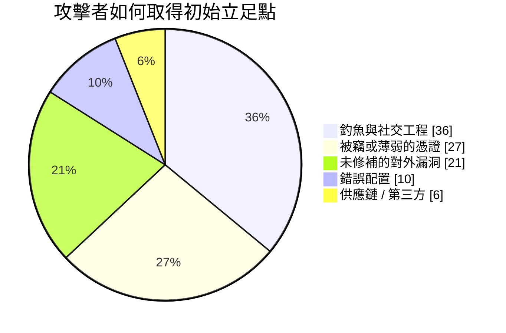
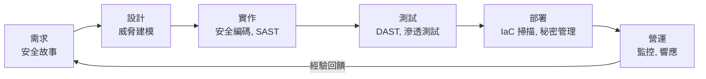
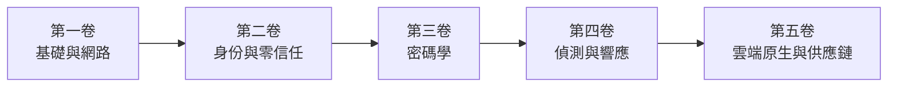

## 系列的起點

這是一趟橫跨五卷、探索**安全架構 (Security Architecture)** 之旅的開篇。在整個系列中，我們將走遍整個技術堆疊，從銅線到容器，其地圖如下：

* **第一卷（本卷）** - 基礎：作為攻擊面的網路、可防禦的設計、縱深防禦、威脅建模，以及攻擊者的方法論。
* **第二卷** - [身份、存取與零信任前線](/posts/identity_and_access_in_depth/)：當周界瓦解時，身份便成為新的邊界。
* **第三卷** - [密碼學工程](/posts/cryptography_engineering_in_depth/)：讓這一切變得可信的基本原語。
* **第四卷** - [偵測、響應與威脅情報](/posts/detection_and_response_in_depth/)：當預防失敗時你該怎麼做。
* **第五卷** - [雲端原生與供應鏈安全](/posts/cloud_native_and_supply_chain_security_in_depth/)：保護短暫易逝的事物，並證明你所交付的內容。

本指南與眾不同之處在於其方法。每個主題都會透過**四雙眼睛**來審視，因為一個真實的系統是由四種工程師同時爭論出來的：

* 構建基礎的**網路工程師 (Network Engineer)**。
* 必須保護它的**防禦者 (Defender)**。
* 試圖破解它的**駭客 (Hacker)**。
* 編寫運行其上程式碼的**軟體工程師 (Software Engineer)**。

:::note[整個系列的核心論點]
沒有任何單一控制措施是可信的。防火牆會失效、憑證會外洩、程式碼有臭蟲，而依賴項會被下毒。因此，安全不是你能購買的產品，而是你所**工程打造的一種屬性**：每一層都假設它前面的一層已經失守。本卷建構最外層的防禦與心態，系列的其餘部分則向內建構。
:::

---

## 第一部分：網路即疆域

數據通訊始於網路，攻擊亦然。對 OSI 或 TCP/IP 模型只有膚淺的理解是不夠的 [^1]；安全專業人員會把每一層讀兩遍，一遍看它*做什麼*，一遍看它如何被*轉為己用*。

### 第 1 章：透過安全視角看待堆疊

每一層都承載著它自身固有的攻擊與固有的防禦。你越往下走，妥協就越是物理性、越是絕對。

**第 1 層 - 實體層。** 纜線、光纖與交換器的世界。對駭客而言，*只要能觸及*，它就是終極攻擊向量：在未加密線路上安裝的網路竊聽器 [^2]、留在防火牆後方作為持久命令與控制據點的廉價植入設備，或僅僅是一台插入大廳活躍網路插孔的筆記型電腦。防禦者的答案是程序性與實體性的——上鎖的機房、停用的連接埠、防篡改封條——並在技術上以 **IEEE 802.1X** 網路存取控制為後盾，它迫使任何實體連接的設備在取得一個可用訊框之前先進行身份驗證 [^3]。

**第 2 層 - 資料連結層。** MAC 位址、交換器，以及 **ARP**——這個將 IP 映射到 MAC、設計上帶有隱式信任的協定 [^4]。那份信任正是漏洞所在：

這就是 **ARP 欺騙 (ARP spoofing)**，它讓攻擊者在本地網段上取得中間人 (Man-in-the-Middle) 的位置 [^5]。它的同類手法包括 **MAC 泛洪 (MAC flooding)**（灌爆交換器的 CAM 表，直到它故障開放並像集線器一樣廣播一切 [^6]）與 **VLAN 跳躍 (VLAN hopping)**（透過設定錯誤的 Trunk 連接埠逃出你的 VLAN [^7]）。防禦者在此的工具箱是交換器衛生：以**連接埠安全 (port security)** 將 MAC 綁定到每個連接埠 [^8]、以 **DHCP 監聽 (DHCP snooping)** 消滅惡意 DHCP 伺服器，以及以**動態 ARP 檢查 (Dynamic ARP Inspection)** 對照可信綁定表丟棄偽造的 ARP。

**第 3 層 - 網路層。** IP 位址與路由。**IP 欺騙 (IP spoofing)** 偽造來源位址——這是諸如經典 Smurf 攻擊等反射式 DoS 背後的引擎 [^9]——而 **BGP 劫持 (BGP hijacking)** 則破壞網際網路的路由表以大規模吞噬流量，是一種國家級的間諜與大規模攔截工具 [^10]。防禦者進行過濾：依據 BCP 38 / RFC 2827 的**入站/出站過濾 (ingress/egress filtering)** 丟棄來源 IP 造假的封包 [^11]，而 ACL 則規範誰可以與誰通訊。

**第 4 層 - 傳輸層。** **TCP**（面向連接、三向交握）與 **UDP**（發送即忘）。**SYN 泛洪 (SYN flood)** 以永不完成的偽造 SYN 耗盡伺服器的半開連接表 [^12]；使用 `nmap` 等工具的**連接埠掃描 (port scanning)** 則測繪出正在監聽的攻擊面 [^13]。防禦者以**狀態防火牆 (stateful firewalls)** 回應，只放行它握有對應交握的 ACK，並以 **SYN cookies** 在客戶端證明自己是真實之前不分配任何狀態 [^14]。

### 第 2 章：設計一個可防禦的網路

**扁平化網路 (flat network)**——每個設備都能觸及其他每一個設備——是駭客的天堂。攻陷一台被遺忘的印表機，你就能一路走到網域控制器。可防禦的網路是**分段的 (segmented)** 網路 [^15]。

分段——子網路、**VLAN** 與分層的 **DMZ** [^16]——把每一次跳躍都變成受監控的瓶頸。它是以拓撲形式表達的最小權限：Web 伺服器沒有理由撥接網域控制器，因此防火牆禁止它，而一台被攻陷的 Web 伺服器會發現自己身處死巷而非高速公路上。

**微分段 (Microsegmentation)** 把這一點推向其邏輯終點：把政策邊界圍繞在*每一個工作負載*上，而非每一個區域。同一子網路上的兩台 VM 並非被隱式信任；每一條流量都必須被明確允許。那條原則——*永不信任，始終驗證*——正是**零信任 (Zero Trust)** 的種子，並成長為下一卷的整個主題。

:::important[第一次交棒]
微分段問的是*「這兩個主體是否應被允許通訊？」*——而一旦你認真看待這個問題，網路位址就不再是一個足夠好的答案。你需要驗證**身份**。這正是 **[第二卷](/posts/identity_and_access_in_depth/)** 接手之處：身份即新周界。
:::

### 第 3 章：守門人 - 防火牆與 IDS/IPS

**狀態防火牆**理解連接的上下文；**次世代防火牆 (Next-Generation Firewall, NGFW)** 更進一步具備應用感知（封鎖一個應用、允許另一個，兩者都在 443 連接埠上）、整合式入侵防禦，以及威脅情報摘要 [^17]。**Web 應用程式防火牆 (WAF)** 則在第 7 層運作以鈍化 OWASP Top 10 攻擊 [^18]。

:::warning[WAF 是安全網，不是解藥]
WAF 或許能封鎖天真的 `OR 1=1`，但 WAF 規避是一門成熟的學科——編碼、混淆與大小寫花招每天都在繞過特徵。注入的真正修正存在於程式碼中（參數化查詢），而不在栓在它前面的過濾器裡。把 WAF 當作縱深防禦，永遠別把它當作那道防禦本身。
:::

**IDS** 監看並發出警報；**IPS** 位於在線位置並進行封鎖。兩者都透過**特徵 (signature)**（對已知威脅精準，對新穎威脅盲目）或**異常 (anomaly)**（能捕捉未知，但會用誤報淹沒你）來偵測 [^19]。而且除非你付費解密，否則兩者都會對加密流量失聰——這預示了為何*偵測*最終必須從線路轉移到端點，這正是第四卷的故事。

---

## 第二部分：縱深防禦 - 以及它為何就是這個系列

縱深防禦是一種認知：任何單一控制*終將*失效，因此你建構層層防禦，每一層都爭取到時間、可視性，以及阻止攻擊者的又一次機會 [^20]。中世紀城堡是那個老掉牙卻完美的類比：護城河、城牆、弓箭手、內堡、皇冠珠寶，以及把這一切串連起來的衛兵。

以下是組織整個系列的那一步棋：**城堡的每一層都是一卷。**

* **護城河與外牆**是網路周界與分段——**本卷**。
* **每扇門前的衛兵**是身份與存取——**[第二卷](/posts/identity_and_access_in_depth/)**。
* **衛兵所信任的密封訊息**是密碼學——**[第三卷](/posts/cryptography_engineering_in_depth/)**。
* **守望突破口的弓箭手**是偵測與響應——**[第四卷](/posts/detection_and_response_in_depth/)**。
* **石塊本身的來源出處**是供應鏈與雲端原生安全——**[第五卷](/posts/cloud_native_and_supply_chain_security_in_depth/)**。

**駭客的視角：** 攻擊者把各層視為障礙，並獵尋每一層中最薄弱的接縫。若員工點擊了釣魚連結，再完美的防火牆也一文不值；若主機未經修補，再無瑕的程式碼也毫無用處。深度之所以重要，正是因為攻擊者只需要*一條*路徑，而深度是你確保沒有任何單一失效成為那條路徑的方式。

---

## 第三部分：威脅建模 - 刻意地像攻擊者一樣思考

威脅建模是在你建構弱接縫*之前*就找到它們的一種結構化方式 [^21]。它是主動的、廉價的，並且是一個團隊所能做的槓桿最高的安全活動之一。標準的助記符是微軟的 **STRIDE** [^22]。

考慮一個平凡的端點：`PUT /api/users/{id}`。先繪製它的資料流圖，標出資料從敵對外部越入你基礎設施的**信任邊界 (trust boundary)**。

現在對每個元素與流量走一遍 STRIDE：

| STRIDE 威脅 | 對此端點該問的問題 | 主要防禦 |
|---|---|---|
| **S**poofing（欺騙） | 使用者 A 能否更改 `{id}` 並編輯使用者 B 的檔案？ | 強身份驗證 + 每物件授權 |
| **T**ampering（篡改） | 中間人能否在傳輸中竄改請求主體？ | TLS（第三卷） |
| **R**epudiation（否認） | 使用者能否否認他做了該變更？ | 已簽章、不可變的稽核日誌 |
| **I**nformation disclosure（資訊洩漏） | 回應是否洩漏 PII 或密碼雜湊？ | 最小化輸出、靜態加密 |
| **D**enial of service（阻斷服務） | 單一客戶端能否灌爆它並使資料庫餓死？ | 速率限制、配額 |
| **E**levation of privilege（權限提升） | 是否存在通往管理員的注入路徑？ | 參數化查詢、最小權限 |

多數真實世界的入侵都始於那張表的兩端：**欺騙**（損壞的身份驗證）與**權限提升**。最常見的單一 Web 缺陷——**不安全直接物件參考 (Insecure Direct Object Reference, IDOR)**——只不過是披著 URL 外衣的欺騙：應用程式信任了使用者提供的 `{id}`，卻沒有檢查*這個*使用者是否可以觸碰*那個*物件 [^23]。

列舉威脅只是工作的一半；你無法修復所有問題，因此你依據**可能性 × 影響**排序，並把預算花在兩者乘積最高的地方。

以下是同一套紀律，化為一個你能在一小時設計會議中執行的可重複循環：

:::steps

:::step[分解系統]{subtitle="繪製資料流圖"}
標出每一個處理程序、資料儲存、外部實體與流量。明確畫出**信任邊界**——它們是攻擊從不受信任越入受信任之處，也是你多數發現會聚集之處。若你畫不出來，就代表你對它的理解還不足以保護它。
:::

:::step[以 STRIDE 列舉威脅]{subtitle="要系統化，而非耍聰明"}
對每個元素走一遍欺騙、篡改、否認、資訊洩漏、阻斷服務與權限提升。助記符的意義在於阻止你跳過那個你寧願不去想的類別。
:::

:::step[依可能性與影響排序]{subtitle="把力氣花在要緊處"}
把每個威脅標在風險矩陣上。一個災難性但不可能發生的威脅，和一個微不足道卻持續不斷的威脅，兩者都在浪費你的注意力。先為右上象限投入資源。
:::

:::step[緩解，然後驗證]{subtitle="把發現轉化為測試"}
每一個被接受的威脅都會變成一項工程任務*以及*一個測試案例——一個授權整合測試、一個速率限制檢查、一個模糊測試目標。一個沒有改變待辦事項的威脅模型只是一場作秀。
:::

:::

---

## 第四部分：攻擊者的方法

要打破鏈條，你必須先看見它。Lockheed Martin 的**網路殺傷鏈 (Cyber Kill Chain)** 把一次典型入侵建模為七個階段；防禦者的目標是盡可能*及早*打破它，因為修補成本在每一步都會攀升 [^24]。

偵察融合了**被動 OSINT** 與**主動**探測（連接埠掃描、DNS 枚舉、Shodan 掃描）。武器化與傳遞則建構並投送有效負載——絕大多數是透過**釣魚 (phishing)**，至今仍是頭號入侵途徑：

在**利用**與**安裝**之後，攻擊者透過 **C2** 通道「撥電回家」並開始**達成目標**。取得立足點之後，其手法轉為保持隱蔽：

* **橫向移動 (Lateral movement)** - 從第一台主機跳向皇冠珠寶。在 Windows 網域中，這意味著從記憶體傾倒憑證並重複使用，通常透過**傳遞雜湊 (Pass-the-Hash)**，無需明文密碼。
* **持久性 (Persistence)** - 以一個能重新長出的立足點在重啟與修補中存活下來。
* **寄生 (Living off the Land, LotL)** - 完全避開自訂惡意軟體；使用機器上早已受信任的 `PowerShell`、`PsExec` 等工具，因此一切看起來都不突兀。

:::caution[為何僅靠周界永遠無法致勝]
LotL 正是第一卷的城牆必要卻不充分的原因。一個只使用合法、已簽章系統工具的攻擊者，不會拋出任何可供防火牆或防毒軟體比對的特徵。要抓住他們，需要監看*行為*——一份 Word 文件生成了 PowerShell，而 PowerShell 又打開了一個網路 socket——這正是 **[第四卷](/posts/detection_and_response_in_depth/)** 及其攻擊者行為地圖 **MITRE ATT&CK** 的領域。預防假設你能把他們擋在外面。偵測則假設你擋不住。
:::

---

## 第五部分：安全設計 (Secure by Design)

最便宜的漏洞是那個從未被寫出來的漏洞。**左移 (Shifting left)** 意味著把安全移到生命週期的更早階段，在那裡一次修正的成本只是一次程式碼審查，而非一起事故 [^25]。

在這條管線之下，坐落著少數幾條早於雲端、也將比雲端更長壽的原則——由 Saltzer 與 Schroeder 闡述的永恆設計法則 [^26]：

* **最小權限 (Least privilege)** - 每個主體都只獲得它所需的最小存取權，別無其他。
* **故障安全預設 (Fail-safe defaults)** - 預設拒絕；以例外方式授予。
* **完全仲裁 (Complete mediation)** - 檢查每一次存取，每一次都檢查，而不只是第一次。
* **機制經濟 (Economy of mechanism)** - 讓安全關鍵的部分小到足以稽核。
* **縱深防禦 (Defense in depth)** - 貫穿整個系列的主線。

這些是恆定不變的常數。而你如何滿足它們的*具體細節*，才是系列其餘部分所在之處，第一卷刻意將每一項交棒出去，而非重複它們：

* 身份驗證、授權、工作階段管理與秘密——**[第二卷](/posts/identity_and_access_in_depth/)**。
* 「永遠不要自己設計加密」、TLS 實際上如何運作，以及如何管理金鑰——**[第三卷](/posts/cryptography_engineering_in_depth/)**。
* SOC、SIEM/SOAR、威脅獵捕，以及當控制措施失效時你所執行的事件響應生命週期——**[第四卷](/posts/detection_and_response_in_depth/)**。
* 容器與 Kubernetes 加固、IaC 掃描、SBOM，以及防禦依賴項供應鏈（記得 **Log4Shell** [^27]）——**[第五卷](/posts/cloud_native_and_supply_chain_security_in_depth/)**。

:::tip[要帶著往前走的心智模型]
把後續的每一卷都讀作對此處所提出問題的更深入回答。第一卷問的是*「我們如何把攻擊者擋在外面並拖慢他們？」*——而每一個答案最終都會承認自己的極限，那正是下一卷開篇的問題。那條由誠實極限所串起的鏈條，就是這個系列。
:::

---

## 結論與前路

我們從實體層出發——一條纜線、一台交換器、一個偽造的 ARP 回應——爬升到一場設計會議，四位工程師在那裡就一張資料流圖爭論不休。一路上我們建構了外層防禦：一個分段、可防禦的網路；假設彼此都會失效的分層控制；一種在攻擊者之前找到弱接縫的可重複方式；以及對那名攻擊者實際如何運作的清醒模型。

現代系統工程師必須是一位通才——既能推理封包，也能推理應用邏輯，既懂防火牆規則，也懂容器清單，同時像建構者、防禦者與破解者一樣思考。安全不是你添加上去的功能。它是一個系統的屬性，在每一層都經過工程打造，以在其相鄰層失效時仍能存活。

本卷我們建起了城牆。但當筆電回到家中、伺服器搬進別人的資料中心、API 跨越開放的網際網路呼叫 API 的那一刻，城牆便不再描述現實。你所保護的那個「內部」，溶解成一群主體——人、服務、設備、工作負載——每一個都請求做某件事，每一個都需要證明自己是誰、以及自己可以觸碰什麼。

那正是 **[第二卷 - 身份、存取與零信任前線](/posts/identity_and_access_in_depth/)** 的起點。**身份即新周界**，而每一個請求都是一次越境。我們在那裡見。

---

## 參考文獻

[^1]: [Cloudflare - What is the OSI Model?](https://www.cloudflare.com/learning/ddos/glossary/open-systems-interconnection-model-osi/)
[^2]: [Krebs, B. (2012) - The Growing Threat From Tiny, Silent Network Taps](https://krebsonsecurity.com/2012/03/the-growing-threat-from-tiny-silent-network-taps/)
[^3]: [Cisco - What Is 802.1X?](https://www.cisco.com/c/en/us/products/security/what-is-802-1x.html)
[^4]: [Microsoft (2021) - Address Resolution Protocol](https://learn.microsoft.com/en-us/windows-server/administration/performance-tuning/network-subsystem/address-resolution-protocol)
[^5]: [OWASP - Address Resolution Protocol Spoofing](https://owasp.org/www-community/attacks/ARP_Spoofing)
[^6]: [Imperva - MAC Flooding](https://www.imperva.com/learn/application-security/mac-flooding/)
[^7]: [Cisco - VLAN Hopping Attack](https://www.cisco.com/c/en/us/td/docs/switches/lan/catalyst4500/12-2/15-02SG/configuration/guide/config/dhcp.html)
[^8]: [GeeksforGeeks (2023) - Port Security in Computer Networks](https://www.geeksforgeeks.org/port-security-in-computer-networks/)
[^9]: [Cloudflare - Smurf DDoS Attack](https://www.cloudflare.com/learning/ddos/smurf-ddos-attack/)
[^10]: [Cloudflare - What is BGP hijacking?](https://www.cloudflare.com/learning/security/glossary/bgp-hijacking/)
[^11]: [IETF (2000) - RFC 2827: Network Ingress Filtering](https://datatracker.ietf.org/doc/html/rfc2827)
[^12]: [Cloudflare - SYN Flood Attack](https://www.cloudflare.com/learning/ddos/syn-flood-ddos-attack/)
[^13]: [Nmap - Official Nmap Project Site](https://nmap.org/)
[^14]: [Wikipedia - SYN cookies](https://en.wikipedia.org/wiki/SYN_cookies)
[^15]: [SANS Institute (2016) - Implementing Network Segmentation](https://www.sans.org/white-papers/37232/)
[^16]: [Palo Alto Networks - What is a DMZ?](https://www.paloaltonetworks.com/cyberpedia/what-is-a-dmz)
[^17]: [Palo Alto Networks - What is a Next-Generation Firewall (NGFW)?](https://www.paloaltonetworks.com/cyberpedia/what-is-a-next-generation-firewall-ngfw)
[^18]: [OWASP - OWASP Top 10](https://owasp.org/www-project-top-ten/)
[^19]: [SANS Institute (2001) - Understanding Intrusion Detection Systems](https://www.sans.org/white-papers/27/)
[^20]: [NSA (2021) - Defense in Depth](https://www.nsa.gov/portals/75/documents/what-we-do/cybersecurity/professional-resources/csg-defense-in-depth-20210225.pdf)
[^21]: [OWASP - Threat Modeling](https://owasp.org/www-community/Threat_Modeling)
[^22]: [Microsoft (2022) - The STRIDE Threat Model](https://learn.microsoft.com/en-us/azure/security/develop/threat-modeling-tool-threats)
[^23]: [OWASP - A01:2021 Broken Access Control (IDOR)](https://owasp.org/Top10/A01_2021-Broken_Access_Control/)
[^24]: [Lockheed Martin - The Cyber Kill Chain](https://www.lockheedmartin.com/en-us/capabilities/cyber/cyber-kill-chain.html)
[^25]: [OWASP - Shift Left](https://owasp.org/www-community/Shift_Left)
[^26]: [Saltzer & Schroeder (1975) - The Protection of Information in Computer Systems](https://www.cs.virginia.edu/~evans/cs551/saltzer/)
[^27]: [CISA - Apache Log4j Vulnerability Guidance](https://www.cisa.gov/uscert/apache-log4j-vulnerability-guidance)
</content>
</invoke>
